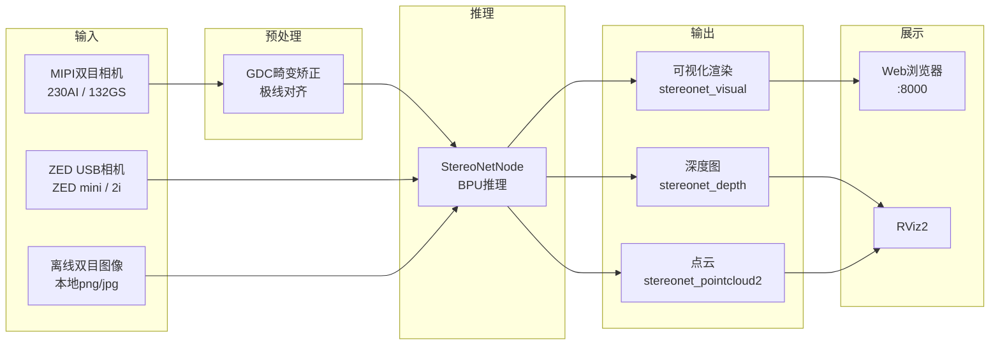

# 双目深度算法

```mdx-code-block
import Tabs from '@theme/Tabs';
import TabItem from '@theme/TabItem';
import DocScope from '@site/src/components/DocScope';
```

## 1. 功能介绍

地瓜双目深度估计算法输入为双目图像数据，输出为左视图对应的视差图和深度图。算法借鉴IGEV网络，采用了GRU架构，具有较好的数据泛化性和较高的推理效率。

算法整体数据流如下图所示：



双目算法代码仓库：https://github.com/D-Robotics/hobot_stereonet

mipi相机代码仓库：https://github.com/D-Robotics/hobot_mipi_cam

zed相机代码仓库：https://github.com/D-Robotics/hobot_zed_cam

双目算法讲解：

- [视频：直播回放 | 基于RDK X5的AI双目算法部署实战](https://www.bilibili.com/video/BV1KdEjzREMz/?share_source=copy_web&vd_source=deb3551e36cc4b1c1020033ad17c564b)
- [博客：地瓜AI双目算法：双目立体匹配算法发展综述](https://mp.weixin.qq.com/s/09kvfQzYgO4dKLUMNLweTg)

## 2. 支持平台

| 平台                  | 系统支持                           | 示例功能                                      |
| --------------------- | ---------------------------------- | --------------------------------------------- |
| RDK X5, RDK X5 Module | Ubuntu 22.04 (Humble)              | 启动双目相机，推理出深度结果，并在 Web 端显示 |
| RDK S100, RDK S100P   | Ubuntu 22.04/24.04 (Humble, Jazzy) | 启动双目相机，推理出深度结果，并在 Web 端显示 |

## 3. 模型版本

### 3.1. X5 模型

| 算法版本              | 量化方式 | 输入尺寸    | 最高推理帧率(fps) | 模型说明                                       |
| --------------------- | -------- | ----------- | ----------------- | ---------------------------------------------- |
| V2.0                  | int16    | 640x352x3x2 | 15                | 历史版本                                       |
| V2.1                  | int16    | 640x352x3x2 | 15                | 历史版本，带置信度输出                         |
| V2.2                  | int8     | 640x352x3x2 | 23                | 历史版本                                       |
| V2.3                  | int8     | 640x352x3x2 | 27                | 历史版本，最高帧率                             |
| V2.4_int16            | int16    | 640x352x3x2 | 15                | 当前主版本，高精度深度估计                     |
| V2.4_int8             | int8     | 640x352x3x2 | 23                | 当前主版本，高帧率深度估计                     |
| V2.5_int16            | int16    | 640x352x3x2 | 16                | 最新版本，高精度深度估计                       |
| V2.5_int16_96         | int16    | 640x352x3x2 | 18                | 最新版本，最大搜索视差 96 视差                 |
| V2.5_int16_544_448    | int16    | 544x448x3x2 | 15                | 最新版本，544x448 分辨率                       |
| V2.5_int16_544_448_96 | int16    | 544x448x3x2 | 17                | 最新版本，544x448 分辨率，最大搜索视差 96 视差 |

### 3.2. S100 模型

| 算法版本 | 量化方式 | 输入尺寸    | 最高推理帧率(fps) | 模型说明                 |
| -------- | -------- | ----------- | ----------------- | ------------------------ |
| V2.1     | int16    | 640x352x3x2 | 53                | 历史版本，带置信度输出   |
| V2.4     | int16    | 640x352x3x2 | 53                | 当前主版本，带置信度输出 |

## 4. 准备工作

### 4.1. RDK平台

1. RDK已烧录好RDK OS系统
2. RDK已成功安装TogetheROS.Bot
3. 如果需要在线推理，请准备好双目相机，目前支持多款MIPI相机、ZED mini/2i USB相机
4. 如果需要离线推理，请准备好双目图像数据
5. 确认PC机能够通过网络访问RDK

### 4.2. 系统和功能包版本

|                                        | 版本              | 查询方法                                        |
| -------------------------------------- | ----------------- | ----------------------------------------------- |
| RDK X5 系统镜像版本                    | 3.3.3 及以上      | `cat /etc/version`                              |
| RDK S100 系统镜像版本                  | 4.0.2-Beta 及以上 | `cat /etc/version`                              |
| tros-humble-hobot-stereonet 功能包版本 | 2.5.0 及以上      | `apt list \| grep tros-humble-hobot-stereonet/` |
| tros-humble-mipi-cam 功能包版本        | 2.3.13 及以上     | `apt list \| grep tros-humble-mipi-cam/`        |
| tros-humble-hobot-zed-cam 功能包版本   | 2.3.3 及以上      | `apt list \| grep tros-humble-hobot-zed-cam/`   |

- 如果**系统镜像版本**不符合要求，请参考文档对应章节进行镜像烧录
- 如果**功能包版本**不符合要求，请执行以下指令进行更新：

<Tabs groupId="tros-distro">
<TabItem value="humble" label="Humble">

```bash
sudo apt update
sudo apt install --only-upgrade tros-humble-hobot-stereonet
sudo apt install --only-upgrade tros-humble-mipi-cam
sudo apt install --only-upgrade tros-humble-hobot-zed-cam
```

</TabItem>

<TabItem value="jazzy" label="Jazzy">

```bash
sudo apt update
sudo apt install --only-upgrade tros-jazzy-hobot-stereonet
sudo apt install --only-upgrade tros-jazzy-mipi-cam
sudo apt install --only-upgrade tros-jazzy-hobot-zed-cam
```

</TabItem>
</Tabs>

### 4.3. Beta源配置（X5专用）

<DocScope products="RDK-X5">

如果以上指令无法将程序更新到最新版本，则需要将apt源文件修改为beta源：

```bash
# 修改为beta源，执行以下命令：
sudo echo 'deb [signed-by=/usr/share/keyrings/sunrise.gpg] http://archive.d-robotics.cc/ubuntu-rdk-x5-beta  jammy main' | sudo tee /etc/apt/sources.list.d/sunrise.list
apt update

# 如果需要重新改回为正式源，则执行以下命令：
sudo echo 'deb [signed-by=/usr/share/keyrings/sunrise.gpg] http://archive.d-robotics.cc/ubuntu-rdk-x5  jammy main' | sudo tee /etc/apt/sources.list.d/sunrise.list
apt update
```

:::caution **注意**
**如果`sudo apt update`命令执行失败或报错，请查看[常见问题](https://developer.d-robotics.cc/rdk_x_doc/FAQ/hardware_and_system?v=3.5.0&p=RDK+X5#q10-apt-update-%E5%91%BD%E4%BB%A4%E6%89%A7%E8%A1%8C%E5%A4%B1%E8%B4%A5%E6%88%96%E6%8A%A5%E9%94%99%E5%A6%82%E4%BD%95%E5%A4%84%E7%90%86)章节的`Q10: apt update 命令执行失败或报错如何处理？`解决。**
:::

</DocScope>

<DocScope products="RDK-S100">

:::caution **注意**
**如果`sudo apt update`命令执行失败或报错，请查看[常见问题](https://developer.d-robotics.cc/rdk_s_doc/FAQ/hardware_and_system#q6-apt-update-%E5%91%BD%E4%BB%A4%E6%89%A7%E8%A1%8C%E5%A4%B1%E8%B4%A5%E6%88%96%E6%8A%A5%E9%94%99%E5%A6%82%E4%BD%95%E5%A4%84%E7%90%86)章节的`Q6: apt update 命令执行失败或报错如何处理？`解决。**
:::

</DocScope>

## 5. 硬件安装

### 5.1. 230AI MIPI双目相机

- RDK官方230AI MIPI双目相机如图所示：


<p style={{ color: 'red' }}> 注意：请检查相机背面丝印印有CDPxxx-V3/V4，确认相机是V3或V4版本 </p>

- RDK X5安装方式如图所示：


- RDK S100安装方式如图所示，注意S100的CAM子板拨码开关要拨到`LPWM`和`3.3V`：


### 5.2. 132GS MIPI双目相机

- RDK官方132GS MIPI双目相机如图所示：


- RDK X5安装方式如图所示：


- 最新线材做了升级，注意线材是带有方向的，CAM端接入相机，RDK端接入开发板。（白色和黑色线材均能正常使用，两种线材随机发货）


- RDK S100安装方式如图所示，注意S100的CAM子板拨码开关要拨到`LPWM`和`3.3V`：


### 5.3. ZED相机连接

- ZED双目摄像头如图所示：


- 将ZED相机通过USB连接到RDK即可

## 6. 注意事项

:::caution **重要**
**请务必使用`root`用户执行本文档中的所有命令。**

其他用户执行可能权限不够，造成一些不必要的错误。可通过以下命令确认当前用户：
:::


## 7. MIPI相机启动

### 7.1. 获取启动脚本

`run_stereo.sh`脚本已内置在功能包中，可通过以下方式获取：

<Tabs groupId="tros-distro">
<TabItem value="humble" label="Humble">

```bash
cp -rv /opt/tros/humble/share/hobot_stereonet/script/run_cam.sh ./
cp -rv /opt/tros/humble/share/hobot_stereonet/script/run_codec_web.sh ./
cp -rv /opt/tros/humble/share/hobot_stereonet/script/run_stereo.sh ./
```

</TabItem>

<TabItem value="jazzy" label="Jazzy">

```bash
cp -rv /opt/tros/jazzy/share/hobot_stereonet/script/run_cam.sh ./
cp -rv /opt/tros/jazzy/share/hobot_stereonet/script/run_codec_web.sh ./
cp -rv /opt/tros/jazzy/share/hobot_stereonet/script/run_stereo.sh ./
```

</TabItem>
</Tabs>

如果无法从功能包中复制，也可以手动创建以下三个脚本。

#### run_cam.sh

```bash
#!/bin/bash
if [[ -f /opt/tros/humble/setup.bash ]]; then
  source /opt/tros/humble/setup.bash
elif [[ -f /opt/tros/jazzy/setup.bash ]]; then
  source /opt/tros/jazzy/setup.bash
else
  echo "Error: neither Humble nor Jazzy TROS environment was found"
  exit 1
fi

image_width=1280
image_height=1088
framerate=30.0
rotation=90.0
gdc_enable=False
cal_rotation=90.0
lpwm_enable=True
frame_ts_type=realtime
out_format=nv12
channel=2
channel2=0
log_level=ERROR

while [[ $# -gt 0 ]]; do
  case $1 in
    --image_width) image_width=$2; shift 2 ;;
    --image_height) image_height=$2; shift 2 ;;
    --framerate) framerate=$2; shift 2 ;;
    --rotation) rotation=$2; shift 2 ;;
    --gdc_enable) gdc_enable=$2; shift 2 ;;
    --cal_rotation) cal_rotation=$2; shift 2 ;;
    --lpwm_enable) lpwm_enable=$2; shift 2 ;;
    --frame_ts_type) frame_ts_type=$2; shift 2 ;;
    --out_format) out_format=$2; shift 2 ;;
    --channel) channel=$2; shift 2 ;;
    --channel2) channel2=$2; shift 2 ;;
    --log_level) log_level=$2; shift 2 ;;
    *) echo "unknown param: $1"; exit 1 ;;
  esac
done

ros2 run mipi_cam mipi_cam --ros-args \
-p device_mode:=dual -p dual_combine:=1 \
-p image_width:=$image_width -p image_height:=$image_height \
-p framerate:=$framerate -p rotation:=$rotation \
-p gdc_enable:=$gdc_enable -p cal_rotation:=$cal_rotation \
-p lpwm_enable:=$lpwm_enable \
-p frame_ts_type:=$frame_ts_type \
-p out_format:=$out_format \
-p channel:=$channel -p channel2:=$channel2 \
--log-level $log_level
```

#### run_codec_web.sh

```bash
#!/bin/bash
if [[ -f /opt/tros/humble/setup.bash ]]; then
  source /opt/tros/humble/setup.bash
elif [[ -f /opt/tros/jazzy/setup.bash ]]; then
  source /opt/tros/jazzy/setup.bash
else
  echo "Error: neither Humble nor Jazzy TROS environment was found"
  exit 1
fi

codec_sub_topic=/StereoNetNode/stereonet_visual
codec_in_format=bgr8
codec_pub_topic=/image_jpeg
websocket_image_topic=/image_jpeg
websocket_channel=0

while [[ $# -gt 0 ]]; do
  case $1 in
    --codec_sub_topic) codec_sub_topic=$2; shift 2 ;;
    --codec_in_format) codec_in_format=$2; shift 2 ;;
    --codec_pub_topic) codec_pub_topic=$2; shift 2 ;;
    --websocket_image_topic) websocket_image_topic=$2; shift 2 ;;
    --websocket_channel) websocket_channel=$2; shift 2 ;;
    *) echo "unknown param: $1"; exit 1 ;;
  esac
done

ros2 launch hobot_stereonet codec_web_visual.launch.py \
codec_sub_topic:=$codec_sub_topic codec_in_format:=$codec_in_format codec_pub_topic:=$codec_pub_topic \
websocket_image_topic:=$websocket_image_topic websocket_channel:=$websocket_channel
```

#### run_stereo.sh

```bash
#!/bin/bash
if [[ -f /opt/tros/humble/setup.bash ]]; then
  source /opt/tros/humble/setup.bash
elif [[ -f /opt/tros/jazzy/setup.bash ]]; then
  source /opt/tros/jazzy/setup.bash
else
  echo "Error: neither Humble nor Jazzy TROS environment was found"
  exit 1
fi

ros2 pkg prefix mipi_cam
ros2 pkg prefix hobot_stereonet

rm -rfv performance_*.txt

# stereonet version
stereonet_version=v2.4_int16

# node name
stereo_node_name=StereoNetNode

# uncertainty
uncertainty_th=-0.10

# topic
stereo_image_topic=/image_combine_raw
camera_info_topic=/image_combine_raw/right/camera_info
left_camera_info_topic=/image_combine_raw/left/camera_info
depth_image_topic="~/stereonet_depth"
depth_camera_info_topic="~/stereonet_depth/camera_info"
rectify_left_camera_info_topic="~/rectify_left_image/camera_info"
rectify_right_camera_info_topic="~/rectify_right_image/camera_info"
pointcloud2_topic="~/stereonet_pointcloud2"
publish_pcd_enabled=True
rectify_left_image_topic="~/rectify_left_image"
rectify_right_image_topic="~/rectify_right_image"
publish_rectify_bgr=False
origin_left_image_topic="~/origin_left_image"
origin_right_image_topic="~/origin_right_image"
publish_origin_enable=True
visual_image_topic="~/stereonet_visual"
publish_visual_enabled=True
stereonet_frame_id="camera_link"

# mipi cam
use_mipi_cam=True
mipi_image_width=640
mipi_image_height=352
mipi_image_framerate=30.0
mipi_frame_ts_type=realtime
mipi_gdc_enable=True
mipi_lpwm_enable=True
mipi_rotation=90.0
mipi_channel=2
mipi_channel2=0
mipi_cal_rotation=0.0

# calib
calib_method=none
stereo_calib_file_path=calib.yaml

# render
render_type=distance
render_perf=True
render_max_disp=80
render_z_near=-1.0
render_z_range=3.0
depth_decimal_num=2

# speckle filter
speckle_filter_enable=False
max_speckle_size=100
max_disp_diff=1.0

# pointcloud
pointcloud_height_min=-5.0
pointcloud_height_max=5.0
pointcloud_depth_max=5.0
pointcloud_downsample_step=2
pointcloud_coord=ROS

# pcl filter
pcl_filter_enable=False
grid_size=0.1
grid_min_point_count=5

# thread
infer_thread_num=2
save_thread_num=4
max_save_task=50

# save
save_result_flag=False
save_dir=./result
save_freq=1
save_total=-1
save_stereo_flag=True
save_origin_flag=False
save_disp_flag=True
save_uncert_flag=False
save_depth_flag=True
save_visual_flag=True
save_pcd_flag=False

# local image
use_local_image_flag=False
local_image_dir=./offline
image_sleep=0

# camera intrinsic
camera_cx=0.0
camera_cy=0.0
camera_fx=0.0
camera_fy=0.0
baseline=0.0
doffs=0.0

# mask
left_img_mask_enable=False

# epipolar
epipolar_mode=False
epipolar_img=rect
chessboard_per_rows=20
chessboard_per_cols=11
chessboard_square_size=0.06
feature_epipolar_mode=False

# angle calc
ground_angle_enable=False
ground_roi_center_x=-1
ground_roi_center_y=-1
ground_roi_width=80
ground_roi_height=40
ground_roi_min_valid_points=100

# web
stereonet_pub_web=True
codec_sub_topic=/$stereo_node_name/stereonet_visual
codec_in_format=bgr8
codec_pub_topic=/image_jpeg
websocket_image_topic=/image_jpeg
websocket_channel=0

while [[ $# -gt 0 ]]; do
  case $1 in
    # stereonet version
    --stereonet_version) stereonet_version=$2; shift 2 ;;

    # node name
    --stereo_node_name) stereo_node_name=$2; shift 2 ;;

    # uncertainty
    --uncertainty_th) uncertainty_th=$2; shift 2 ;;

    # topic
    --stereo_image_topic) stereo_image_topic=$2; shift 2 ;;
    --camera_info_topic) camera_info_topic=$2; shift 2 ;;
    --left_camera_info_topic) left_camera_info_topic=$2; shift 2 ;;
    --depth_image_topic) depth_image_topic=$2; shift 2 ;;
    --rectify_left_camera_info_topic) rectify_left_camera_info_topic=$2; shift 2 ;;
    --rectify_right_camera_info_topic) rectify_right_camera_info_topic=$2; shift 2 ;;
    --depth_camera_info_topic) depth_camera_info_topic=$2; shift 2 ;;
    --pointcloud2_topic) pointcloud2_topic=$2; shift 2 ;;
    --publish_pcd_enabled) publish_pcd_enabled=$2; shift 2 ;;
    --rectify_left_image_topic) rectify_left_image_topic=$2; shift 2 ;;
    --rectify_right_image_topic) rectify_right_image_topic=$2; shift 2 ;;
    --publish_rectify_bgr) publish_rectify_bgr=$2; shift 2 ;;
    --origin_left_image_topic) origin_left_image_topic=$2; shift 2 ;;
    --origin_right_image_topic) origin_right_image_topic=$2; shift 2 ;;
    --publish_origin_enable) publish_origin_enable=$2; shift 2 ;;
    --visual_image_topic) visual_image_topic=$2; shift 2 ;;
    --publish_visual_enabled) publish_visual_enabled=$2; shift 2 ;;
    --stereonet_frame_id) stereonet_frame_id=$2; shift 2 ;;

    # mipi cam
    --use_mipi_cam) use_mipi_cam=$2; shift 2 ;;
    --mipi_image_width) mipi_image_width=$2; shift 2 ;;
    --mipi_image_height) mipi_image_height=$2; shift 2 ;;
    --mipi_image_framerate) mipi_image_framerate=$2; shift 2 ;;
    --mipi_frame_ts_type) mipi_frame_ts_type=$2; shift 2 ;;
    --mipi_gdc_enable) mipi_gdc_enable=$2; shift 2 ;;
    --mipi_lpwm_enable) mipi_lpwm_enable=$2; shift 2 ;;
    --mipi_rotation) mipi_rotation=$2; shift 2 ;;
    --mipi_channel) mipi_channel=$2; shift 2 ;;
    --mipi_channel2) mipi_channel2=$2; shift 2 ;;
    --mipi_cal_rotation) mipi_cal_rotation=$2; shift 2 ;;

    # calib
    --calib_method) calib_method=$2; shift 2 ;;
    --stereo_calib_file_path) stereo_calib_file_path=$2; shift 2 ;;

    # render
    --render_type) render_type=$2; shift 2 ;;
    --render_perf) render_perf=$2; shift 2 ;;
    --render_max_disp) render_max_disp=$2; shift 2 ;;
    --render_z_near) render_z_near=$2; shift 2 ;;
    --render_z_range) render_z_range=$2; shift 2 ;;
    --depth_decimal_num) depth_decimal_num=$2; shift 2 ;;

    # speckle filter
    --speckle_filter_enable) speckle_filter_enable=$2; shift 2 ;;
    --max_speckle_size) max_speckle_size=$2; shift 2 ;;
    --max_disp_diff) max_disp_diff=$2; shift 2 ;;

    # pointcloud
    --pointcloud_height_min) pointcloud_height_min=$2; shift 2 ;;
    --pointcloud_height_max) pointcloud_height_max=$2; shift 2 ;;
    --pointcloud_depth_max) pointcloud_depth_max=$2; shift 2 ;;
    --pointcloud_downsample_step) pointcloud_downsample_step=$2; shift 2 ;;
    --pointcloud_coord) pointcloud_coord=$2; shift 2 ;;

    # pcl filter
    --pcl_filter_enable) pcl_filter_enable=$2; shift 2 ;;
    --grid_size) grid_size=$2; shift 2 ;;
    --grid_min_point_count) grid_min_point_count=$2; shift 2 ;;

    # thread
    --infer_thread_num) infer_thread_num=$2; shift 2 ;;
    --save_thread_num) save_thread_num=$2; shift 2 ;;
    --max_save_task) max_save_task=$2; shift 2 ;;

    # save
    --save_result_flag) save_result_flag=$2; shift 2 ;;
    --save_dir) save_dir=$2; shift 2 ;;
    --save_freq) save_freq=$2; shift 2 ;;
    --save_total) save_total=$2; shift 2 ;;
    --save_stereo_flag) save_stereo_flag=$2; shift 2 ;;
    --save_origin_flag) save_origin_flag=$2; shift 2 ;;
    --save_disp_flag) save_disp_flag=$2; shift 2 ;;
    --save_uncert_flag) save_uncert_flag=$2; shift 2 ;;
    --save_depth_flag) save_depth_flag=$2; shift 2 ;;
    --save_visual_flag) save_visual_flag=$2; shift 2 ;;
    --save_pcd_flag) save_pcd_flag=$2; shift 2 ;;

    # local image
    --use_local_image_flag) use_local_image_flag=$2; shift 2 ;;
    --local_image_dir) local_image_dir=$2; shift 2 ;;
    --image_sleep) image_sleep=$2; shift 2 ;;

    # camera intrinsic
    --camera_cx) camera_cx=$2; shift 2 ;;
    --camera_cy) camera_cy=$2; shift 2 ;;
    --camera_fx) camera_fx=$2; shift 2 ;;
    --camera_fy) camera_fy=$2; shift 2 ;;
    --baseline) baseline=$2; shift 2 ;;
    --doffs) doffs=$2; shift 2 ;;

    # mask
    --left_img_mask_enable) left_img_mask_enable=$2; shift 2 ;;

    # epipolar
    --epipolar_mode) epipolar_mode=$2; shift 2 ;;
    --epipolar_img) epipolar_img=$2; shift 2 ;;
    --chessboard_per_rows) chessboard_per_rows=$2; shift 2 ;;
    --chessboard_per_cols) chessboard_per_cols=$2; shift 2 ;;
    --chessboard_square_size) chessboard_square_size=$2; shift 2 ;;
    --feature_epipolar_mode) feature_epipolar_mode=$2; shift 2 ;;

    # angle calc
    --ground_angle_enable) ground_angle_enable=$2; shift 2 ;;
    --ground_roi_center_x) ground_roi_center_x=$2; shift 2 ;;
    --ground_roi_center_y) ground_roi_center_y=$2; shift 2 ;;
    --ground_roi_width) ground_roi_width=$2; shift 2 ;;
    --ground_roi_height) ground_roi_height=$2; shift 2 ;;
    --ground_roi_min_valid_points) ground_roi_min_valid_points=$2; shift 2 ;;

    # web
    --stereonet_pub_web) stereonet_pub_web=$2; shift 2 ;;
    --codec_sub_topic) codec_sub_topic=$2; shift 2 ;;
    --codec_in_format) codec_in_format=$2; shift 2 ;;
    --codec_pub_topic) codec_pub_topic=$2; shift 2 ;;
    --websocket_image_topic) websocket_image_topic=$2; shift 2 ;;
    --websocket_channel) websocket_channel=$2; shift 2 ;;

    *) echo "unknown param: $1"; exit 1 ;;
  esac
done

ros2 launch hobot_stereonet stereonet_model_web_visual_$stereonet_version.launch.py \
stereo_node_name:=$stereo_node_name \
uncertainty_th:=$uncertainty_th \
stereo_image_topic:=$stereo_image_topic camera_info_topic:=$camera_info_topic left_camera_info_topic:=$left_camera_info_topic \
depth_image_topic:=$depth_image_topic depth_camera_info_topic:=$depth_camera_info_topic \
rectify_left_camera_info_topic:=$rectify_left_camera_info_topic rectify_right_camera_info_topic:=$rectify_right_camera_info_topic \
pointcloud2_topic:=$pointcloud2_topic publish_pcd_enabled:=$publish_pcd_enabled \
rectify_left_image_topic:=$rectify_left_image_topic rectify_right_image_topic:=$rectify_right_image_topic publish_rectify_bgr:=$publish_rectify_bgr \
origin_left_image_topic:=$origin_left_image_topic origin_right_image_topic:=$origin_right_image_topic publish_origin_enable:=$publish_origin_enable \
visual_image_topic:=$visual_image_topic publish_visual_enabled:=$publish_visual_enabled \
use_mipi_cam:=$use_mipi_cam mipi_image_width:=$mipi_image_width mipi_image_height:=$mipi_image_height \
mipi_image_framerate:=$mipi_image_framerate mipi_frame_ts_type:=$mipi_frame_ts_type \
mipi_gdc_enable:=$mipi_gdc_enable mipi_lpwm_enable:=$mipi_lpwm_enable mipi_rotation:=$mipi_rotation \
mipi_channel:=$mipi_channel mipi_channel2:=$mipi_channel2 mipi_cal_rotation:=$mipi_cal_rotation \
calib_method:=$calib_method stereo_calib_file_path:=$stereo_calib_file_path \
render_type:=$render_type render_perf:=$render_perf render_max_disp:=$render_max_disp render_z_near:=$render_z_near render_z_range:=$render_z_range \
depth_decimal_num:=$depth_decimal_num \
speckle_filter_enable:=$speckle_filter_enable max_speckle_size:=$max_speckle_size max_disp_diff:=$max_disp_diff \
pointcloud_height_min:=$pointcloud_height_min pointcloud_height_max:=$pointcloud_height_max pointcloud_depth_max:=$pointcloud_depth_max \
pointcloud_downsample_step:=$pointcloud_downsample_step pointcloud_coord:=$pointcloud_coord \
pcl_filter_enable:=$pcl_filter_enable grid_size:=$grid_size grid_min_point_count:=$grid_min_point_count \
infer_thread_num:=$infer_thread_num save_thread_num:=$save_thread_num max_save_task:=$max_save_task \
use_local_image_flag:=$use_local_image_flag local_image_dir:=$local_image_dir image_sleep:=$image_sleep \
save_result_flag:=$save_result_flag save_dir:=$save_dir save_freq:=$save_freq save_total:=$save_total save_stereo_flag:=$save_stereo_flag \
save_origin_flag:=$save_origin_flag save_disp_flag:=$save_disp_flag save_uncert_flag:=$save_uncert_flag save_depth_flag:=$save_depth_flag \
save_visual_flag:=$save_visual_flag save_pcd_flag:=$save_pcd_flag \
use_local_image_flag:=$use_local_image_flag local_image_dir:=$local_image_dir image_sleep:=$image_sleep \
camera_cx:=$camera_cx camera_cy:=$camera_cy camera_fx:=$camera_fx camera_fy:=$camera_fy baseline:=$baseline doffs:=$doffs \
left_img_mask_enable:=$left_img_mask_enable \
epipolar_mode:=$epipolar_mode epipolar_img:=$epipolar_img \
chessboard_per_rows:=$chessboard_per_rows chessboard_per_cols:=$chessboard_per_cols chessboard_square_size:=$chessboard_square_size \
feature_epipolar_mode:=$feature_epipolar_mode \
ground_angle_enable:=$ground_angle_enable ground_roi_center_x:=$ground_roi_center_x ground_roi_center_y:=$ground_roi_center_y \
ground_roi_width:=$ground_roi_width ground_roi_height:=$ground_roi_height ground_roi_min_valid_points:=$ground_roi_min_valid_points \
stereonet_pub_web:=$stereonet_pub_web codec_sub_topic:=$codec_sub_topic codec_in_format:=$codec_in_format \
codec_pub_topic:=$codec_pub_topic websocket_image_topic:=$websocket_image_topic websocket_channel:=$websocket_channel
```

### 7.2. 确认I2C信号

通过ssh连接RDK，执行以下命令检测相机I2C信号。

- 230AI双目相机：如果输出0x30、0x32、0x50等地址，则代表相机连接正常

```bash
# RDK X5
i2cdetect -r -y 4
i2cdetect -r -y 6

# RDK S100
i2cdetect -r -y 1
i2cdetect -r -y 2
```


- 132GS双目相机：如果输出0x32、0x33、0x50等地址，则代表相机连接正常

```bash
# RDK X5
i2cdetect -r -y 4
i2cdetect -r -y 6

# RDK S100
i2cdetect -r -y 1
i2cdetect -r -y 2
```


:::caution **注意**
**如果I2C信号检测不到，相机无法正常工作**
:::

### 7.3. 验证相机出流

先启动相机，确认图像采集正常。

<Tabs groupId="Stereo Cam">
<TabItem value="230AI" label="230AI">

```bash
bash run_cam.sh --image_width 1920 --image_height 1080 --rotation 0.0 --cal_rotation 0.0 --log_level INFO
```

</TabItem>
<TabItem value="132GS" label="132GS">

```bash
bash run_cam.sh --log_level INFO
```

</TabItem>
</Tabs>

以X5上接入132GS相机为例，正确启动相机会打印如下日志（S100或不同型号相机接入会打印不同的日志）：


**日志解析：**

- **I2C bus** 是控制通道编号，用于配置传感器寄存器（如设置分辨率、帧率、启动 streaming），图像数据不走I2C，I2C只负责控制。程序会检测板子的I2C控制器是否能扫到sensor地址。日志中检测到0x32、0x30两个地址，对应I2C bus-4和I2C bus-6。
- **mipi rx phy** 是图像数据通道编号，相机采集的图像数据走该高速通道传输到芯片。日志显示 X5 有两个 mipi phy，分别是编号 0 和编号 2，对应左右目相机。该编号可以通过 `channel` 和 `mipi_channel` 参数调整，用于改变左右目图像的拼接顺序。

相机启动后，可通过以下方式查看图像是否正确。启动 `run_codec_web.sh`：

```bash
bash run_codec_web.sh --codec_sub_topic /image_combine_raw --codec_in_format nv12
```

程序启动后，在 RDK 板端，可通过 WebSocket 将话题 `/image_combine_raw` 发布的实时图像数据持续发布到网络中。连接到同一网络的 PC 只需使用浏览器访问开发板提供的 Web 页面，即可通过 WebSocket 实时接收并显示图像，无需安装额外客户端软件，便于图像预览、算法调试以及远程监控。

在连接 RDK 板端的PC上，打开浏览器，输入 `http://ip:8000`（ip 为 RDK 对应的 ip 地址），即可查看左右目图像。通过实时显示的图像，确认上图是左相机发布的图像，下图是右相机发布的图像。

### 7.4. 启动双目算法

通过ssh连接RDK，执行以下命令启动算法：

<Tabs groupId="RDK">
<TabItem value="RDK X5" label="RDK X5">

```bash
# 搭配230AI相机
bash run_stereo.sh --mipi_rotation 0.0

# 搭配132GS相机
bash run_stereo.sh
```

**注意：**
- 需要观察网页端图像RGB图是否是左目相机采集的图像，可以用镜头盖遮挡一下左目相机确认
- 如果左右目相机顺序不正确，有两个方法调整：
  - 方法1：交换MIPI线
  - 方法2：在上面的运行指令上，加入参数：`--mipi_channel 0 --mipi_channel2 2` 或 `--mipi_channel 2 --mipi_channel2 0`，看看哪种情况能输出正确的结果

</TabItem>
<TabItem value="RDK S100" label="RDK S100">

```bash
# 搭配230AI相机
bash run_stereo.sh --stereonet_version v2.4 --mipi_rotation 0.0

# 搭配132GS相机
bash run_stereo.sh --stereonet_version v2.4

# S100还支持大分辨率模型，以132GS相机为例，启动指令如下
bash run_stereo.sh --stereonet_version v2.4_1280_704 --mipi_image_width 1280 --mipi_image_height 704
```

**注意：**
- 需要观察网页端图像RGB图是否是左目相机采集的图像，可以用镜头盖遮挡一下左目相机确认
- 如果左右目相机顺序不正确，有两个方法调整：
  - 方法1：交换MIPI线
  - 方法2：在上面的运行指令上，加入参数：`--mipi_channel 0 --mipi_channel2 1` 或 `--mipi_channel 1 --mipi_channel2 0`，看看哪种情况能输出正确的结果

</TabItem>
</Tabs>

:::caution **注意**
**如果程序没有正确启动，可以通过`ros2 topic list -v`检查一下是否存在`stereo_image_topic`和`camera_info_topic`对应的话题**

**如果程序正确启动，但深度效果不好，要确认：1.左右目图像的拼接顺序为左上右下; 2.参考[极线对齐检测](#12-极线对齐检测)章节确认左右图是否满足极线对齐要求**
:::

左右目相机定义，<span style={{ color: 'red' }}> 需要确认网页端显示的RGB图像是否是左相机拍摄的图像 </span>：


### 7.5. 查看结果

双目算法启动成功后会打印如下日志，`fx/fy/cx/cy/baseline`是相机内参，`fps`是算法运行的帧率：


**Web端查看：** 在浏览器输入 `http://ip:8000`（图中RDK ip是192.168.1.100），即可查看RGB图和深度图：


**RViz2查看点云：** RDK可直接安装rviz2查看，注意rviz2中需要做如下配置：

```bash
if [[ -f /opt/tros/humble/setup.bash ]]; then
  source /opt/tros/humble/setup.bash
elif [[ -f /opt/tros/jazzy/setup.bash ]]; then
  source /opt/tros/jazzy/setup.bash
else
  echo "Error: neither Humble nor Jazzy TROS environment was found"
  exit 1
fi
# 安装rviz2
sudo apt install ros-$ROS_DISTRO-rviz2
# 启动rviz2
rviz2
```


## 8. ZED相机启动

### 8.1. 启动ZED相机节点

通过ssh连接RDK，X5和S100执行相同指令：

```bash
if [[ -f /opt/tros/humble/setup.bash ]]; then
  source /opt/tros/humble/setup.bash
elif [[ -f /opt/tros/jazzy/setup.bash ]]; then
  source /opt/tros/jazzy/setup.bash
else
  echo "Error: neither Humble nor Jazzy TROS environment was found"
  exit 1
fi

ros2 launch hobot_zed_cam zed_cam_node.launch.py \
resolution:=720p \
need_rectify:=true dst_width:=640 dst_height:=352
```

| 参数         | 定义                                                                    |
| ------------ | ----------------------------------------------------------------------- |
| resolution   | zed 原始输出分辨率，带畸变，720p 表示 1280*720 的分辨率，可设置为 1080p |
| need_rectify | 表示最终输出的图像是否需要矫正                                          |
| dst_width    | 最终输出的矫正后图像分辨率为 640*352                                    |
| dst_height   | 最终输出的矫正后图像分辨率为 640*352                                    |

<p style={{ color: 'red' }}> 注意：运行ZED相机RDK一定要联网，因为ZED需要联网下载标定文件 </p>


联网的情况下程序会自动下载标定文件，如果RDK没有联网，可以手动下载标定文件然后上传到RDK。
根据log信息，在PC端打开浏览器，输入 `https://calib.stereolabs.com/?SN=38085162`，即可下载标定文件SN38085162.conf。
注意每台ZED的SN码是不一样的，使用时请根据报错信息下载对应的标定文件，将标定文件上传到 `/root/zed/settings/` 目录下，如果目录不存在则手动创建。

### 8.2. 启动双目算法

开启另一个终端执行：

```bash
bash run_stereo.sh --use_mipi_cam False --camera_info_topic /image_combine_raw/camera_info
```

### 8.3. 查看结果

通过网页端查看深度图，在浏览器输入 `http://ip:8000`（ip为RDK对应的ip地址）。如需查看**点云**和**保存图像**，请参考[MIPI相机启动-查看结果](#75-查看结果)和[数据保存](#11-数据保存)章节。

## 9. 离线启动

### 9.1. 准备离线数据

如果想利用本地图像评估算法效果，需要准备如下数据并上传到RDK：

1. **去畸变、极线对齐**的左右目图像，png或者jpg格式，图片需要按照规则命名，左目图像需要带有 `left` 字段，右目图像需要带有 `right` 字段，算法按序号遍历图像，直至图像全部计算完毕：


2. 相机内参文件，保存在图像目录下，命名为 `camera_intrinsic.txt`，参考内容如下：

```bash
# fx fy cx cy baseline(m)
215.762581 215.762581 325.490113 173.881556 0.079957
```

### 9.2. 启动双目算法

通过ssh连接RDK，执行以下命令：

<Tabs groupId="RDK">
<TabItem value="RDK X5" label="RDK X5">

```bash
bash run_stereo.sh \
--use_local_image_flag True --local_image_dir <离线图像路径> \
--save_result_flag True --save_dir <结果保存路径> \
--save_stereo_flag True --save_origin_flag False \
--save_disp_flag True --save_uncert_flag False \
--save_depth_flag True --save_visual_flag True \
--save_pcd_flag True

# 如果网页端显示太快，可以加入参数控制一下停顿时间：--image_sleep 2000
```

</TabItem>
<TabItem value="RDK S100" label="RDK S100">

```bash
bash run_stereo.sh --stereonet_version v2.4 \
--use_local_image_flag True --local_image_dir <离线图像路径> \
--save_result_flag True --save_dir <结果保存路径> \
--save_stereo_flag True --save_origin_flag False \
--save_disp_flag True --save_uncert_flag False \
--save_depth_flag True --save_visual_flag True \
--save_pcd_flag True

# 如果网页端显示太快，可以加入参数控制一下停顿时间：--image_sleep 2000
```

</TabItem>
</Tabs>

### 9.3. 查看结果

运行成功后，会打印如下日志：


通过网页端查看RGB图和深度图，在浏览器输入 `http://ip:8000`（图中RDK ip是192.168.128.10）：


## 10. 启动参数参考

`run_stereo.sh` 脚本支持以下参数，可通过 `--参数名 参数值` 的方式在命令行传入。

### 10.1. 模型与节点

| 参数                | 说明                                 | 默认值          | 可选值                                                                                                                                                                                                                                                                                                                                 |
| ------------------- | ------------------------------------ | --------------- | -------------------------------------------------------------------------------------------------------------------------------------------------------------------------------------------------------------------------------------------------------------------------------------------------------------------------------------- |
| `stereonet_version` | 算法版本                             | `v2.4_int16`    | X5: `v2.0` / `v2.1` / `v2.2` / `v2.3` / `v2.4_int16` / `v2.4_int8` / `v2.4_int16_1280_704` / `v2.4_int16_320_256` / `v2.4_int16_640_480` / `v2.4_int8_544_448` / `v2.4_int8_544_448_96` / `v2.5_int16` / `v2.5_int16_96` / `v2.5_int16_544_448` / `v2.5_int16_544_448_96`<br/>S100: `v2.1` / `v2.4` / `v2.4_1280_704` / `v2.4_640_416` |
| `stereo_node_name`  | ROS节点名称                          | `StereoNetNode` | 任意合法ROS节点名                                                                                                                                                                                                                                                                                                                      |
| `uncertainty_th`    | 置信度阈值，设为正数时启用置信度过滤 | `-0.10`         | 建议设为 `0.10`                                                                                                                                                                                                                                                                                                                        |
| `infer_thread_num`  | 推理线程数，多线程帧率高但延迟大     | `2`             | `1` / `2`                                                                                                                                                                                                                                                                                                                              |

### 10.2. 相机参数

| 参数                   | 说明                                 | 默认值 | 可选值                          |
| ---------------------- | ------------------------------------ | ------ | ------------------------------- |
| `use_mipi_cam`         | 是否启动MIPI相机                     | `True` | `True` / `False`                |
| `mipi_image_width`     | 相机输出图像宽度                     | `640`  | 根据相机型号设置                |
| `mipi_image_height`    | 相机输出图像高度                     | `352`  | 根据相机型号设置                |
| `mipi_image_framerate` | 相机输出帧率                         | `30.0` | 根据相机型号设置                |
| `mipi_rotation`        | 图像旋转角度                         | `90.0` | 132GS设为`90.0`，230AI设为`0.0` |
| `mipi_gdc_enable`      | 开启GDC畸变矫正                      | `True` | `True` / `False`                |
| `mipi_lpwm_enable`     | 开启硬件同步，保证左右图像时间戳一致 | `True` | `True` / `False`                |
| `mipi_channel`         | 左目相机MIPI通道编号                 | `2`    | X5: `0` / `2`; S100: `0` / `1`  |
| `mipi_channel2`        | 右目相机MIPI通道编号                 | `0`    | X5: `0` / `2`; S100: `0` / `1`  |
| `mipi_cal_rotation`    | 标定旋转角度                         | `0.0`  | 一般保持默认                    |

### 10.3. 标定

| 参数                                                  | 说明                         | 默认值       | 可选值                                                |
| ----------------------------------------------------- | ---------------------------- | ------------ | ----------------------------------------------------- |
| `calib_method`                                        | 矫正方式                     | `none`       | `none`（相机已做GDC矫正）/ `custom`（自定义标定文件） |
| `stereo_calib_file_path`                              | 自定义标定参数文件路径       | `calib.yaml` | 文件路径                                              |
| `camera_fx` / `camera_fy` / `camera_cx` / `camera_cy` | 相机内参（自定义标定时使用） | `0.0`        | 浮点数                                                |
| `baseline`                                            | 双目基线长度（m）            | `0.0`        | 浮点数                                                |
| `doffs`                                               | 视差偏移                     | `0.0`        | 浮点数                                                |

### 10.4. 渲染

| 参数              | 说明                                       | 默认值     | 可选值                                                |
| ----------------- | ------------------------------------------ | ---------- | ----------------------------------------------------- |
| `render_type`     | 渲染方式                                   | `distance` | `distance` / `indoor` / `outdoor`（不建议用`indoor`） |
| `render_perf`     | 渲染图像上是否展示CPU/BPU占用率、延迟、FPS | `True`     | `True` / `False`                                      |
| `render_max_disp` | 渲染最大视差                               | `80`       | 整数                                                  |
| `render_z_near`   | 渲染最近距离（m）                          | `-1.0`     | 浮点数                                                |
| `render_z_range`  | 渲染距离范围（m）                          | `3.0`      | 浮点数                                                |

### 10.5. 点云

| 参数                         | 说明              | 默认值 | 可选值 |
| ---------------------------- | ----------------- | ------ | ------ |
| `pointcloud_height_min`      | 点云最小高度（m） | `-5.0` | 浮点数 |
| `pointcloud_height_max`      | 点云最大高度（m） | `5.0`  | 浮点数 |
| `pointcloud_depth_max`       | 点云最大深度（m） | `5.0`  | 浮点数 |
| `pointcloud_downsample_step` | 点云下采样步长    | `2`    | 整数   |
| `pointcloud_coord`           | 点云坐标系        | `ROS`  | `ROS`  |

### 10.6. 滤波

| 参数                    | 说明                                   | 默认值  | 可选值               |
| ----------------------- | -------------------------------------- | ------- | -------------------- |
| `speckle_filter_enable` | 是否开启视差散斑滤波                   | `False` | `True` / `False`     |
| `max_speckle_size`      | 散斑最大尺寸，小于该尺寸的散斑会被滤除 | `100`   | 整数，越大滤波越强   |
| `max_disp_diff`         | 散斑视差差异阈值                       | `1.0`   | 浮点数，越小滤波越强 |
| `pcl_filter_enable`     | 是否开启点云体素滤波                   | `False` | `True` / `False`     |
| `grid_size`             | 体素滤波网格大小（m）                  | `0.1`   | 浮点数               |
| `grid_min_point_count`  | 网格内最小点数，小于该数量的点被滤除   | `5`     | 整数                 |

### 10.7. 数据保存

| 参数               | 说明                               | 默认值     | 可选值           |
| ------------------ | ---------------------------------- | ---------- | ---------------- |
| `save_result_flag` | 是否开启保存                       | `False`    | `True` / `False` |
| `save_dir`         | 保存目录，不存在会自动创建         | `./result` | 路径             |
| `save_freq`        | 保存频率，每隔N帧保存一次          | `1`        | 整数             |
| `save_total`       | 保存总数，-1表示一直保存           | `-1`       | 整数             |
| `save_stereo_flag` | 保存双目图像（输入算法的图像）     | `True`     | `True` / `False` |
| `save_origin_flag` | 保存原始图像（未预处理）           | `False`    | `True` / `False` |
| `save_disp_flag`   | 保存视差图                         | `True`     | `True` / `False` |
| `save_uncert_flag` | 保存置信度图（仅带置信度模型支持） | `False`    | `True` / `False` |
| `save_depth_flag`  | 保存深度图                         | `True`     | `True` / `False` |
| `save_visual_flag` | 保存Web端渲染的可视化图            | `True`     | `True` / `False` |
| `save_pcd_flag`    | 保存点云数据                       | `False`    | `True` / `False` |

### 10.8. 离线推理

| 参数                   | 说明                       | 默认值      | 可选值           |
| ---------------------- | -------------------------- | ----------- | ---------------- |
| `use_local_image_flag` | 是否开启离线推理           | `False`     | `True` / `False` |
| `local_image_dir`      | 离线图像目录               | `./offline` | 路径             |
| `image_sleep`          | 每帧图像间的停顿时间（ms） | `0`         | 整数             |

### 10.9. 极线对齐检测

| 参数                     | 说明                                | 默认值  | 可选值            |
| ------------------------ | ----------------------------------- | ------- | ----------------- |
| `epipolar_mode`          | 是否开启基于棋盘格的极线对齐检测    | `False` | `True` / `False`  |
| `epipolar_img`           | 检测使用的图像类型                  | `rect`  | `origin` / `rect` |
| `chessboard_per_rows`    | 棋盘格每行内角点数                  | `20`    | 整数              |
| `chessboard_per_cols`    | 棋盘格每列内角点数                  | `11`    | 整数              |
| `chessboard_square_size` | 棋盘格方块大小（m）                 | `0.06`  | 浮点数            |
| `feature_epipolar_mode`  | 是否开启基于ORB特征点的极线对齐检测 | `False` | `True` / `False`  |

### 10.10. Web可视化

| 参数                    | 说明                        | 默认值                                | 可选值           |
| ----------------------- | --------------------------- | ------------------------------------- | ---------------- |
| `stereonet_pub_web`     | 是否开启Web端发布可视化图像 | `True`                                | `True` / `False` |
| `codec_sub_topic`       | 编码订阅的话题              | `/$stereo_node_name/stereonet_visual` | 话题名           |
| `codec_in_format`       | 编码输入格式                | `bgr8`                                | 格式名           |
| `codec_pub_topic`       | 编码发布的话题              | `/image_jpeg`                         | 话题名           |
| `websocket_image_topic` | WebSocket图像话题           | `/image_jpeg`                         | 话题名           |

### 10.11. 话题

| 参数                        | 说明                 | 默认值                                 |
| --------------------------- | -------------------- | -------------------------------------- |
| `stereo_image_topic`        | 订阅的双目图像话题   | `/image_combine_raw`                   |
| `camera_info_topic`         | 订阅的相机参数话题   | `/image_combine_raw/right/camera_info` |
| `left_camera_info_topic`    | 订阅的左相机参数话题 | `/image_combine_raw/left/camera_info`  |
| `depth_image_topic`         | 发布的深度图话题     | `/StereoNetNode/stereonet_depth`       |
| `pointcloud2_topic`         | 发布的点云话题       | `/StereoNetNode/stereonet_pointcloud2` |
| `visual_image_topic`        | 发布的可视化渲染话题 | `/StereoNetNode/stereonet_visual`      |
| `rectify_left_image_topic`  | 发布的矫正左图话题   | `/StereoNetNode/rectify_left_image`    |
| `rectify_right_image_topic` | 发布的矫正右图话题   | `/StereoNetNode/rectify_right_image`   |
| `origin_left_image_topic`   | 发布的原始左图话题   | `/StereoNetNode/origin_left_image`     |
| `origin_right_image_topic`  | 发布的原始右图话题   | `/StereoNetNode/origin_right_image`    |

## 11. 数据保存

### 11.1. 运行时保存一帧

程序运行成功后，开启另一个终端，执行如下指令保存一帧数据：

```bash
if [[ -f /opt/tros/humble/setup.bash ]]; then
  source /opt/tros/humble/setup.bash
elif [[ -f /opt/tros/jazzy/setup.bash ]]; then
  source /opt/tros/jazzy/setup.bash
else
  echo "Error: neither Humble nor Jazzy TROS environment was found"
  exit 1
fi

# 首先查看一下节点是否正常运行，注意一下是否设置了ROS_DOMAIN_ID或者改变了节点名称
ros2 node list

# 如果/StereoNetNode节点正常运行，运行如下指令可以保存一帧数据
# 设置保存目录，建议设置绝对路径，如果保存目录不存在会自动创建
ros2 param set /StereoNetNode save_dir /root/online_once
# 保存一帧数据，可重复执行
ros2 param set /StereoNetNode save_result_once true
```

### 11.2. 启动时批量保存

在启动命令中指定保存参数：

```bash
# 搭配230AI相机
bash run_stereo.sh --mipi_rotation 0.0 \
--save_result_flag True --save_dir /root/online_batch \
--save_freq 1 --save_total -1 \
--save_stereo_flag True --save_origin_flag False \
--save_disp_flag True --save_uncert_flag False \
--save_depth_flag True --save_visual_flag True \
--save_pcd_flag False

# 搭配132GS相机
bash run_stereo.sh \
--save_result_flag True --save_dir /root/online_batch \
--save_freq 1 --save_total -1 \
--save_stereo_flag True --save_origin_flag False \
--save_disp_flag True --save_uncert_flag False \
--save_depth_flag True --save_visual_flag True \
--save_pcd_flag False

# S100需要指定模型版本，例如增加参数--stereonet_version v2.4
# save_stereo_flag    保存双目图像，该图像会输入算法进行推理
# save_origin_flag    保存双目原始图像，该图像不会最终输入算法推理，比如没有矫正的图、和算法模型分辨率不匹配的图，会进行预处理，得到最终可以输入算法的图像
# save_disp_flag      保存视差图
# save_uncert_flag    保存置信度图，只有带置信度的模型支持
# save_depth_flag     保存深度图
# save_visual_flag    保存web端渲染的可视化图
# save_pcd_flag       保存点云数据
```


### 11.3. 运行时批量保存

程序运行成功后，开启另一个终端，执行如下指令保存数据：

```bash
if [[ -f /opt/tros/humble/setup.bash ]]; then
  source /opt/tros/humble/setup.bash
elif [[ -f /opt/tros/jazzy/setup.bash ]]; then
  source /opt/tros/jazzy/setup.bash
else
  echo "Error: neither Humble nor Jazzy TROS environment was found"
  exit 1
fi

# 首先查看一下节点是否正常运行，注意一下是否设置了ROS_DOMAIN_ID或者改变了节点名称
ros2 node list

# 如果/StereoNetNode节点正常运行，运行如下指令可以保存数据
# 设置保存目录，建议设置绝对路径，如果保存目录不存在会自动创建
ros2 param set /StereoNetNode save_dir /root/online_batch
# 设置保存总数
ros2 param set /StereoNetNode save_total 10
# 设置保存频率
ros2 param set /StereoNetNode save_freq 1

# 设置保存内容，按需要设置
ros2 param set /StereoNetNode save_stereo_flag true   # 保存双目图像，该图像会输入算法进行推理
ros2 param set /StereoNetNode save_origin_flag true   # 保存双目原始图像，该图像不会最终输入算法推理，比如没有矫正的图、和算法模型分辨率不匹配的图，会进行预处理，得到最终可以输入算法的图像
ros2 param set /StereoNetNode save_disp_flag true     # 保存视差图
ros2 param set /StereoNetNode save_uncert_flag true   # 保存置信度图，只有带置信度的模型支持
ros2 param set /StereoNetNode save_depth_flag true    # 保存深度图
ros2 param set /StereoNetNode save_visual_flag true   # 保存web端渲染的可视化图
ros2 param set /StereoNetNode save_pcd_flag true      # 保存点云数据

# 执行保存命令
ros2 param set /StereoNetNode save_result_flag true

# 如果保存完毕后，还需要继续保存，需要再执行一下下面两条指令
# 重新设置保存总数
ros2 param set /StereoNetNode save_total 10
# 执行保存命令
ros2 param set /StereoNetNode save_result_flag true
```

## 12. 极线对齐检测

如果出现深度图较差的情况，除了可能是左右图的拼接顺序错误之外，还有可能是左右目图像没有达到极线对齐状态。
双目算法对极线对齐的要求很高，一般要求左右图的极线对齐误差小于 `1 pixel`。

本程序提供了两种极线对齐检测方式：

### 12.1. 基于棋盘格（推荐）

这种方式比较严格，推荐使用。需要准备棋盘格标定板。

以X5搭配132GS相机为例：

```bash
# X5搭配132GS相机，S100或其它相机注意参考上文参数的设置
# 注意棋盘格参数的设置，例子中使用每行内角点20、每列内角度11、方格大小为0.06m的棋盘格
bash run_stereo.sh --epipolar_mode True \
--chessboard_per_rows 20 --chessboard_per_cols 11 --chessboard_square_size 0.06
```

运行成功后，可以在web端看到如下图像：


基于棋盘格的极线对齐检测，极线对齐误差和重投影误差都应该在 `1 pixel` 内，双目图像才是合格图像，否则使用的标定参数是错误的。

### 12.2. 基于ORB特征点

这种方式不需要标定板，只需要在纹理丰富的场景运行即可，但计算出来的极线对齐误差可能偏大。

以X5搭配132GS相机为例：

```bash
# X5搭配132GS相机，S100或其它相机注意参考上文参数的设置
bash run_stereo.sh --feature_epipolar_mode True
```

运行成功后，可以在web端看到如下图像：


基于 ORB 特征点的极线对齐检测没有那么严格，极线对齐误差要小于 `1 pixel`，双目图像才是合格图像。

## 13. 话题说明

### 13.1. 订阅话题

| 默认名称（参数可调）                         | 消息类型                     | 说明                                       |
| -------------------------------------------- | ---------------------------- | ------------------------------------------ |
| /image_combine_raw                           | sensor_msgs::msg::Image      | 左右目上下拼接的图像，用于模型推理         |
| /image_combine_raw/right/camera_info（可选） | sensor_msgs::msg::CameraInfo | 相机标定参数，用于视差图和深度图之间的转换 |

### 13.2. 发布话题

| 默认名称（参数可调）                 | 消息类型                      | 说明                 |
| ------------------------------------ | ----------------------------- | -------------------- |
| /StereoNetNode/stereonet_depth       | sensor_msgs::msg::Image       | 深度图像，单位为毫米 |
| /StereoNetNode/stereonet_visual      | sensor_msgs::msg::Image       | 可视化渲染图像       |
| /StereoNetNode/stereonet_pointcloud2 | sensor_msgs::msg::PointCloud2 | 点云，单位为 m       |
| /StereoNetNode/rectify_left_image    | sensor_msgs::msg::Image       | 矫正后左图，输入算法 |
| /StereoNetNode/rectify_right_image   | sensor_msgs::msg::Image       | 矫正后右图，输入算法 |
| /StereoNetNode/origin_left_image     | sensor_msgs::msg::Image       | 原始左图，不输入算法 |
| /StereoNetNode/origin_right_image    | sensor_msgs::msg::Image       | 原始右图，不输入算法 |

## 14. 开发接入指南

如果用户希望在自己的程序中接入双目深度估计算法，有两种方式：**ROS2 话题接入**和**C++ API 直接调用**。

### 14.1. ROS2 话题接入

这是最简单的接入方式。用户只需在自己的程序中发布双目图像话题和相机参数话题，StereoNetNode 订阅后即可自动推理并输出深度图、点云等结果。

**输入话题要求：**

| 话题                                                        | 消息类型                       | 说明                              |
| ----------------------------------------------------------- | ------------------------------ | --------------------------------- |
| 双目图像话题（默认 `/image_combine_raw`）                   | `sensor_msgs::msg::Image`      | 左右目图像上下拼接，格式为 `nv12` |
| 相机参数话题（默认 `/image_combine_raw/right/camera_info`） | `sensor_msgs::msg::CameraInfo` | 右目相机标定参数，用于视差转深度  |

**图像拼接格式：**

左右目图像需要上下拼接为一张图像，上半部分为左目图像，下半部分为右目图像，两幅图像分辨率必须相同。例如模型输入尺寸为 640x352，则拼接后的图像为 640x704。

```
┌──────────────┐
│   左目图像    │  640x352
├──────────────┤
│   右目图像    │  640x352
└──────────────┘
```

**发布示例代码：**

```cpp
#include <rclcpp/rclcpp.hpp>
#include <sensor_msgs/msg/image.hpp>
#include <sensor_msgs/msg/camera_info.hpp>
#include <cv_bridge/cv_bridge.h>

// 发布拼接后的双目图像
auto stereo_img_pub = node->create_publisher<sensor_msgs::msg::Image>("/image_combine_raw", 10);

// 上下拼接左右目图像
cv::Mat combined(704, 640, CV_8UC3); // 640x352 x2 = 640x704
cv::Mat left_img = cv::imread("left.png");
cv::Mat right_img = cv::imread("right.png");
left_img.copyTo(combined(cv::Rect(0, 0, 640, 352)));
right_img.copyTo(combined(cv::Rect(0, 352, 640, 352)));

auto msg = cv_bridge::CvImage(std_msgs::msg::Header(), "bgr8", combined).toImageMsg();
stereo_img_pub->publish(*msg);

// 发布相机参数
auto cam_info_pub = node->create_publisher<sensor_msgs::msg::CameraInfo>(
    "/image_combine_raw/right/camera_info", 10);
sensor_msgs::msg::CameraInfo info_msg;
info_msg.k[0] = fx; info_msg.k[2] = cx;  // 内参矩阵
info_msg.k[4] = fy; info_msg.k[5] = cy;
info_msg.k[8] = 1.0;
cam_info_pub->publish(info_msg);
```

**启动 StereoNetNode：**

```bash
# 通过 run_stereo.sh 启动，指定不使用 MIPI 相机
bash run_stereo.sh --use_mipi_cam False
```

**订阅输出话题获取结果：**

StereoNetNode 启动后会自动发布以下话题，用户可订阅获取深度图和点云：

| 输出话题                               | 消息类型                        | 说明                     |
| -------------------------------------- | ------------------------------- | ------------------------ |
| `/StereoNetNode/stereonet_depth`       | `sensor_msgs::msg::Image`       | 深度图，单位为 mm，16UC1 |
| `/StereoNetNode/stereonet_pointcloud2` | `sensor_msgs::msg::PointCloud2` | 点云，单位为 m           |
| `/StereoNetNode/stereonet_visual`      | `sensor_msgs::msg::Image`       | 可视化渲染图像           |

### 14.2. C++ API 直接调用

如果不想依赖 ROS2 框架，可以直接使用 `stereonet::StereonetProcess` 类进行推理，适用于嵌入式和离线评估场景。

#### 14.2.1. Standalone 参考工程

项目源码中提供了完整的 standalone 参考工程，可以直接编译运行：

https://github.com/D-Robotics/hobot_stereonet/tree/develop/standalone

**编译**

standalone 使用 ARM 交叉编译工具链进行编译，生成可在 RDK 板端运行的可执行文件。

**依赖：**

- ARM 交叉编译工具链（如 `arm-gnu-toolchain-11.3.rel1-x86_64-aarch64-none-linux-gnu`）
- 下载地址：https://developer.arm.com/downloads/-/arm-gnu-toolchain-downloads

**编译步骤：**

```bash
# 1. 下载并解压交叉编译工具链
tar -xvf arm-gnu-toolchain-11.3.rel1-x86_64-aarch64-none-linux-gnu.tar.xz -C /opt

# 2. 进入 standalone 目录，执行编译脚本
cd hobot_stereonet/standalone
bash run_build_X5.sh
```

编译完成后，`build/` 目录下会生成 `StereoInfer_X5.tar.gz` 测试包，将其拷贝到 RDK 板端解压即可使用：

```bash
cd /userdata/
tar -zxvf StereoInfer_X5.tar.gz
cd StereoInfer
bash make_ln.sh
```

**两个参考例子**

standalone 工程包含两个可执行程序，覆盖了常见的两种使用场景：

**1. infer — 离线批量推理**

适合对一组已有图像进行深度估计，输入为本地图像目录，输出为视差图、深度图、点云等文件。

```bash
export LD_LIBRARY_PATH=${LD_LIBRARY_PATH}:/userdata/StereoInfer/3rdparty/lib_opencv4.5.4/lib/
./infer ./model/DStereoV2.4_int16.bin ./img 0.10
```

输入目录格式（支持多子目录批量处理）：

```text
img/
 ├── scene1/
 │    ├── left_xxx.png
 │    ├── right_xxx.png
 │    ├── camera_intrinsic.txt
 ├── scene2/
 │    ├── ...
```

源代码 `infer.cpp` 展示了完整的调用流程：初始化模型 → 读取图像 → 格式转换 → 推理 → 视差/深度/点云/可视化输出。

**2. test_perf — 性能测试**

模拟相机采集管线，持续推理并统计性能指标。

```bash
export LD_LIBRARY_PATH=${LD_LIBRARY_PATH}:/userdata/StereoInfer/3rdparty/lib_opencv4.5.4/lib/
./test_perf ./model/DStereoV2.4_int16.bin 1 30 0.10
```

参数含义：`模型路径 推理线程数 模拟帧率 置信度阈值`。

运行后控制台会输出 fps、latency、cpu_usage、bpu_usage 等信息，同时也会记录到 `performance_xx.txt` 文件中。

源代码 `test_perf.cpp` 展示了多线程管线的搭建方式：采集线程 → 推理线程 → 后处理/保存线程，可作为高性能实时场景的参考。

####  14.2.2. 自行搭建 C++ 工程

如果需要在独立工程中调用双目算法 API，可以按照以下步骤操作。

**工程目录结构**

```
my_stereo_project/
├── CMakeLists.txt
├── main.cpp
├── include/                          # 从 hobot_stereonet/include/ 复制
│   ├── stereonet_process.h
│   ├── camera_intrinsic.h
│   ├── img_convert_utils.h
│   ├── dnn_platform.h
│   ├── timer_utils.h
│   ├── log_macros.h
│   └── ...
├── src/                              # 从 hobot_stereonet/src/ 复制
│   ├── stereonet_process.cpp
│   ├── img_convert_utils.cpp
│   ├── timer_utils.cpp
│   └── ...
└── 3rdparty/                         # 依赖库
    ├── libdnn/                       # 或 ucp_3.13.6（S100/S600）
    ├── lib_opencv4.5.4/
    ├── eigen3/
    ├── magic_enum/
    ├── concurrentqueue/
    └── thread-pool/
```

**CMakeLists.txt 示例**

```cmake
cmake_minimum_required(VERSION 3.10)
project(MyStereoProject)

set(CMAKE_CXX_STANDARD 17)

# 平台定义（X5 / S100 / S600 三选一）
add_definitions(-DPLATFORM_X5)

# OpenCV
set(OpenCV_DIR ${CMAKE_CURRENT_SOURCE_DIR}/3rdparty/lib_opencv4.5.4/lib/cmake/opencv4)
find_package(OpenCV REQUIRED)

# 包含路径
include_directories(
    include
    ${CMAKE_CURRENT_SOURCE_DIR}/3rdparty/eigen3
    ${CMAKE_CURRENT_SOURCE_DIR}/3rdparty/concurrentqueue
    ${CMAKE_CURRENT_SOURCE_DIR}/3rdparty/magic_enum/include
    ${CMAKE_CURRENT_SOURCE_DIR}/3rdparty/thread-pool/include
    ${CMAKE_CURRENT_SOURCE_DIR}/3rdparty/libdnn
)

# 链接路径
link_directories(
    ${CMAKE_CURRENT_SOURCE_DIR}/3rdparty/libdnn
    ${CMAKE_CURRENT_SOURCE_DIR}/3rdparty/libdnn/hobot/lib
)

# 编译可执行文件
add_executable(my_stereo
    main.cpp
    src/stereonet_process.cpp
    src/timer_utils.cpp
    src/img_convert_utils.cpp
)

# 链接库
target_link_libraries(my_stereo
    dnn cnn_intf hbmem hbrt_bayes_aarch64 alog
    ${OpenCV_LIBS}
)
```

**交叉编译**

```bash
cd my_stereo_project
mkdir build && cd build
cmake -DCMAKE_BUILD_TYPE=Release .. \
  -DCMAKE_C_COMPILER=/opt/arm-gnu-toolchain-11.3.rel1-x86_64-aarch64-none-linux-gnu/bin/aarch64-none-linux-gnu-gcc \
  -DCMAKE_CXX_COMPILER=/opt/arm-gnu-toolchain-11.3.rel1-x86_64-aarch64-none-linux-gnu/bin/aarch64-none-linux-gnu-g++
make -j$(nproc)
```

**调用 API 示例**

```cpp
#include "stereonet_process.h"
#include "camera_intrinsic.h"
#include "img_convert_utils.h"
#include <opencv2/opencv.hpp>

int main() {
  // 1. 初始化模型
  auto process = std::make_shared<stereonet::StereonetProcess>();
  process->init("./model/DStereoV2.4_int16.bin");

  // 2. 获取模型输入尺寸
  int w, h;
  process->get_model_input_size(w, h); // 例如 640x352

  // 3. 读取左右目图像并 resize
  cv::Mat left = cv::imread("left.png");
  cv::Mat right = cv::imread("right.png");
  cv::resize(left, left, cv::Size(w, h));
  cv::resize(right, right, cv::Size(w, h));

  // 4. 转换为 NV12 格式（模型要求的输入格式）
  size_t nv12_size = w * h * 3 / 2;
  std::vector<uint8_t> left_nv12(nv12_size), right_nv12(nv12_size);
  ImgConvertUtils::bgr_mat_to_nv12(left, left_nv12.data());
  ImgConvertUtils::bgr_mat_to_nv12(right, right_nv12.data());

  // 5. 同步推理
  cv::Mat disp, uncert;
  process->forward_sync(left_nv12, right_nv12, 0.10, disp, uncert);

  // 6. 设置相机内参，将视差转为深度
  stereonet::CameraIntrinsic intrinsic;
  intrinsic.fx = 215.76; intrinsic.fy = 215.76;
  intrinsic.cx = 325.49; intrinsic.cy = 173.88;
  intrinsic.baseline = 0.08; // 基线长度，单位 m

  cv::Mat depth;
  process->disp_to_depth(disp, depth, intrinsic);

  // 7. 生成点云
  std::vector<stereonet::PointXYZRGB> pointcloud;
  process->depth_to_pointcloud_rgb(depth, left, intrinsic, pointcloud, 5.0f);
  process->dump_pcd_file_rgb("output.pcd", pointcloud);

  // 8. 生成可视化图像
  cv::Mat visual;
  process->convert_visual_img(left, disp, depth, intrinsic, visual);
  cv::imwrite("visual.jpg", visual);

  return 0;
}
```

**核心 API 说明：**

| 接口                                                      | 功能                                 |
| --------------------------------------------------------- | ------------------------------------ |
| `init(model_path)`                                        | 加载模型文件，初始化 BPU             |
| `get_model_input_size(w, h)`                              | 获取模型需要的输入图像尺寸           |
| `forward_sync(left_nv12, right_nv12, th, disp, uncert)`   | 同步推理，输入 NV12 数据，输出视差图 |
| `disp_to_depth(disp, depth, intrinsic)`                   | 视差图转深度图，需要相机内参         |
| `depth_to_pointcloud_rgb(depth, rgb, intrinsic, pcl)`     | 深度图 + RGB 图生成彩色点云          |
| `convert_visual_img(rgb, disp, depth, intrinsic, visual)` | 生成带深度标注的可视化图像           |

