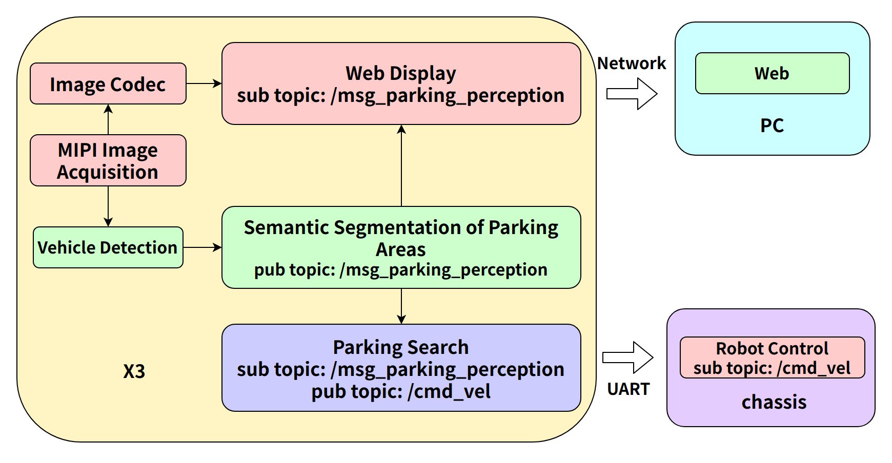
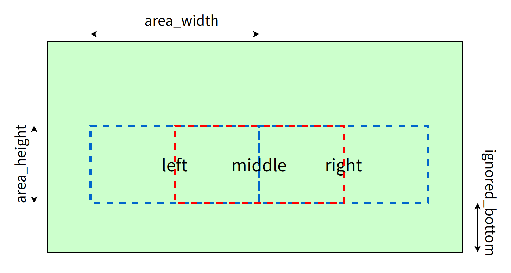
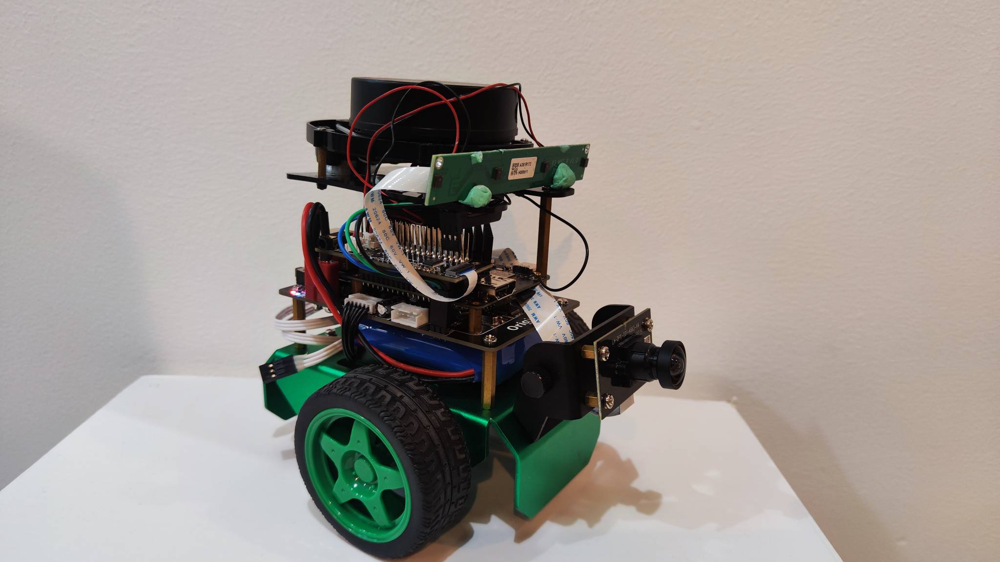

# 4.8 小车车位寻找

## 功能介绍

车位寻找控制App功能为通过车位检测算法指导机器人运动到停车位，包括左右旋转和前后平移运动。App由MIPI图像采集、车位检测算法、车位寻找控制策略、图像编解码、Web展示端组成，流程如下图：



App通过车位寻找控制策略发布的控制指令直接控制实物小车，也可以利用PC端Gazebo仿真环境下的虚拟小车进行测试。

代码仓库：<https://github.com/HorizonRDK/parking_search.git>

## 支持平台

| 平台    | 运行方式      | 示例功能                       |
| ------- | ------------ | ------------------------------ |
| RDK X3, RDK X3 Module | Ubuntu 20.04 | 启动MIPI/USB摄像头获取图像，并进行停车区域检测和车位寻找，最后通过实车运动展示寻找效果 |

## 设计说明

1.视野设置:

将视野场景区域分为“左”、“中”、“右”三个区域。计算每个区域内停车区域和行车区域的IOU，根据阈值判断对应区域类型，从而完成小车运动决策。



2.阈值设置:

| 视野区域 | 左 | 中 | 右 |
| - | - | - | - |
| 停车区域 IOU | 0.6 | 0.7 | 0.6 |
| 行车区域 IOU | 0.8 | 0.9 | 0.8 |

3.类别设置:

| 视野区域 | 道路 | 背景 | 车道线 | 标志线 | 车位线 | 车位区域 | 停车杆 | 地锁 |
| - | - | - | - | - | - | - | - | - |
| 停车区域 IOU | | | | | √ | √ | | |
| 行车区域 IOU | √ | | √ | √ | √ | √ | | |

说明：由于实际检测中，由于算法本身检测精度不能达到100%，存在将行车区域误检为停车区域的情况，因此计算行车区域时将停车区域类别包括其中。

4.算法流程:


## 准备工作

### 地平线RDK平台

1. 地平线RDK已烧录好地平线提供的Ubuntu 20.04系统镜像。

2. 地平线RDK已成功安装TogetheROS.Bot。

3. 地平线RDK已安装MIPI或者USB摄像头。

4. 一台古月居小车作为控制下位机。



## 使用介绍

### 地平线RDK平台

将小车置于水平地面，调整相机角度为水平，运行车位寻找App后，小车根据停车区域检测算法的结果，自动进行决策并控制小车运动，直到找到车位并进入车位停止。

APP启动后可以在PC端浏览器上渲染显示sensor发布的图片和对应的算法结果（浏览器输入http://IP:8000，IP为地平线RDK的IP地址）。

打开Web端，需打开界面右上角设置，选中”全图分割“选项，可显示渲染效果。（参考4.2 Boxs应用算法——室外停车区域检测）

启动古月居小车，在地平线RDK上运行控制下位机节点：

```shell
source /opt/tros/setup.bash
source /userdata/originbot/local_setup.bash
ros2 run originbot_base originbot_base
```

启动成功后，地平线RDK输出log信息：

```shell
Loading parameters:
 - port name: ttyS3
 - correct factor vx: 1.0000
 - correct factor vth: 1.000000
[INFO] [1662551769.540781132] [originbot_base]: originbot serial port opened
[INFO] [1662551769.741758424] [originbot_base]: IMU calibration ok.
[INFO] [1662551769.742268424] [originbot_base]: OriginBot Start, enjoy it.
```

**使用MIPI摄像头发布图片**

```shell
# 配置tros.b环境
source /opt/tros/setup.bash

# 从tros.b的安装路径中拷贝出运行示例需要的配置文件。
cp -r /opt/tros/${TROS_DISTRO}/lib/parking_perception/config/ .

# 配置MIPI摄像头
export CAM_TYPE=mipi

# 启动launch文件
ros2 launch parking_search parking_search.launch.py
```

**使用USB摄像头发布图片**

```shell
# 配置tros.b环境
source /opt/tros/setup.bash

# 从tros.b的安装路径中拷贝出运行示例需要的配置文件。
cp -r /opt/tros/${TROS_DISTRO}/lib/parking_perception/config/ .

# 配置USB摄像头
export CAM_TYPE=usb

# 启动launch文件
ros2 launch parking_search parking_search.launch.py
```

## 结果分析

1.小车在行车区域搜寻前进时地平线RDK运行终端输出log信息，其中控制小车以0.1m/s的速度前进运动（do move, direction: 0, step: 0.100000）。

```shell
[parking_search-4] [WARN] [1661942399.306904646] [ParkingSearchEngine]: do move, direction: 0, step: 0.100000
[parking_search-4] [WARN] [1661942399.343490021] [ParkingSearchEngine]: do move, direction: 0, step: 0.100000
[parking_perception-3] [WARN] [1661942399.347396979] [parking_perception]: input fps: 29.97, out fps: 29.67
[parking_search-4] [WARN] [1661942399.410602188] [ParkingSearchEngine]: do move, direction: 0, step: 0.100000
[parking_search-4] [WARN] [1661942399.449585563] [ParkingSearchEngine]: do move, direction: 0, step: 0.100000
```


2.小车发现车位后转向时在地平线RDK运行终端输出log信息:

```shell
[parking_search-4] [WARN] [1662539779.408424498] [ParkingSearchEngine]: do rotate, direction: 2, step: 0.100000
[parking_search-4] [WARN] [1662539779.442805415] [ParkingSearchEngine]: do rotate, direction: 2, step: 0.100000
[parking_search-4] [WARN] [1662539779.483669831] [ParkingSearchEngine]: do rotate, direction: 2, step: 0.100000
[parking_search-4] [WARN] [1662539779.522690915] [ParkingSearchEngine]: do rotate, direction: 2, step: 0.100000
[parking_search-4] [WARN] [1662539779.563660873] [ParkingSearchEngine]: do rotate, direction: 2, step: 0.100000
[parking_perception-3] [WARN] [1662539779.595755290] [parking_perception]: input fps: 29.87, out fps: 29.63
[parking_search-4] [WARN] [1662539779.604272498] [ParkingSearchEngine]: do rotate, direction: 2, step: 0.100000
```


3.小车确定车位后前进并最终停止时在地平线RDK运行终端输出log信息:

```shell
[parking_search-4] [WARN] [1662539796.196264298] [ParkingSearchEngine]: do move, direction: 0, step: 0.100000
[parking_search-4] [WARN] [1662539796.227805589] [ParkingSearchEngine]: Find Target, current count: 398, target count: 400
[parking_search-4] [WARN] [1662539796.267424798] [ParkingSearchEngine]: do move, direction: 0, step: 0.100000
[parking_search-4] [WARN] [1662539796.317332964] [ParkingSearchEngine]: Find Target, current count: 399, target count: 400
[parking_search-4] [WARN] [1662539796.346787673] [ParkingSearchEngine]: do move, direction: 0, step: 0.100000
[parking_search-4] [WARN] [1662539796.386203756] [ParkingSearchEngine]: Find Target, current count: 400, target count: 400
[parking_perception-3] [WARN] [1662539796.428427089] [ParkingSearchEngine]: input fps: 29.90, out fps: 29.74
[parking_search-4] [WARN] [1662539796.465178589] [ParkingSearchEngine]: Parking Area Arrived !!!
[parking_search-4] [WARN] [1662539796.506218048] [ParkingSearchEngine]: Parking Area Arrived !!!
[parking_search-4] [WARN] [1662539796.547036881] [ParkingSearchEngine]: Parking Area Arrived !!!

```


PC端在终端使用`ros2 topic list`命令可以查询到地平线RDK的topic信息：

```shell
$ ros2 topic list
/ai_msg_parking_perception
/cmd_vel
/hbmem_img080a1b02022201080403012021072312
/image
/imu
/odom
/originbot_status
/parameter_events
/rosout
/tf
```

其中`/image_jpeg`是地平线RDK发布的从MIPI sensor采集图像后经过JPEG格式编码的图片，`/ai_msg_parking_perception`是地平线RDK发布的包含车位检测信息的算法msg，`/cmd_vel`是地平线RDK发布的运动控制指令。
