# 3.2 应用算法

## 人体检测和跟踪{#detection_and_track}

### 功能介绍

人体检测和跟踪算法示例订阅图片，利用BPU进行算法推理，发布包含人体、人头、人脸、人手框和人体关键点检测结果msg，并通过多目标跟踪（multi-target tracking，即MOT）功能，实现检测框的跟踪。X86版本暂不支持多目标跟踪以及Web端展示功能。

算法支持的检测类别，以及不同类别在算法msg中对应的数据类型如下：

| 类别     | 说明 | 数据类型 |
| -------- | ----------- | ----------- |
| body     | 人体框      | Roi |
| head     | 人头框      | Roi |
| face     | 人脸框      | Roi |
| hand     | 人手框      | Roi |
| body_kps | 人体关键点  | Point |

人体关键点算法结果索引如下图：

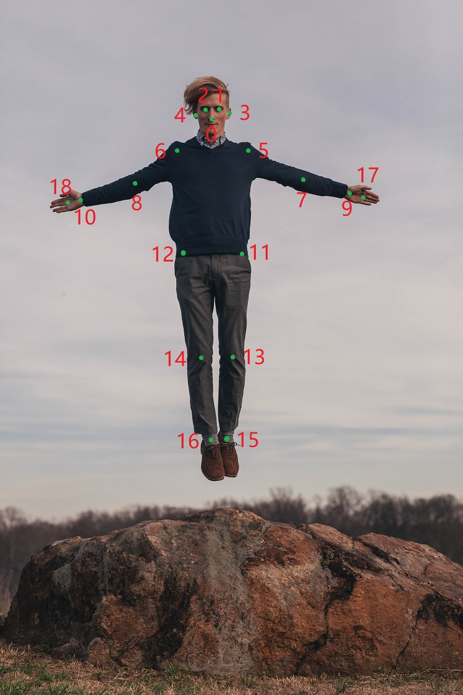


代码仓库：<https://github.com/HorizonRDK/mono2d_body_detection>

应用场景：人体检测和跟踪算法是人体运动视觉分析的重要组成部分，可实现人体姿态分析以及人流量统计等功能，主要应用于人机交互、游戏娱乐等领域。

姿态检测案例：[5.3. 姿态检测](../apps/fall_detection)    
小车人体跟随案例：[5.4. 小车人体跟随](../apps/car_tracking)  
基于人体姿态分析以及手势识别实现游戏人物控制案例：[玩转X3派，健身游戏两不误](https://developer.horizon.ai/forumDetail/112555512834430487)

### 支持平台

| 平台    | 运行方式      | 示例功能                       |
| ------- | ------------ | ------------------------------ |
| RDK X3, RDK X3 Module, RDK X5 Ultra| Ubuntu 20.04 | · 启动MIPI/USB摄像头/本地回灌，并通过Web展示推理渲染结果 |
| X86     | Ubuntu 20.04 | · 启动本地回灌，并通过Web展示推理渲染结果 |

### 准备工作

#### 地平线RDK平台

1. 地平线RDK已烧录好地平线提供的Ubuntu 20.04系统镜像。

2. 地平线RDK已成功安装TogetheROS.Bot。

3. 地平线RDK已安装MIPI或者USB摄像头。

4. 确认PC机能够通过网络访问地平线RDK。

#### X86平台

1. X86环境已配置Ubuntu 20.04系统镜像。

2. X86环境已成功安装tros.b。

### 使用介绍

人体检测和跟踪(mono2d_body_detection)package订阅sensor package发布的图片，经过推理后发布算法msg，通过websocket package实现在PC端浏览器上渲染显示sensor发布的图片和对应的算法结果。

#### 地平线RDK平台

**使用MIPI摄像头发布图片**

```shell
# 配置tros.b环境
source /opt/tros/setup.bash

# 从tros.b的安装路径中拷贝出运行示例需要的配置文件。
cp -r /opt/tros/lib/mono2d_body_detection/config/ .

# 配置MIPI摄像头
export CAM_TYPE=mipi

# 启动launch文件
ros2 launch mono2d_body_detection mono2d_body_detection.launch.py
```

**使用USB摄像头发布图片**

```shell
# 配置tros.b环境
source /opt/tros/setup.bash

# 从tros.b的安装路径中拷贝出运行示例需要的配置文件。
cp -r /opt/tros/lib/mono2d_body_detection/config/ .

# 配置USB摄像头
export CAM_TYPE=usb

# 启动launch文件
ros2 launch mono2d_body_detection mono2d_body_detection.launch.py
```

**使用本地回灌图片**

```shell
# 配置tros.b环境
source /opt/tros/setup.bash

# 从tros.b的安装路径中拷贝出运行示例需要的配置文件。
cp -r /opt/tros/lib/mono2d_body_detection/config/ .
cp -r /opt/tros/lib/dnn_node_example/config/ .

# 配置本地回灌图片
export CAM_TYPE=fb

# 启动launch文件
ros2 launch mono2d_body_detection mono2d_body_detection.launch.py
```

#### X86平台

**使用本地回灌图片**

```shell
# 配置tros.b环境
source /opt/tros/setup.bash

# 从tros.b的安装路径中拷贝出运行示例需要的配置文件。
cp -r /opt/tros/lib/mono2d_body_detection/config/ .
cp -r /opt/tros/lib/dnn_node_example/config/ .

# 配置本地回灌图片
export CAM_TYPE=fb

# 启动launch文件
ros2 launch mono2d_body_detection mono2d_body_detection.launch.py
```

### 结果分析

在运行终端输出如下信息：

```shell
[mono2d_body_detection-3] [WARN] [1660219823.214730286] [example]: This is mono2d body det example!
[mono2d_body_detection-3] [WARN] [1660219823.417856952] [mono2d_body_det]: Parameter:
[mono2d_body_detection-3]  is_sync_mode_: 0
[mono2d_body_detection-3]  model_file_name_: config/multitask_body_head_face_hand_kps_960x544.hbm
[mono2d_body_detection-3]  is_shared_mem_sub: 1
[mono2d_body_detection-3]  ai_msg_pub_topic_name: /hobot_mono2d_body_detection
[mono2d_body_detection-3] [C][31082][08-11][20:10:23:425][configuration.cpp:49][EasyDNN]EasyDNN version: 0.4.11
[mono2d_body_detection-3] [BPU_PLAT]BPU Platform Version(1.3.1)!
[mono2d_body_detection-3] [HBRT] set log level as 0. version = 3.14.5
[mono2d_body_detection-3] [DNN] Runtime version = 1.9.7_(3.14.5 HBRT)
[mono2d_body_detection-3] [WARN] [1660219823.545293244] [mono2d_body_det]: Create hbmem_subscription with topic_name: /hbmem_img
[mono2d_body_detection-3] (MOTMethod.cpp:39): MOTMethod::Init config/iou2_euclid_method_param.json
[mono2d_body_detection-3] 
[mono2d_body_detection-3] (IOU2.cpp:34): IOU2 Mot::Init config/iou2_euclid_method_param.json
[mono2d_body_detection-3] 
[mono2d_body_detection-3] (MOTMethod.cpp:39): MOTMethod::Init config/iou2_method_param.json
[mono2d_body_detection-3] 
[mono2d_body_detection-3] (IOU2.cpp:34): IOU2 Mot::Init config/iou2_method_param.json
[mono2d_body_detection-3] 
[mono2d_body_detection-3] (MOTMethod.cpp:39): MOTMethod::Init config/iou2_method_param.json
[mono2d_body_detection-3] 
[mono2d_body_detection-3] (IOU2.cpp:34): IOU2 Mot::Init config/iou2_method_param.json
[mono2d_body_detection-3] 
[mono2d_body_detection-3] (MOTMethod.cpp:39): MOTMethod::Init config/iou2_method_param.json
[mono2d_body_detection-3] 
[mono2d_body_detection-3] (IOU2.cpp:34): IOU2 Mot::Init config/iou2_method_param.json
[mono2d_body_detection-3] 
[mono2d_body_detection-3] [WARN] [1660219824.895102286] [mono2d_body_det]: input fps: 31.34, out fps: 31.22
[mono2d_body_detection-3] [WARN] [1660219825.921873870] [mono2d_body_det]: input fps: 30.16, out fps: 30.21
[mono2d_body_detection-3] [WARN] [1660219826.922075496] [mono2d_body_det]: input fps: 30.16, out fps: 30.00
[mono2d_body_detection-3] [WARN] [1660219827.955463330] [mono2d_body_det]: input fps: 30.01, out fps: 30.01
[mono2d_body_detection-3] [WARN] [1660219828.955764872] [mono2d_body_det]: input fps: 30.01, out fps: 30.00
```

输出log显示，程序运行成功，推理时算法输入和输出帧率为30fps，每秒钟刷新一次统计帧率。

在PC端的浏览器输入http://IP:8000 即可查看图像和算法（人体、人头、人脸、人手检测框，检测框类型和目标跟踪ID，人体关键点）渲染效果（IP为地平线RDK/X86设备的IP地址）：


## 人手关键点检测

### 功能介绍

人手关键点检测算法示例订阅图片和包含人手框信息的智能msg，利用BPU进行算法推理，发布包含人手关键点信息的算法msg。

人手关键点索引如下图：

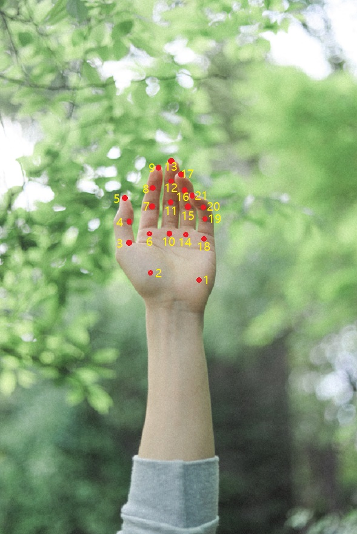

代码仓库：

<https://github.com/HorizonRDK/hand_lmk_detection>

<https://github.com/HorizonRDK/mono2d_body_detection>

应用场景：人手关键点检测算法主要用于捕捉人手部的骨骼关键点，可实现自定义手势识别等功能，主要应用于智能家居、虚拟现实、游戏娱乐等领域。

### 支持平台

| 平台    | 运行方式      | 示例功能                       |
| ------- | ------------ | ------------------------------ |
| RDK X3, RDK X3 Module, RDK X5 Ultra| Ubuntu 20.04 | · 启动MIPI/USB摄像头，并通过web展示推理渲染结果 |

### 准备工作

#### 地平线RDK平台

1. 地平线RDK已烧录好地平线提供的Ubuntu 20.04系统镜像。

2. 地平线RDK已成功安装TogetheROS.Bot。

3. 地平线RDK已安装MIPI或者USB摄像头。

4. 确认PC机能够通过网络访问地平线RDK。

### 使用介绍

人手关键点检测(hand_lmk_detection)package订阅sensor package发布的图片以及人体检测和跟踪package发布的人手框检测结果，经过推理后发布算法msg，通过websocket package实现在PC端浏览器上渲染显示发布的图片和对应的算法结果。

**使用MIPI摄像头发布图片**

```shell
# 配置tros.b环境
source /opt/tros/setup.bash

# 从tros.b的安装路径中拷贝出运行示例需要的配置文件。
cp -r /opt/tros/lib/mono2d_body_detection/config/ .
cp -r /opt/tros/lib/hand_lmk_detection/config/ .

# 配置MIPI摄像头
export CAM_TYPE=mipi

# 启动launch文件
ros2 launch hand_lmk_detection hand_lmk_detection.launch.py
```

**使用USB摄像头发布图片**

```shell
# 配置tros.b环境
source /opt/tros/setup.bash

# 从tros.b的安装路径中拷贝出运行示例需要的配置文件。
cp -r /opt/tros/lib/mono2d_body_detection/config/ .
cp -r /opt/tros/lib/hand_lmk_detection/config/ .

# 配置USB摄像头
export CAM_TYPE=usb

# 启动launch文件
ros2 launch hand_lmk_detection hand_lmk_detection.launch.py
```

### 结果分析

在运行终端输出如下信息：

```shell
[mono2d_body_detection-3] (MOTMethod.cpp:39): MOTMethod::Init config/iou2_euclid_method_param.json
[mono2d_body_detection-3] 
[mono2d_body_detection-3] (IOU2.cpp:34): IOU2 Mot::Init config/iou2_euclid_method_param.json
[mono2d_body_detection-3] 
[mono2d_body_detection-3] (MOTMethod.cpp:39): MOTMethod::Init config/iou2_method_param.json
[mono2d_body_detection-3] 
[mono2d_body_detection-3] (IOU2.cpp:34): IOU2 Mot::Init config/iou2_method_param.json
[mono2d_body_detection-3] 
[mono2d_body_detection-3] (MOTMethod.cpp:39): MOTMethod::Init config/iou2_method_param.json
[mono2d_body_detection-3] 
[mono2d_body_detection-3] (IOU2.cpp:34): IOU2 Mot::Init config/iou2_method_param.json
[mono2d_body_detection-3] 
[mono2d_body_detection-3] (MOTMethod.cpp:39): MOTMethod::Init config/iou2_method_param.json
[mono2d_body_detection-3] 
[mono2d_body_detection-3] (IOU2.cpp:34): IOU2 Mot::Init config/iou2_method_param.json
[mono2d_body_detection-3] 
[hand_lmk_detection-4] [WARN] [1660269063.553205182] [hand_lmk_det]: input fps: 31.43, out fps: 31.47
[hand_lmk_detection-4] [WARN] [1660269064.579457516] [hand_lmk_det]: input fps: 30.21, out fps: 30.21
[hand_lmk_detection-4] [WARN] [1660269065.612579058] [hand_lmk_det]: input fps: 30.01, out fps: 30.01
[hand_lmk_detection-4] [WARN] [1660269066.612778892] [hand_lmk_det]: input fps: 30.00, out fps: 30.00
[hand_lmk_detection-4] [WARN] [1660269067.646101309] [hand_lmk_det]: input fps: 30.01, out fps: 30.01
[hand_lmk_detection-4] [WARN] [1660269068.679036184] [hand_lmk_det]: input fps: 30.04, out fps: 30.04
```

输出log显示，程序运行成功，推理时算法输入和输出帧率为30fps，每秒钟刷新一次统计帧率。

在PC端的浏览器输入http://IP:8000 即可查看图像和算法渲染效果（IP为地平线RDK的IP地址）：


## 手势识别

### 功能介绍

手势识别算法示例订阅包含人手框、人手关键点信息的算法msg，利用BPU进行推理，发布包含手势信息的智能结果msg。

算法支持的手势识别类别，以及手势类别在算法msg（Attribute成员，type为"gesture"）中对应的数值如下：

| 手势       | 说明 | 数值 |
| ---------- | ---------- | ---------- |
| ThumbUp    | 竖起大拇指 | 2 |
| Victory    | “V”手势    | 3 |
| Mute       | “嘘”手势   | 4 |
| Palm       | 手掌       | 5 |
| Okay       | OK手势     | 11 |
| ThumbLeft  | 大拇指向左 | 12 |
| ThumbRight | 大拇指向右 | 13 |
| Awesome    | 666手势    | 14 |

代码仓库：

<https://github.com/HorizonRDK/hand_lmk_detection>

<https://github.com/HorizonRDK/hand_gesture_detection>

<https://github.com/HorizonRDK/mono2d_body_detection>

应用场景：手势识别算法集成了人手关键点检测，手势分析等技术，使得计算机能够将人的手势解读为对应指令，可实现手势控制以及手语翻译等功能，主要应用于智能家居，智能座舱、智能穿戴设备等领域。

小车手势控制案例：[5.5. 小车手势控制 — 地平线机器人平台用户手册](../apps/car_gesture_control)

基于手势识别以及人体姿态分析实现游戏人物控制案例：[玩转X3派，健身游戏两不误](https://developer.horizon.ai/forumDetail/112555512834430487)

### 支持平台

| 平台    | 运行方式      | 示例功能                       |
| ------- | ------------- | ------------------------------ |
| RDK X3, RDK X3 Module, RDK X5 Ultra| Ubuntu 20.04  | · 启动MIPI/USB摄像头，并通过Web展示推理渲染结果 |

### 准备工作

#### 地平线RDK平台

1. 地平线RDK已烧录好地平线提供的Ubuntu 20.04系统镜像。

2. 地平线RDK已成功安装TogetheROS.Bot。

3. 地平线RDK已安装MIPI或者USB摄像头。

4. 确认PC机能够通过网络访问地平线RDK。

### 使用介绍

手势识别(hand_gesture_detection)package订阅人手关键点检测package发布的人手关键点检测结果，经过推理后发布算法msg，通过websocket package实现在PC端浏览器上渲染显示发布的图片和对应的算法结果。

**使用MIPI摄像头发布图片**

```shell
# 配置tros.b环境
source /opt/tros/setup.bash

# 从tros.b的安装路径中拷贝出运行示例需要的配置文件。
cp -r /opt/tros/lib/mono2d_body_detection/config/ .
cp -r /opt/tros/lib/hand_lmk_detection/config/ .
cp -r /opt/tros/lib/hand_gesture_detection/config/ .

# 配置MIPI摄像头
export CAM_TYPE=mipi

# 启动launch文件
ros2 launch hand_gesture_detection hand_gesture_detection.launch.py
```

**使用USB摄像头发布图片**

```shell
# 配置tros.b环境
source /opt/tros/setup.bash

# 从tros.b的安装路径中拷贝出运行示例需要的配置文件。
cp -r /opt/tros/lib/mono2d_body_detection/config/ .
cp -r /opt/tros/lib/hand_lmk_detection/config/ .
cp -r /opt/tros/lib/hand_gesture_detection/config/ .

# 配置USB摄像头
export CAM_TYPE=usb

# 启动launch文件
ros2 launch hand_gesture_detection hand_gesture_detection.launch.py
```

### 结果分析

在运行终端输出如下信息：

```shell
[hand_gesture_detection-5] [C][32711][08-12][09:39:39:575][configuration.cpp:49][EasyDNN]EasyDNN version: 0.4.11
[hand_gesture_detection-5] [DNN] Runtime version = 1.9.7_(3.14.5 HBRT)
[hand_gesture_detection-5] [WARN] [1660268379.611419981] [hand gesture det node]: input_idx: 0, tensorType = 8, tensorLayout = 0
[hand_gesture_detection-5] [WARN] [1660268379.619313022] [hand gesture det node]: Create subscription with topic_name: /hobot_hand_lmk_detection
[hand_gesture_detection-5] [WARN] [1660268379.629207314] [hand gesture det node]: ai_msg_pub_topic_name: /hobot_hand_gesture_detection
[mono2d_body_detection-3] (MOTMethod.cpp:39): MOTMethod::Init config/iou2_euclid_method_param.json
[mono2d_body_detection-3] 
[mono2d_body_detection-3] (IOU2.cpp:34): IOU2 Mot::Init config/iou2_euclid_method_param.json
[mono2d_body_detection-3] 
[mono2d_body_detection-3] (MOTMethod.cpp:39): MOTMethod::Init config/iou2_method_param.json
[mono2d_body_detection-3] 
[mono2d_body_detection-3] (IOU2.cpp:34): IOU2 Mot::Init config/iou2_method_param.json
[mono2d_body_detection-3] 
[mono2d_body_detection-3] (MOTMethod.cpp:39): MOTMethod::Init config/iou2_method_param.json
[mono2d_body_detection-3] 
[mono2d_body_detection-3] (IOU2.cpp:34): IOU2 Mot::Init config/iou2_method_param.json
[mono2d_body_detection-3] 
[mono2d_body_detection-3] (MOTMethod.cpp:39): MOTMethod::Init config/iou2_method_param.json
[mono2d_body_detection-3] 
[mono2d_body_detection-3] (IOU2.cpp:34): IOU2 Mot::Init config/iou2_method_param.json
[mono2d_body_detection-3] 
[hand_gesture_detection-5] [WARN] [1660268381.026173815] [hand_gesture_det]: Sub smart fps 31.16
[hand_gesture_detection-5] [WARN] [1660268381.206196565] [hand_gesture_det]: Pub smart fps 30.17
[hand_gesture_detection-5] [WARN] [1660268382.054034899] [hand_gesture_det]: Sub smart fps 30.19
[hand_gesture_detection-5] [WARN] [1660268382.234087357] [hand_gesture_det]: Pub smart fps 30.19
[hand_gesture_detection-5] [WARN] [1660268383.055988982] [hand_gesture_det]: Sub smart fps 29.97
[hand_gesture_detection-5] [WARN] [1660268383.235230316] [hand_gesture_det]: Pub smart fps 30.00
[hand_gesture_detection-5] [WARN] [1660268384.087152150] [hand_gesture_det]: Sub smart fps 30.10
[hand_gesture_detection-5] [WARN] [1660268384.256141566] [hand_gesture_det]: Pub smart fps 30.39
```

输出log显示，程序运行成功，推理时算法输入和输出帧率为30fps，每秒钟刷新一次统计帧率。

输出log显示，订阅到的算法msg中有一个hand（包含人手框和人手关键点检测结果），手势识别算法输出的手势分类结果是“Palm”手势（分类结果为5）。

在PC端的浏览器输入http://IP:8000 即可查看图像和算法渲染效果（IP为地平线RDK的IP地址）：

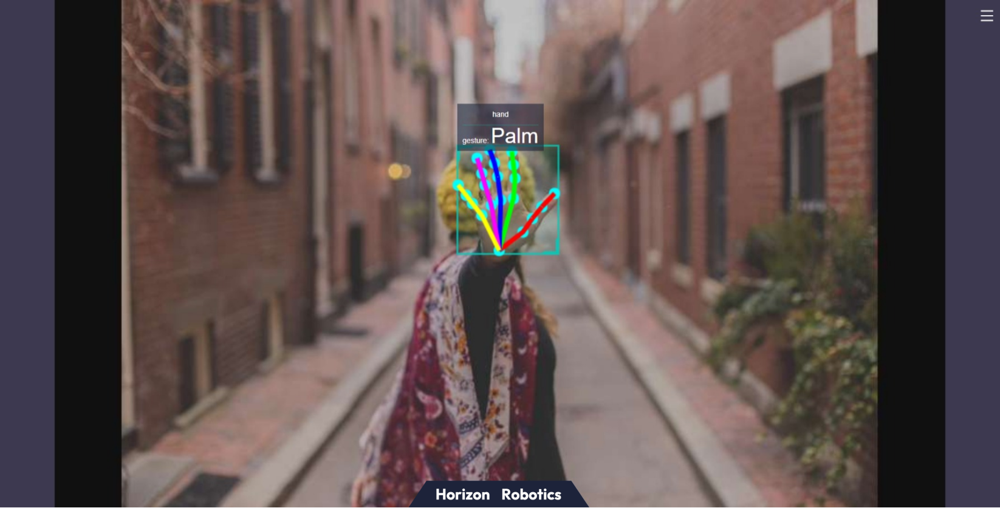

## 单目3D室内检测

### 功能介绍

mono3d_indoor_detection package是基于hobot_dnn package开发的室内物体3D检测算法示例，在地平线的地平线RDK上使用3D检测模型和室内数据利用BPU进行模型推理，从而得到推理结果。

相比于2D目标检测只能够识别出物体的类别和检测框，3D目标检测能够识别出物体的精确位置和朝向。例如在导航避障应用场景下，3D目标检测算法提供的丰富信息可以帮助规划控制模块实现更好的避障效果。

算法支持的室内物体检测类别包括：充电座、垃圾桶、拖鞋。

每个类别的检测结果包括：

- 长、宽、高：三维物体（即六面体）的长、宽、高，单位为米。

- 转向：物体相对于相机的朝向，单位弧度，取值范围为-π~ π，表示在相机坐标系下物体前进方向与相机坐标系x轴的夹角。

- 深度信息：相机到物体的距离，单位为米。

代码仓库：<https://github.com/HorizonRDK/mono3d_indoor_detection>

应用场景：单目3D室内检测算法能够直接识别出图片中物体的确切位置和朝向，可实现物体姿态的识别，主要应用于自动驾驶、智能家居等领域。

单目3D车辆检测案例：<https://github.com/RayXie29/Kaggle-Peking-University-Baidu-Autonomous-Driving-32-place-solution>

### 支持平台

| 平台     | 运行方式     | 示例功能                       |
| -------- | ------------ | ------------------------------ |
| RDK X3, RDK X3 Module | Ubuntu 20.04 | · 启动MIPI/USB摄像头/本地回灌，推理渲染结果保存在本地 |
| X86      | Ubuntu       | · 启动本地回灌，推理渲染结果保存在本地 |

### 准备工作

#### 地平线RDK平台

1. 地平线RDK已烧录好地平线提供的Ubuntu 20.04系统镜像。

2. 地平线RDK已成功安装TogetheROS.Bot。

#### X86平台

1. X86环境已配置Ubuntu 20.04系统镜像。

2. X86环境已成功安装tros.b。

### 使用介绍

因3D检测模型与相机参数相关，不同相机需要进行参数等调整。

单目3D室内检测算法示例package采取读取本地图片的形式进行检测推理，经过算法推理后检测出物体类别和3D定位信息，并且对外发布3D检测信息的算法msg。用户可以订阅3D检测结果msg用于应用开发。

#### 地平线RDK平台

```shell
# 配置ROS2环境
source /opt/tros/setup.bash

# 从tros.b的安装路径中拷贝出运行示例需要的配置文件。
cp -r /opt/tros/lib/mono3d_indoor_detection/config/ .

# 启动launch文件
ros2 launch mono3d_indoor_detection mono3d_indoor_detection.launch.py 
```

#### X86平台

```shell
# 配置ROS2环境
source /opt/tros/setup.bash

# 从tros.b的安装路径中拷贝出运行示例需要的配置文件。
cp -r /opt/tros/lib/mono3d_indoor_detection/config/ .

# 启动launch文件
ros2 launch mono3d_indoor_detection mono3d_indoor_detection.launch.py 
```

### 结果分析

mono3d_indoor_detection package处理完一帧图片数据后，在运行终端输出如下信息：

```shell
[mono3d_indoor_detection-1] [INFO] [1662612553.868256257] [mono3d_detection]: target type: trash_can
[mono3d_indoor_detection-1] [INFO] [1662612553.868303755] [mono3d_detection]: target type: width, value: 0.236816
[mono3d_indoor_detection-1] [INFO] [1662612553.868358420] [mono3d_detection]: target type: height, value: 0.305664
[mono3d_indoor_detection-1] [INFO] [1662612553.868404002] [mono3d_detection]: target type: length, value: 0.224182
[mono3d_indoor_detection-1] [INFO] [1662612553.868448000] [mono3d_detection]: target type: rotation, value: -1.571989
[mono3d_indoor_detection-1] [INFO] [1662612553.868487790] [mono3d_detection]: target type: x, value: -0.191978
[mono3d_indoor_detection-1] [INFO] [1662612553.868530705] [mono3d_detection]: target type: y, value: -0.143963
[mono3d_indoor_detection-1] [INFO] [1662612553.868570870] [mono3d_detection]: target type: z, value: 0.714024
[mono3d_indoor_detection-1] [INFO] [1662612553.868611119] [mono3d_detection]: target type: depth, value: 0.714024
[mono3d_indoor_detection-1] [INFO] [1662612553.868651409] [mono3d_detection]: target type: score, value: 0.973215
[mono3d_indoor_detection-1] [INFO] [1662612553.868760238] [mono3d_detection]: target type: trash_can
[mono3d_indoor_detection-1] [INFO] [1662612553.868799486] [mono3d_detection]: target type: width, value: 0.253052
[mono3d_indoor_detection-1] [INFO] [1662612553.868842610] [mono3d_detection]: target type: height, value: 0.282349
[mono3d_indoor_detection-1] [INFO] [1662612553.868885191] [mono3d_detection]: target type: length, value: 0.257935
[mono3d_indoor_detection-1] [INFO] [1662612553.868929273] [mono3d_detection]: target type: rotation, value: -1.542728
[mono3d_indoor_detection-1] [INFO] [1662612553.868968855] [mono3d_detection]: target type: x, value: 0.552460
[mono3d_indoor_detection-1] [INFO] [1662612553.869010645] [mono3d_detection]: target type: y, value: -0.164073
[mono3d_indoor_detection-1] [INFO] [1662612553.869050018] [mono3d_detection]: target type: z, value: 1.088358
[mono3d_indoor_detection-1] [INFO] [1662612553.869088767] [mono3d_detection]: target type: depth, value: 1.088358
[mono3d_indoor_detection-1] [INFO] [1662612553.869126765] [mono3d_detection]: target type: score, value: 0.875521
```

log截取显示了一帧的处理结果，结果显示，订阅到的算法msg中的target type即分类结果为trash_can，同时也给出了trash_can的三维和距离以及旋转角度信息。

读取本地图片（可以通过修改mono3d_indoor_detection.launch.py中feed_image字段替换图片）渲染的结果保存成图片在程序运行的result目录下。对应图片推理结果以及渲染信息如下：

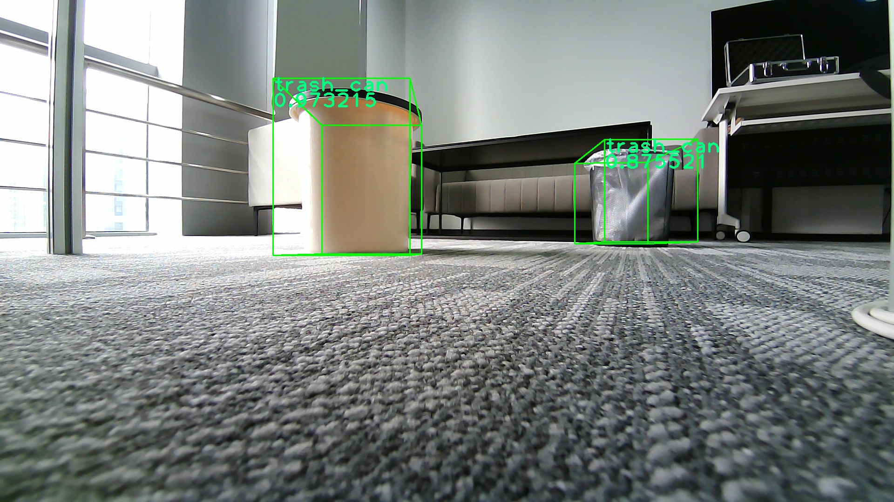

## 单目高程网络检测

### 功能介绍

elevation_net是基于hobot_dnn package开发的高程网络检测算法示例，在地平线的地平线RDK上使用高程网络模型和室内数据利用BPU进行模型推理，从而得到算法推理结果。

代码仓库：<https://github.com/HorizonRDK/elevation_net>

应用场景：单目高程网络检测算法通过解析图片得到像素点的深度和高度信息，主要应用于自动驾驶、智能家居、智能交通等领域。

### 支持平台

| 平台    | 运行方式     | 示例功能                       |
| ------- | ------------ | ------------------------------ |
| RDK X3, RDK X3 Module| Ubuntu 20.04 | · 启动本地回灌，推理渲染结果保存在本地 |
| X86     | Ubuntu 20.04 | · 启动本地回灌，推理渲染结果保存在本地 |

### 准备工作

#### 地平线RDK平台

1. 地平线RDK已烧录好地平线提供的Ubuntu 20.04系统镜像。

2. 地平线RDK已成功安装TogetheROS.Bot。

#### X86平台

1. X86环境已配置Ubuntu 20.04系统镜像。

2. X86环境已成功安装tros.b。

### 使用介绍

单目高程网络检测算法示例package采用读取本地图片的形式，经过算法推理后检测出Image基于像素的深度和高度信息，同时package将深度和高度信息进行处理，发布PointCloud2话题数据，用户可以订阅PointCloud2数据用于应用开发。

#### 地平线RDK平台

```shell
# 配置ROS2环境
source /opt/tros/setup.bash

# 从tros.b的安装路径中拷贝出运行示例需要的配置文件。
cp -r /opt/tros/lib/elevation_net/config/ .

# 启动launch文件
ros2 launch elevation_net elevation_net.launch.py
```

#### X86平台

```shell
# 配置ROS2环境
source /opt/tros/setup.bash

# 从tros.b的安装路径中拷贝出运行示例需要的配置文件。
cp -r /opt/tros/lib/elevation_net/config/ .

# 启动launch文件
ros2 launch elevation_net elevation_net.launch.py
```

### 结果分析

package在运行终端推理输出如下信息：

```shell
[16:15:17:520]root@ubuntu:/userdata# ros2 run elevation_net elevation_net
[16:15:18:976][WARN] [1655108119.406738772] [example]: This is dnn node example!
[16:15:19:056][WARN] [1655108119.475098438] [elevation_dection]: Parameter:
[16:15:19:056]config_file_path_:./config
[16:15:19:056] model_file_name_: ./config/elevation.hbm
[16:15:19:058]feed_image:./config/images/charging_base.png
[16:15:19:058][INFO] [1655108119.475257138] [dnn]: Node init.
[16:15:19:058][INFO] [1655108119.475309553] [elevation_dection]: Set node para.
[16:15:19:058][INFO] [1655108119.475370258] [dnn]: Model init.
[16:15:19:058][BPU_PLAT]BPU Platform Version(1.3.1)!
[16:15:19:095][HBRT] set log level as 0. version = 3.13.27
[16:15:19:095][DNN] Runtime version = 1.8.4_(3.13.27 HBRT)
[16:15:19:133][000:000] (model.cpp:244): Empty desc, model name: elevation, input branch:0, input name:inputquanti-_output
[16:15:19:133][000:000] (model.cpp:244): Empty desc, model name: elevation, input branch:1, input name:inputquanti2-_output
[16:15:19:134][000:000] (model.cpp:313): Empty desc, model name: elevation, output branch:0, output name:output_block1quanticonvolution0_conv_output
[16:15:19:134][INFO] [1655108119.528437276] [dnn]: The model input 0 width is 960 and height is 512
[16:15:19:134][INFO] [1655108119.528535271] [dnn]: The model input 1 width is 960 and height is 512
[16:15:19:134][INFO] [1655108119.528598393] [dnn]: Task init.
[16:15:19:135][INFO] [1655108119.530435806] [dnn]: Set task_num [2]
[16:15:19:135][INFO] [1655108119.530549051] [elevation_dection]: The model input width is 960 and height is 512
[16:15:19:158][INFO] [1655108119.559583836] [elevation_dection]: read image: ./config/images/charging_base.png to detect
[16:15:19:299][WARN] [1655108119.731084555] [elevation_dection]: start success!!!
[16:15:19:351][INFO] [1655108119.779924566] [elevation_net_parser]: fx_inv_: 0.000605
[16:15:19:383][INFO] [1655108119.780357879] [elevation_net_parser]: fy_inv_: 0.000604
[16:15:19:383][INFO] [1655108119.780576493] [elevation_net_parser]: cx_inv_: -0.604389
[16:15:19:383][INFO] [1655108119.780654031] [elevation_net_parser]: cy_inv_: -0.318132
[16:15:19:384][INFO] [1655108119.780751527] [elevation_net_parser]: nx_: 0.000000
[16:15:19:384][INFO] [1655108119.780858063] [elevation_net_parser]: ny_: 0.000000
[16:15:19:384][INFO] [1655108119.780962558] [elevation_net_parser]: nz_: 1.000000
[16:15:19:384][INFO] [1655108119.781067928] [elevation_net_parser]: camera_height: 1.000000
[16:15:19:385][INFO] [1655108119.781833267] [elevation_net_parser]: model out width: 480, height: 256
[16:15:19:416][INFO] [1655108119.808395254] [elevation_net_parser]: depth: 998.000000
[16:15:19:416][INFO] [1655108119.808593786] [elevation_net_parser]: height: -42.699909
[16:15:19:416][INFO] [1655108119.808644533] [elevation_net_parser]: depth: 998.000000
[16:15:19:416][INFO] [1655108119.808692531] [elevation_net_parser]: height: -25.339746
[16:15:19:416][INFO] [1655108119.808739279] [elevation_net_parser]: depth: 998.000000
[16:15:19:416][INFO] [1655108119.808785527] [elevation_net_parser]: height: -22.111366
[16:15:19:416][INFO] [1655108119.808832774] [elevation_net_parser]: depth: 998.000000
[16:15:19:416][INFO] [1655108119.808878606] [elevation_net_parser]: height: -25.339746
[16:15:19:416][INFO] [1655108119.808925645] [elevation_net_parser]: depth: 998.000000
[16:15:19:416][INFO] [1655108119.808971809] [elevation_net_parser]: height: -21.989540
[16:15:19:416][INFO] [1655108119.809017516] [elevation_net_parser]: depth: 998.000000
[16:15:19:416][INFO] [1655108119.809063138] [elevation_net_parser]: height: -48.303890
[16:15:19:416][INFO] [1655108119.809109678] [elevation_net_parser]: depth: 998.000000
[16:15:19:416][INFO] [1655108119.809155592] [elevation_net_parser]: height: -32.527466
[16:15:19:416][INFO] [1655108119.809202548] [elevation_net_parser]: depth: 998.000000
[16:15:19:416][INFO] [1655108119.809247880] [elevation_net_parser]: height: -32.710201
[16:15:19:416][INFO] [1655108119.809294669] [elevation_net_parser]: depth: 998.000000
[16:15:19:416][INFO] [1655108119.809340542] [elevation_net_parser]: height: -33.014767
[16:15:19:417][INFO] [1655108119.809387165] [elevation_net_parser]: depth: 998.000000
[16:15:19:417][INFO] [1655108119.809433454] [elevation_net_parser]: height: -35.451283
[16:15:19:417][INFO] [1655108119.809480202] [elevation_net_parser]: depth: 998.000000
[16:15:19:417][INFO] [1655108119.809527158] [elevation_net_parser]: height: -38.192360
[16:15:19:417][INFO] [1655108119.809573906] [elevation_net_parser]: depth: 998.000000
[16:15:19:417][INFO] [1655108119.809619820] [elevation_net_parser]: height: -34.233025
[16:15:19:417][INFO] [1655108119.809667235] [elevation_net_parser]: depth: 998.000000
[16:15:19:417][INFO] [1655108119.809713357] [elevation_net_parser]: height: -34.233025
[16:15:19:417][INFO] [1655108119.809759397] [elevation_net_parser]: depth: 998.000000
[16:15:19:417][INFO] [1655108119.809805686] [elevation_net_parser]: height: -33.014767
[16:15:19:417][INFO] [1655108119.809852643] [elevation_net_parser]: depth: 998.000000
[16:15:19:417][INFO] [1655108119.809899307] [elevation_net_parser]: height: -34.354851
[16:15:19:417][INFO] [1655108119.809945930] [elevation_net_parser]: depth: 998.000000
[16:15:19:417][INFO] [1655108119.809991844] [elevation_net_parser]: height: -35.024891
[16:15:19:417][INFO] [1655108119.810038384] [elevation_net_parser]: depth: 998.000000
[16:15:19:417][INFO] [1655108119.810084715] [elevation_net_parser]: height: -41.298916
[16:15:19:417][INFO] [1655108119.810131296] [elevation_net_parser]: depth: 998.000000
[16:15:19:417][INFO] [1655108119.810268706] [elevation_net_parser]: height: -33.745720
[16:15:19:417][INFO] [1655108119.810317745] [elevation_net_parser]: depth: 998.000000
[16:15:19:417][INFO] [1655108119.810364285] [elevation_net_parser]: height: -32.710201
[16:15:19:417][INFO] [1655108119.810410741] [elevation_net_parser]: depth: 998.000000
```

log显示，读取本地图片推理之后输出image基于像素的深度和高度信息。

## 智能语音

### 功能介绍

地平线智能语音算法采用本地离线模式，订阅音频数据后送给BPU处理，然后发布**唤醒、命令词识别**、**声源定位DOA角度信息**以及**语音ASR识别结果**等消息。智能语音功能的实现对应于TogetheROS.Bot的**hobot_audio** package，适用于地平线RDK配套的环形和线形四麦阵列。

代码仓库：<https://github.com/HorizonRDK/hobot_audio.git>

应用场景：智能语音算法能够识别音频中的唤醒词以及自定义的命令词，并将语音内容解读为对应指令或转化为文字，可实现语音控制以及语音翻译等功能，主要应用于智能家居、智能座舱、智能穿戴设备等领域。

语音控制小车运动案例：[5.6. 语音控制小车运动](../apps/car_audio_control)

### 支持平台

| 平台    | 运行方式     | 示例功能                       |
| ------- | ------------ | ------------------------------ |
| RDK X3| Ubuntu 20.04 | 启动音频模块算法，并在终端显示结果 |

**注意：仅支持RDK X3，RDK X3 Module暂不支持。**

### 准备工作

1. 地平线RDK已烧录好地平线提供的Ubuntu 20.04系统镜像。
2. 地平线RDK已成功安装TogetheROS.Bot。
3. 地平线RDK已成功安装智能语音算法包，安装命令：`apt update; apt install tros-hobot-audio`。
4. 按照以下方法在地平线RDK上接好环形或线形四麦音频板。

#### 连接音频板

##### 接口连接

###### 环形麦克风阵列

环形麦克风板为一体化设计，实物如下图：


购买链接如下：

<https://www.waveshare.net/shop/Audio-Driver-HAT.htm>

连接步骤：

1. 将麦克风板连接到地平线RDK X3 40PIN GPIO 接口上，连接后实物如下图：

   

2. 接上电源，网线等。

###### 线形麦克风阵列

线形麦克风阵列由音频转接板和线形麦克风板两部分组成，实物图和连接说明如下：

音频转接板:


线形麦克风板：


1. 首先需要将地平线RDK X3与音频转接板连接，二者引脚与引脚均应对齐，连接实物图如下：

   

2. 其次，需要将地平线RDK X3与麦克风阵列拾音板连接，转接板 FPC 接口通过15pin 异面FFC线缆接入到麦克风阵列拾音板，线缆金手指应朝下，连接实物图如下：

   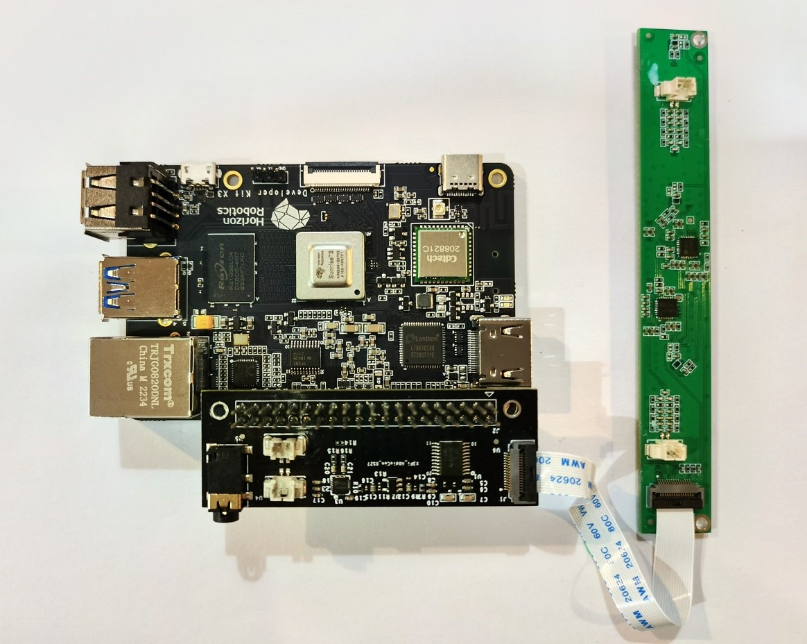

3. 接上AEC的线。

   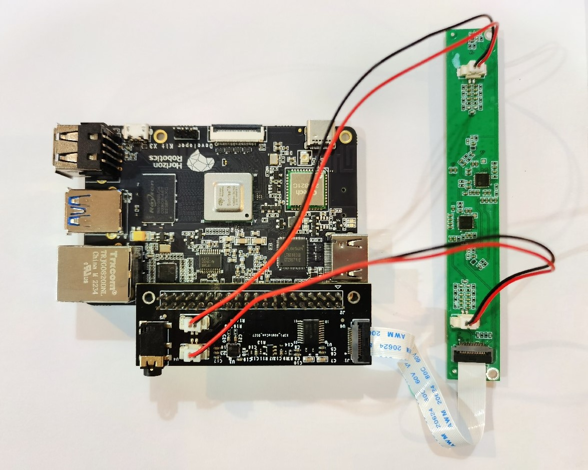

4. 接上电源，网线等。

##### 上电检查

将地平线RDK与麦克风阵列接好之后上电，在串口上使用指令`i2cdetect -r -y 0`可以检查设备的接入情况，若成功接好，默认可以在I2C上读取到三个地址。如下图：


若没检测到，请重新检查设备的连接。

### 使用介绍

智能语音hobot_audio package开始运行之后，会从麦克风阵列采集音频，并且将采集到的音频数据送入语音智能算法SDK模块做智能处理，输出唤醒事件、命令词、ASR结果等智能信息，其中唤醒事件、命令词通过`audio_msg::msg::SmartAudioData`类型消息发布，ASR结果通过`std_msgs::msg::String`类型消息发布。

具体流程如下图：


智能语音功能支持对原始音频进行降噪之后进行ASR识别，默认的唤醒词和命令词定义在智能语音功能代码模块根目录下*config/hrsc/cmd_word.json*文件，默认为：

```json
{
    "cmd_word": [
        "地平线你好",
        "向前走",
        "向后退",
        "向左转",
        "向右转",
        "停止运动"
    ]
}
```

唤醒词以及命令词用户可以根据需要配置，若更改唤醒词效果可能会与默认的唤醒词命令词效果有差异。推荐唤醒词以及命令词使用中文，最好是朗朗上口的词语，且词语长度推荐使用3~5个字。

另外，智能语音功能支持输出声源定位的DOA角度信息，单位为角度，环形麦克风阵列取值范围：0度\~360度，线形麦克风阵列取值范围：0度\~180度。

角度的相对位置关系与麦克风的安装位置强相关，环形麦克风阵列DOA角度示意图如下：


线形麦克风阵列DOA角度示意图如下：


地平线RDK板端运行hobot_audio package：

1. 配置tros.b环境和拷贝配置文件

    ```shell
    # 配置tros.b环境
    source /opt/tros/setup.bash

    # 从tros.b的安装路径中拷贝出运行示例需要的配置文件。
    cp -r /opt/tros/lib/hobot_audio/config/ .
    ```

2. 选择麦克风阵列类型以及是否开启ASR结果输出

   麦克风阵列类型和ASR输出均通过配置文件*config/audio_config.json*设置，该文件默认配置如下：

   ```json
   {
     "micphone_enable": 1,
     "micphone_rate": 16000,
     "micphone_chn": 8,  // mic+ref total num
     "micphone_buffer_time": 0, // ring buffer length in us
     "micphone_nperiods": 4,  // period time in us
     "micphone_period_size": 512,  // period_size, how many frames one period contains
     "voip_mode": 0,   // whether the call mode is voice
     "mic_type": 0,    // 0: cir mic; 1: linear mic
     "asr_mode": 0,   // 0: disable, 1: enable asr after wakeup, 2: enable asr anyway
     "asr_channel": 3, // if asr_mode = 2, output specific channel asr, range(0-3)
     "save_audio": 0
   }
   ```

    * 麦克风阵列类型通过`mic_type`字段设置，默认值为`0`，表示环形麦克风阵列。如果使用线形麦克风阵列，需要修改该字段为`1`。
    * ASR输出通过`asr_mode`字段设置，默认值为`0`，表示不输出ASR结果。若要开启ASR结果输出，需要将该字段改为`1`或`2`，其中`1`表示唤醒后才输出ASR结果，`2`表示一直输出ASR结果。

3. 加载音频驱动和启动应用

    ```shell
    # 加载音频驱动，设备启动之后只需要加载一次
    bash config/audio.sh

    #启动launch文件
    ros2 launch hobot_audio hobot_audio.launch.py
    ```

    注意：加载音频驱动时确保无其他音频设备连接，例如USB麦克风或带麦克风功能的USB摄像头，否则会导致应用打开音频设备失败，报错退出。

### 结果分析

在旭日X3板端运行终端输出如下信息：

```text
alsa_device_init, snd_pcm_open. handle((nil)), name(hw:0,0), direct(1), mode(0)
snd_pcm_open succeed. name(hw:0,0), handle(0x557d6e4d00)
Rate set to 16000Hz (requested 16000Hz)
Buffer size range from 16 to 20480
Period size range from 16 to 10240
Requested period size 512 frames
Periods = 4
was set period_size = 512
was set buffer_size = 2048
alsa_device_init. hwparams(0x557d6e4fa0), swparams(0x557d6e5210)

```

以上log显示，音频设备初始化成功，并且打开了音频设备，可正常采集音频。

当人依次在麦克风旁边说出“地平线你好”、“向前走”、“向左转”、“向右转”、“向后退”命令词，语音算法sdk经过智能处理后输出识别结果，log显示如下：

```text
recv hrsc sdk event wakeup success, wkp count is 1
[WARN] [1657869437.600230208] [hobot_audio]: recv event:0
recv hrsc sdk doa data: 100
recv hrsc sdk command data: 向前走
[WARN] [1657869443.870029101] [hobot_audio]: recv cmd word:向前走
recv hrsc sdk doa data: 110
recv hrsc sdk command data: 向左转
[WARN] [1657869447.623147766] [hobot_audio]: recv cmd word:向左转
recv hrsc sdk doa data: 100
recv hrsc sdk command data: 向右转
[WARN] [1657869449.865822772] [hobot_audio]: recv cmd word:向右转
recv hrsc sdk doa data: 110
recv hrsc sdk command data: 向后退
[WARN] [1657869452.313969277] [hobot_audio]: recv cmd word:向后退

```

log显示，识别到语音命令词“向前走”、“向左转”、“向右转”、“向后退”，并且输出DOA的角度信息，如“recv hrsc sdk doa data: 110”字段表示DOA角度为110度。

hobot_audio默认发布的智能语音消息话题名为：**/audio_smart**,  在另一个终端执行使用`ros2 topic list`命令可以查询到此topic信息：

```shell
$ ros2 topic list
/audio_smart
```

若开启ASR输出，发布消息话题为：**/audio_asr**，`ros2 topic list`结果为：

```shell
$ ros2 topic list
/audio_smart
/audio_asr
```

## 视觉SLAM算法

### 功能介绍

SLAM指定位与地图构建（Simultaneous Localization and Mapping，简称SLAM）,ORB-SLAM3是其中研究较多的算法之一。TogetheROS.Bot为了方便开发者开发基于视觉SLAM的应用，集成、改进和优化了ORB-SLAM3。

1. 集成和适配SuperPoint特征提取模型以优化视觉SLAM前端图像特征提取的鲁棒性，并降低CPU的运行负载。
并经过地平线浮点模型转换工具转换成地平线RDK可运行的定点模型，以降低RDK X3的CPU运行负载。
2. 使用ROS2封装了ORB-SLAM3的点云和位姿信息发布以及图像和IMU的订阅。
3. 增加了Track异步接口，分离特征提取和特征点跟踪为不同的线程，提高了处理帧率，有利于实际的工程应用。
4. 新增词袋库创建程序，帮助开发者构建自己的词袋库。

本章节以ORB-SLAM3作为建图算法，使用EuRoC开源数据集以及RealSense D435i相机作为测试数据来源。

代码仓库：

<https://github.com/HorizonRDK/orb_slam3>

应用场景：视觉SLAM算法能够在计算自身位置和姿态的同时计算出环境的三维结构，可实现即时定位以及构建地图的功能，主要应用于自动驾驶、智能家居、三维重建等领域。

SLAM建图案例：[5.1. SLAM建图](../apps/slam)

### 支持平台

| 平台    | 运行方式      |
| ------- | ------------ |
| RDK X3, RDK X3 Module | Ubuntu 20.04 |

### 准备工作

1. 地平线RDK已烧录好地平线提供的Ubuntu 20.04系统镜像。

2. 地平线RDK已成功安装tros.bot。

3. 地平线RDK已成功安装ORB-SLAM3算法包，安装命令：`apt update; apt install tros-orb-slam3 tros-orb-slam3-example-ros2`。

4. 地平线RDK已安装RealSense D435i相机。

5. 开源数据集EuRoC。

6. 和地平线RDK在同一网段的PC，PC已安装Ubuntu 20.04系统、ROS2 Foxy桌面版和数据可视化工具Rviz2。

### 使用介绍

ORB-SLAM3项目本身集成了多种类型的测试程序，比如单/双目以及单/双目+IMU等，其中也针对不同的评测数据集和传感器做了分类。
第一小节介绍如何使用开源数据集测试SLAM程序，第二小节介绍如何使用RealSense相机测试SLAM程序。

#### 1. 使用EuRoC数据集
数据集地址： <http://robotics.ethz.ch/~asl-datasets/ijrr_euroc_mav_dataset/vicon_room2/V2_01_easy/V2_01_easy.zip>，数据集下载好后，
进入ORB-SLAM3项目目录。解压数据集和词袋库到本地，并运行测试程序，如果想要的到更高的处理帧率，可以超频X3的CPU，但同时会带来功耗的提升。

运行命令：

```
# 配置tros.b环境
source /opt/tros/setup.bash
# X3 CPU超频至1.5GHz
sudo bash -c 'echo 1 > /sys/devices/system/cpu/cpufreq/boost'
# 使能X3 CPU性能模式
sudo bash -c 'echo performance > /sys/devices/system/cpu/cpufreq/policy0/scaling_governor'
# 进入ORB_SLAM3项目目录
cd /opt/tros/share/orb_slam3
# 解压数据集，V2_01_easy.zip数据集需自行下载！
unzip V2_01_easy.zip -d V2_01_easy
# 解压词袋库
tar -xvf ./Vocabulary/ORBvoc.txt.tar.gz
# 增加程序可执行权限
sudo chmod +x ./Examples/Monocular/mono_euroc 
# 运行程序，其中 V2_01_easy目录是网络上下载来的EuRoC开源数据集目录，开发者需自行下载！
./Examples/Monocular/mono_euroc ./ORBvoc_refine.txt ./Examples/Monocular/EuRoC.yaml ./V2_01_easy/ ./Examples/Monocular/EuRoC_TimeStamps/V201.txt 
```

程序运行后需要一段时间加载词袋库，等待片刻后程序会打印出当前处理的帧率。
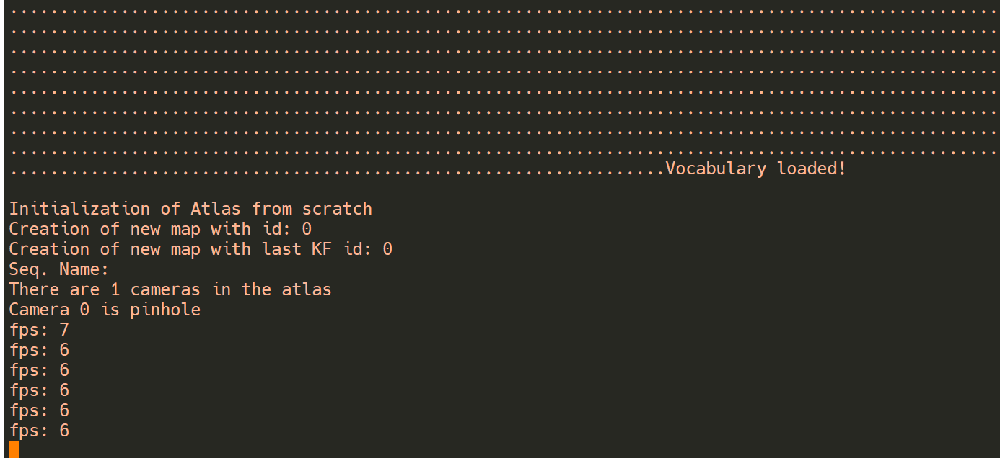

#### 2. 使用RealSense D435i相机

tros.b基于ORB-SLAM3和ROS2开发了一套示例程序，集成了图像和IMU数据的订阅以及地图点云、位姿、行驶轨迹的话题发布功能，可通过Rviz2可视化软件方便地观察程序运行结果，帮助开发者在ROS2开发、调试ORB-SLAM3。

最新版本的镜像在内核打上了RealSense 系列相机的UVC和HID驱动补丁，直接使用apt命令安装RealSense SDK以及ROS2 package后即可直接使用测试程序。ROS2的package与tros.b的并存的安装方法见文档：<https://developer.horizon.ai/api/v1/fileData/TogetherROS/quick_start/install_use_ros_pkg.html#id1>

```bash
# 显示ROS当前版本，如果显示为空，请source /opt/tros/setup.bash
echo $ROS_DISTRO 
# 安装RealSense SDK
sudo apt-get install ros-$ROS_DISTRO-librealsense2* -y 
# 安装RealSense ros wrapper
sudo apt-get install ros-$ROS_DISTRO-realsense2-camera -y
sudo apt-get install ros-$ROS_DISTRO-realsense2-description -y
```

安装完毕后，我们启动Realsense相机作为图像发布节点，视觉SLAM节点作为图像订阅者，订阅图像话题并发布位姿和点云等信息。

接下来，我们使用root账户（密码：root）登录RDK X3，启动Realsense D435i相机，否则权限不足无法正常启动相机。

```bash
source /opt/ros/foxy/setup.bash
source /opt/tros/setup.bash

# 启动D435i，发布图像数据
ros2 launch realsense2_camera rs_launch.py enable_depth:=false enable_color:=false enable_infra1:=true depth_module.profile:=640x480x15 
```

相机启动后，可从控制台观察到以下log：


下一步，我们启动视觉SLAM节点：

```
# 配置tros.b环境
source /opt/tros/setup.bash
# X3 CPU超频至1.5GHz
sudo bash -c 'echo 1 > /sys/devices/system/cpu/cpufreq/boost'
# 使能X3 CPU性能模式
sudo bash -c 'echo performance > /sys/devices/system/cpu/cpufreq/policy0/scaling_governor'
# 进入工作目录
cd /opt/tros/share/orb_slam3
# 解压词袋库
tar -xvf ./Vocabulary/ORBvoc.txt.tar.gz
# 启动 ORB-SLAM3单目处理节点
ros2 run orb_slam3_example_ros2 mono ./ORBvoc.txt ./Examples/Monocular/RealSense_D435i.yaml 
```

X3端的视觉SLAM节点启动并接收到相机图像数据后开始打印当前处理帧率“fps”。

同时在PC端（和地平线RDK在同一网段）打开Rviz2可视化软件，添加相关可视化信息，并订阅以下话题：

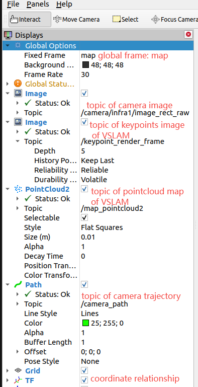

订阅话题后，可以从RVIZ2 软件观察到特征点的渲染结果，
同时随着相机的运动也可以观察到窗口右侧生成的白色地图点云和绿色的相机轨迹信息。

### 使用基于SuperPoint优化的ORB-SLAM3

众所周知，深度学习方法具有传统算法无法比拟的优势和潜力，尤其是在检测和分类任务的稳定性、效率和精度方面，深度学习方法表现出了惊人的优势。在视觉SLAM领域，也涌现出了很多使用深度学习方法代替传统SLAM前端和后端的工作，并表现出明显的优势。

其中SuperPoint和SuperGlue就是典型。SuperPoint是一款自监督深度学习网络模型，能够同时提取图像特征点的位置以及描述子。Tros.b整合SuperPoint与ORB-SLAM3，开发者可以在/opt/tros/share/orb_slam3/Examples/\*/*.yaml配置文件里自由切换使用的特征点提取方法。如下图所示，使用的特征点提取算法为“SUPERPOINT”：


使用Superpoint特征提取算法的结果如下图所示，可以看到，特征点提取非常稠密，检测出了物体的轮廓。
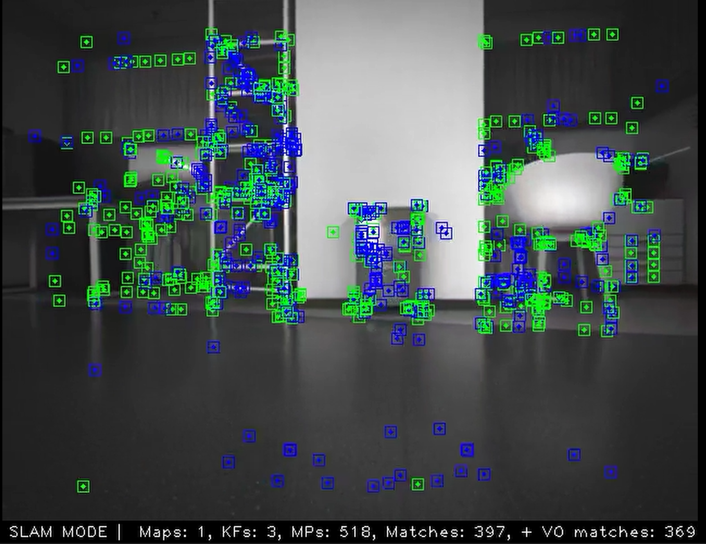

## 路面结构化

### 功能介绍

parking_perception package 是基于 hobot_dnn package开发的路面结构化算法示例，利用BPU进行模型推理，从而得到算法推理结果。
本package支持直接订阅sensors/msg/image类型的话题，并且支持读取本地图片的形式进行推理，将算法信息通过话题发布的同时会将结果在Web页面渲染可视化，同时支持渲染图片保存在程序运行的result目录。

算法支持的目标检测类别如下：

| 类别                | 说明 |
| ---------------------- | ----------- |
| cyclist           | 骑车人         |
| person           | 行人         |
|    rear        |   车背      |
|     vehicle       |   汽车       |
|     parking_lock       |    地锁       |

算法支持的语义分割类别如下：

| 类别                | 说明 |
| ---------------------- | ----------- |
| road           | 道路         |
| background           | 背景         |
|    lane_marking        |   车道线       |
|     sign_line       |   标志线       |
|     parking_lane       |    车位线       |
|     parking_space       |  车位区域        |
|     parking_rod       |   停车杆       |
|     parking_lock       |   地锁       |

代码仓库：<https://github.com/HorizonRDK/parking_perception.git>

应用场景：室外停车区检测算法基于语义分割，识别出图片中的停车区域，可实现自动泊车的功能，主要应用于自动驾驶领域。

小车车位寻找案例：[5.8. 小车车位寻找](../apps/parking_search)

### 支持平台

| 平台    | 运行方式      | 示例功能                       |
| ------- | ------------ | ------------------------------ |
| RDK X3, RDK X3 Module| Ubuntu 20.04 | · 启动MIPI/USB摄像头/本地回灌，推理渲染结果在Web显示/保存在本地 |
| X86     | Ubuntu 20.04 | · 启动本地回灌，推理渲染结果在Web显示/保存在本地 |

### 准备工作

#### 地平线RDK平台

1. 地平线RDK已烧录好地平线提供的Ubuntu 20.04系统镜像。

2. 地平线RDK已成功安装TogetheROS.Bot。

#### X86平台

1. X86环境已配置Ubuntu 20.04系统镜像。

2. X86环境已成功安装tros.b。

### 使用介绍

package对外发布包含语义分割和目标检测信息的算法msg，用户可以订阅发布msg用于应用开发。

运行命令：

#### 地平线RDK平台

**mipi摄像头发布图片**

```shell
# 配置ROS2环境
source /opt/tros/setup.bash

# 从tros.b的安装路径中拷贝出运行示例需要的配置文件。
cp -r /opt/tros/lib/parking_perception/config/ .

# 配置MIPI摄像头
export CAM_TYPE=mipi

# 启动launch文件
ros2 launch parking_perception parking_perception.launch.py 
```

**使用usb摄像头发布图片**

```shell
# 配置ROS2环境
source /opt/tros/setup.bash

# 从tros的安装路径中拷贝出运行示例需要的配置文件。
cp -r /opt/tros/lib/parking_perception/config/ .

# 配置USB摄像头
export CAM_TYPE=usb

# 启动launch文件
ros2 launch parking_perception parking_perception.launch.py 
```

**使用单张回灌图片**

```shell
# 配置ROS2环境
source /opt/tros/setup.bash

# 从tros的安装路径中拷贝出运行示例需要的配置文件。
cp -r /opt/tros/lib/parking_perception/config/ .

# 配置回灌图片
export CAM_TYPE=fb

# 启动launch文件
ros2 launch parking_perception parking_perception.launch.py 
```

#### X86平台

**使用单张回灌图片**

```shell
# 配置ROS2环境
source /opt/tros/setup.bash

# 从tros的安装路径中拷贝出运行示例需要的配置文件。
cp -r /opt/tros/lib/parking_perception/config/ .

# 配置回灌图片
export CAM_TYPE=fb

# 启动launch文件
ros2 launch parking_perception parking_perception.launch.py 
```

### 结果分析

**使用mipi摄像头发布图片**

package初始化后，在运行终端输出如下信息：

```
[INFO] [launch]: All log files can be found below /root/.ros/log/2022-08-02-06-46-55-605266-ubuntu-3669
[INFO] [launch]: Default logging verbosity is set to INFO
[INFO] [mipi_cam-1]: process started with pid [3671]
[INFO] [hobot_codec_republish-2]: process started with pid [3673]
[INFO] [parking_perception-3]: process started with pid [3675]
[INFO] [websocket-4]: process started with pid [3677]
[parking_perception-3] [WARN] [1659394017.194211788] [parking_perception]: Parameter:
[parking_perception-3] shared_men:1
[parking_perception-3]  is_sync_mode_: 1
[parking_perception-3]  model_file_name_: config/parking_perception_640x320.bin
[parking_perception-3] feed_image:
[parking_perception-3] [INFO] [1659394017.194695288] [dnn]: Node init.
[parking_perception-3] [INFO] [1659394017.194784038] [parking_perception]: Set node para.
[parking_perception-3] [INFO] [1659394017.194845413] [dnn]: Model init.
[parking_perception-3] [BPU_PLAT]BPU Platform Version(1.3.1)!
[parking_perception-3] [C][3675][08-02][06:46:57:202][configuration.cpp:49][EasyDNN]EasyDNN version: 0.4.11
[parking_perception-3] [HBRT] set log level as 0. version = 3.14.5
[parking_perception-3] [DNN] Runtime version = 1.9.7_(3.14.5 HBRT)
[parking_perception-3] [INFO] [1659394017.247423580] [dnn]: The model input 0 width is 640 and height is 320
[parking_perception-3] [INFO] [1659394017.247664997] [dnn]: Task init.
[parking_perception-3] [INFO] [1659394017.255848788] [dnn]: Set task_num [2]
[parking_perception-3] [INFO] [1659394017.255999663] [parking_perception]: The model input width is 640 and height is 320
[parking_perception-3] [INFO] [1659394017.263431163] [parking_perception]: msg_pub_topic_name: ai_msg_parking_perception
[parking_perception-3] [INFO] [1659394017.263554788] [parking_perception]: Detect images that use subscriptions
[parking_perception-3] [WARN] [1659394017.263597997] [parking_perception]: Create hbmem_subscription with topic_name: /hbmem_img
[parking_perception-3] [WARN] [1659394017.267204163] [parking_perception]: start success!!!
[parking_perception-3] [WARN] [1662036456.219133588] [parking_perception]: input fps: 29.73, out fps: 29.79
[parking_perception-3] [WARN] [1662036457.228303881] [parking_perception]: input fps: 29.73, out fps: 29.73
[parking_perception-3] [WARN] [1662036458.237841548] [parking_perception]: input fps: 29.73, out fps: 29.73
```

**使用单张回灌图片**

示例中读取本地图片推理的结果会渲染到图片上，在PC端的浏览器输入http://IP:8000 即可查看图像和算法渲染效果（IP为地平线RDK的IP地址），打开界面右上角设置。


选中”全图分割“选项，可以显示渲染效果。


可视化结果可以看到，室外场景下停车区域与行车区域有效分割开，区分了停车车道线和行车车道线，同时目标检测任务定位到远处车辆。

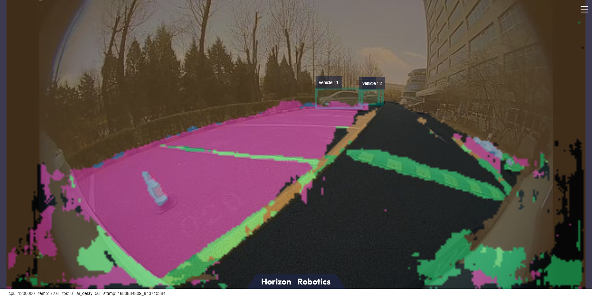

"dump_render_img"设置为"1"时，渲染效果保存在当前路径的result目录下。


## 激光雷达目标检测算法

### 功能介绍

激光雷达目标检测算法是使用地平线[OpenExplorer](https://developer.horizon.ai/api/v1/fileData/horizon_j5_open_explorer_cn_doc/hat/source/examples/centerpoint.html)在[nuscenes](https://www.nuscenes.org/nuscenes)数据集上训练出来的`CenterPoint`算法模型。

算法输入为32线激光雷达点云数据，输出信息包括目标的3D检测框、置信度、类别。支持的目标检测类型包括car、truck、bus、barrier、motorcycle、pedestrian共六大类别。

此示例使用本地激光雷达点云文件作为输入，利用BPU进行算法推理，发布包含点云数据、目标检测框和朝向的渲染图片消息，在PC端浏览器上渲染显示算法结果。

代码仓库：<https://github.com/HorizonRDK/hobot_centerpoint>

### 支持平台

| 平台    | 运行方式      | 示例功能                       |
| ------- | ------------ | ------------------------------ |
| RDK X5 Ultra| Ubuntu 20.04 | 使用本地回灌，并通过web展示推理渲染结果 |

### 准备工作

#### 地平线RDK平台

1. 地平线RDK已烧录好地平线提供的Ubuntu 20.04系统镜像。

2. 地平线RDK已成功安装TogetheROS.Bot。

3. 确认PC机能够通过网络访问地平线RDK。

### 使用介绍

#### 地平线RDK平台

#### 使用本地点云文件回灌

激光雷达物体检测算法示例使用激光雷达点云文件回灌，经过推理后将算法结果渲染后的图片msg，通过websocket package实现在PC端浏览器上渲染显示发布的图片和对应的算法结果。

准备激光雷达点云文件：

```shell
# 板端下载回灌的点云文件
wget http://archive.sunrisepi.tech/TogetheROS/data/hobot_centerpoint_data.tar.gz

# 解压缩
mkdir config
tar -zxvf hobot_centerpoint_data.tar.gz -C config
# 解压完成后数据在config/hobot_centerpoint_data路径下
```

启动算法示例：

```shell
# 配置tros.b环境
source /opt/tros/setup.bash

# 启动launch文件
ros2 launch hobot_centerpoint hobot_centerpoint_websocket.launch.py lidar_pre_path:=config/hobot_centerpoint_data
```

### 结果分析

启动算法示例后在运行终端输出如下信息：

```text
[INFO] [launch]: Default logging verbosity is set to INFO
[INFO] [hobot_centerpoint-1]: process started with pid [22470]
[INFO] [websocket-2]: process started with pid [22472]
[hobot_centerpoint-1] [WARN] [0948485758.916907430] [centerpoint_node]:
[hobot_centerpoint-1]  preprocess_config: config/centerpoint_preprocess_5dim.json
[hobot_centerpoint-1]  model_file: config/model/model.hbm
[hobot_centerpoint-1]  lidar_list_file: ./config/nuscenes_lidar_val.lst
[hobot_centerpoint-1]  is_show: 1
[hobot_centerpoint-1]  is_loop: 1
[hobot_centerpoint-1]  pub_topic_name: /hobot_centerpoint
[hobot_centerpoint-1]  lidar_pre_path: ./config/hobot_centerpoint_data
[hobot_centerpoint-1] [BPU_PLAT]BPU Platform Version(1.3.3)!
[hobot_centerpoint-1] [HBRT] set log level as 0. version = 3.14.25.0
[hobot_centerpoint-1] [DNN] Runtime version = 1.12.3_(3.14.25 HBRT)
[hobot_centerpoint-1] [WARN] [0948485759.205674972] [dnn]: Run default SetOutputParser.
[hobot_centerpoint-1] [WARN] [0948485759.205820889] [dnn]: Set output parser with default dnn node parser, you will get all output tensors and should parse output_tensors in PostProcess.
[hobot_centerpoint-1] [WARN] [0948485759.208895472] [hobot_centerpoint]: A total of 81 files were fetched!
[hobot_centerpoint-1] [WARN] [0948485759.400904472] [CenterPoint_Node]: input fps: -1.00, out fps: -1.00, infer time ms: 61, post process time ms: 57
[hobot_centerpoint-1] [WARN] [0948485759.839328014] [CenterPoint_Node]: input fps: -1.00, out fps: -1.00, infer time ms: 27, post process time ms: 53
[hobot_centerpoint-1] [WARN] [0948485760.281992264] [CenterPoint_Node]: input fps: -1.00, out fps: -1.00, infer time ms: 28, post process time ms: 53
[hobot_centerpoint-1] [WARN] [0948485760.731948223] [CenterPoint_Node]: input fps: 2.93, out fps: 3.01, infer time ms: 27, post process time ms: 56
[hobot_centerpoint-1] [WARN] [0948485761.155906223] [CenterPoint_Node]: input fps: 2.93, out fps: 3.01, infer time ms: 28, post process time ms: 56
[hobot_centerpoint-1] [WARN] [0948485761.572980640] [CenterPoint_Node]: input fps: 2.93, out fps: 3.01, infer time ms: 27, post process time ms: 53
[hobot_centerpoint-1] [WARN] [0948485761.983718973] [CenterPoint_Node]: input fps: 2.40, out fps: 2.40, infer time ms: 28, post process time ms: 55
[hobot_centerpoint-1] [WARN] [0948485762.396930973] [CenterPoint_Node]: input fps: 2.40, out fps: 2.40, infer time ms: 28, post process time ms: 55
[hobot_centerpoint-1] [WARN] [0948485762.816782057] [CenterPoint_Node]: input fps: 2.40, out fps: 2.40, infer time ms: 27, post process time ms: 56
[hobot_centerpoint-1] [WARN] [0948485763.239294099] [CenterPoint_Node]: input fps: 2.39, out fps: 2.39, infer time ms: 27, post process time ms: 57
[hobot_centerpoint-1] [WARN] [0948485763.661555807] [CenterPoint_Node]: input fps: 2.39, out fps: 2.39, infer time ms: 27, post process time ms: 57
[hobot_centerpoint-1] [WARN] [0948485764.084410183] [CenterPoint_Node]: input fps: 2.39, out fps: 2.39, infer time ms: 27, post process time ms: 57
[hobot_centerpoint-1] [WARN] [0948485764.502788849] [CenterPoint_Node]: input fps: 2.37, out fps: 2.37, infer time ms: 27, post process time ms: 55
```

输出log显示，发布算法推理结果的topic为`/hobot_centerpoint`, 获取的回灌点云文件为81个。算法经过推理，后处理(包含推理结果的渲染和发布)，帧率约为2.4fps。

在PC端的浏览器输入http://IP:8000 即可查看图像和算法渲染效果（IP为RDK X5 Ultra的IP地址）：

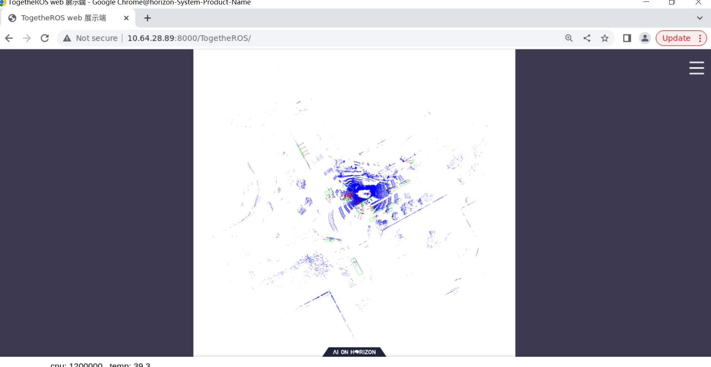

## BEV感知算法

### 功能介绍

BEV感知算法是使用地平线[OpenExplorer](https://developer.horizon.ai/api/v1/fileData/horizon_j5_open_explorer_cn_doc/hat/source/examples/bev.html)在[nuscenes](https://www.nuscenes.org/nuscenes)数据集上训练出来的`BEV`多任务模型。

算法输入为6组图像数据，分别是前视，左前，右前，后视，左后，右后图。模型输出为10个类别的目标以及对应的3D检测框，包括障碍物、多种类型车辆、交通标志等，以及车道线、人行道、马路边缘的语义分割。

此示例使用本地图像数据作为输入，利用BPU进行算法推理，发布算法感知结果渲染的图片消息，在PC端浏览器上渲染显示算法结果。

代码仓库：<https://github.com/HorizonRDK/hobot_bev.git>

### 支持平台

| 平台    | 运行方式      | 示例功能                       |
| ------- | ------------ | ------------------------------ |
| RDK X5 Ultra| Ubuntu 20.04 | 使用本地回灌，并通过web展示推理渲染结果 |

### 准备工作

1. RDK X5 Ultra已烧录好地平线提供的Ubuntu 20.04系统镜像。

2. RDK X5 Ultra已成功安装TogetheROS.Bot。

3. 确认PC机能够通过网络访问RDK X5 Ultra。

### 使用介绍

#### 使用本地数据集回灌

使用本地数据集回灌，经过推理后发布算法结果渲染后的图片消息，通过websocket package实现在PC端浏览器上渲染显示发布的图片和对应的算法结果。

***准备回灌数据集***

```shell
# 板端下载数据集
wget http://archive.sunrisepi.tech/TogetheROS/data/hobot_bev_data.tar.gz

# 解压缩
mkdir -p hobot_bev_data
tar -zxvf hobot_bev_data.tar.gz -C hobot_bev_data

# 解压完成后数据集在hobot_bev_data/data路径下
```

***使用数据集回灌***

```shell
# 配置tros.b环境
source /opt/tros/setup.bash

# 启动运行脚本，并指定数据集路径
ros2 launch hobot_bev hobot_bev.launch.py image_pre_path:=hobot_bev_data/data
```

### 结果分析

在运行终端输出如下信息：

```text
[INFO] [launch]: All log files can be found below /root/.ros/log/2023-07-05-17-47-07-232907-hobot-2627970
[INFO] [launch]: Default logging verbosity is set to INFO
[INFO] [hobot_bev-1]: process started with pid [2627972]
[INFO] [websocket-2]: process started with pid [2627974]
[hobot_bev-1] [WARN] [1688579227.907268364] [bev_node]:
[hobot_bev-1]  image_pre_path: hobot_bev_data/data
[hobot_bev-1] [BPU_PLAT]BPU Platform Version(1.3.3)!
[hobot_bev-1] [HBRT] set log level as 0. version = 3.14.25.0
[hobot_bev-1] [DNN] Runtime version = 1.12.3_(3.14.25 HBRT)
[hobot_bev-1] [WARN] [1688579228.714778531] [dnn]: Run default SetOutputParser.
[hobot_bev-1] [WARN] [1688579228.714925489] [dnn]: Set output parser with default dnn node parser, you will get all output tensors and should parse output_tensors in PostProcess.
[hobot_bev-1] [WARN] [1688579228.886846489] [bev_node]: loop 0/1002
[hobot_bev-1] [WARN] [1688579229.474568573] [bev_node]: loop 1/1002
[hobot_bev-1] [WARN] [1688579230.058551781] [bev_node]: loop 2/1002
[hobot_bev-1] [WARN] [1688579230.691667198] [bev_node]: loop 3/1002
[hobot_bev-1] [WARN] [1688579231.324658782] [bev_node]: loop 4/1002
[hobot_bev-1] [WARN] [1688579231.365145532] [bev_node]: input fps: 2.47, out fps: 2.52, infer time ms: 12, post process time ms: 659
[hobot_bev-1] [WARN] [1688579231.915645741] [bev_node]: loop 5/1002
[hobot_bev-1] [WARN] [1688579231.996993824] [bev_node]: input fps: 2.47, out fps: 2.52, infer time ms: 12, post process time ms: 658
```

在PC端的浏览器输入http://IP:8000 即可查看图像和算法渲染效果（IP为RDK X5 Ultra的IP地址）：

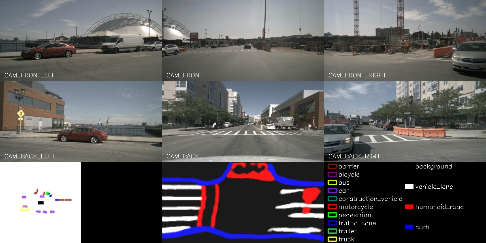

## 双目深度估计算法

### 功能介绍

双目深度估计算法是使用地平线[OpenExplorer](https://developer.horizon.ai/api/v1/fileData/horizon_j5_open_explorer_cn_doc/hat/source/examples/stereonet.html)在[SceneFlow](https://lmb.informatik.uni-freiburg.de/resources/datasets/SceneFlowDatasets.en.html)数据集上训练出来的`StereoNet`模型。

算法输入为双目图像数据，分别是左右视图。算法输出为左视图的视差。

此示例使用ZED 2i双目相机作为图像数据输入源，利用BPU进行算法推理，发布包含双目图像左图和感知结果的话题消息，在PC端浏览器上渲染显示算法结果。

代码仓库：<https://github.com/HorizonRDK/hobot_stereonet.git>

### 支持平台

| 平台    | 运行方式      | 示例功能                       |
| ------- | ------------ | ------------------------------ |
| RDK X5 Ultra| Ubuntu 20.04 | 使用本地回灌，并通过web展示推理渲染结果 |

### 准备工作

1. RDK X5 Ultra已烧录好地平线提供的Ubuntu 20.04系统镜像。

2. RDK X5 Ultra已成功安装TogetheROS.Bot。

3. ZED 2i双目相机，连接到RDK X5 Ultra的USB 3.0接口。

4. 确认PC机能够通过网络访问RDK X5 Ultra。

### 使用介绍

订阅从ZED 2i双目相机采集到的图像数据作为输入，经过推理后发布包含双目图像左图和感知结果的话题消息，通过websocket package实现在PC端浏览器上渲染显示发布的图片和对应的算法结果。

启动命令：

```shell
# 配置tros.b环境
source /opt/tros/setup.bash

ros2 launch hobot_stereonet hobot_stereonet_demo.launch.py 
```

### 结果分析

在运行终端输出如下信息：

```text
[INFO] [launch]: All log files can be found below /root/.ros/log/2023-07-05-18-23-51-350999-hobot-2628272
[INFO] [launch]: Default logging verbosity is set to INFO
webserver has launch
[INFO] [hobot_stereo_usb_cam-1]: process started with pid [2628275]
[INFO] [talker-2]: process started with pid [2628277]
[INFO] [websocket-3]: process started with pid [2628279]
[INFO] [hobot_stereonet-4]: process started with pid [2628281]
[hobot_stereo_usb_cam-1] [WARN] [1688581432.042569331] [stereo_usb_cam_node]: Get params complete.
[hobot_stereo_usb_cam-1]  camera_name: default_cam
[hobot_stereo_usb_cam-1]  video_device index: 0
[hobot_stereo_usb_cam-1]  image_width: 1280
[hobot_stereo_usb_cam-1]  image_height: 720
[hobot_stereo_usb_cam-1]  io_method_name: shared_mem
[hobot_stereo_usb_cam-1]  pub_topic_name: hbmem_stereo_img
[hobot_stereo_usb_cam-1]  out_format: nv12
[hobot_stereo_usb_cam-1]  enable_fb: 0
[hobot_stereo_usb_cam-1]  enable_dump: 0
[hobot_stereonet-4] [WARN] [1688581432.071555206] [stereonet_node]:
[hobot_stereonet-4]  sub_hbmem_topic_name: hbmem_stereo_img
[hobot_stereonet-4]  ros_img_topic_name: /stereonet_node_output
[hobot_stereo_usb_cam-1] [sl_oc::video::VideoCapture] INFO: ZED Open Capture - Camera module - Version: 0.6.0
[hobot_stereo_usb_cam-1] [sl_oc::video::VideoCapture] INFO: Camera resolution: 2560x720@30Hz
[hobot_stereo_usb_cam-1] [sl_oc::video::VideoCapture] INFO: Trying to open the device '/dev/video0'
[hobot_stereonet-4] [BPU_PLAT]BPU Platform Version(1.3.3)!
[hobot_stereonet-4] [HBRT] set log level as 0. version = 3.14.25.0
[hobot_stereonet-4] [DNN] Runtime version = 1.12.3_(3.14.25 HBRT)
[hobot_stereo_usb_cam-1] [sl_oc::video::VideoCapture] INFO: Opened camera with SN: 38085162
[hobot_stereo_usb_cam-1] [sl_oc::video::VideoCapture] INFO: Device '/dev/video0' opened
[hobot_stereonet-4] [WARN] [1688581432.344738873] [dnn]: Run default SetOutputParser.
[hobot_stereonet-4] [WARN] [1688581432.344880957] [dnn]: Set output parser with default dnn node parser, you will get all output tensors and should parse output_tensors in PostProcess.
[hobot_stereonet-4] [WARN] [1688581432.347218373] [stereonet_node]: model_input_count: 1, model_input_width: 1280, model_input_height: 720
[hobot_stereo_usb_cam-1] [WARN] [1688581432.412578248] [stereo_usb_cam_node]: Open video device 0 success.
[hobot_stereo_usb_cam-1] camera sn: 38085162[/dev/video0]
[hobot_stereonet-4] [WARN] [1688581434.992634291] [stereonet_node]: input fps: 1.60, out fps: 1.60, preprocess time ms: 1191, infer time ms: 48, msg preparation for pub time cost ms: 8
[hobot_stereonet-4] [WARN] [1688581436.203778417] [stereonet_node]: input fps: 0.82, out fps: 0.82, preprocess time ms: 1157, infer time ms: 47, msg preparation for pub time cost ms: 2
```

在PC端的浏览器输入http://IP:8000 即可查看图像和算法渲染效果（IP为RDK X5 Ultra的IP地址）：

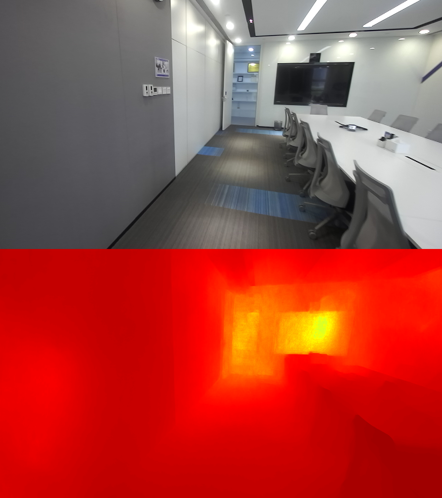

相同场景下ZED的深度估计可视化效果如下：


可以看到对于有光线变化区域，深度学习方法的深度估计准确率更高。

## 视觉惯性里程计算法

### 功能介绍
视觉惯性里程计（Visual Inertial Odometry，VIO）是融合相机与惯性测量单元（Inertial Measurement Unit，IMU）数据实现机器人定位的算法。VIO定位算法具有成本低、适用环境广等优点，在室外环境下能够有效弥补卫星定位中遮挡、多路径干扰等失效场景。优秀、鲁棒的VIO算法是实现室外高精度导航定位的关键。

代码仓库：<https://github.com/HorizonRDK/hobot_vio.git>

### 支持平台

| 平台    | 运行方式      | 示例功能                       |
| ------- | ------------ | ------------------------------ |
| X3 SDB| Ubuntu 20.04 | 使用realsense的图像和IMU数据作为算法输入，算法输出机器人运动轨迹，轨迹可在PC的rviz2上可视化 |

### 准备工作

1. X3 SDB已烧录好地平线提供的Ubuntu 20.04系统镜像。

2. X3 SDB已成功安装TogetheROS.Bot和Realsense的ROS2 Package。

3. realsense相机，连接到X3 SDB的USB 3.0接口。

4. 确认PC机能够通过网络访问X3 SDB。

### 使用介绍

算法订阅realsense相机的图像和IMU数据作为算法的输入，经过计算得到相机的轨迹信息，并通过ROS2的话题机制发布相机的运动轨迹，轨迹结果可在PC的rviz2软件查看。算法的输入和输出topic如下表所示：

## 输入topic
| 参数名 | 类型 | 解释  | 是否必须 | 默认值 |
| ----- | ----| -----| ------- | -----|
| path_config  | std::string | vio算法配置文件路径 | 是        | /opt/tros/lib/hobot_vio/config/realsenseD435i.yaml |
| image_topic  | std::string | vio算法订阅的图像数据话题名  | 是 | /camera/infra1/image_rect_raw |
| imu_topic    | std::string | vio算法订阅的IMU数据话题名  | 是 | /camera/imu  |
| sample_gap  | std::string | vio算法处理频率，1表示每帧图像都会参与轨迹计算，2表示每两帧图像计算一次，依此类推 | 是  | 2 |

## 输出topic

| topic名 | 类型 | 解释  |
| ----- | ----| -----| 
| horizon_vio/horizon_vio_path  | nav_msgs::msg::Path | vio算法输出的机器人运动轨迹  |

启动命令：

```shell
# 配置tros.b环境
source /opt/ros/foxy/setup.bash
source /opt/tros/local_setup.bash

ros2 launch hobot_vio hobot_vio.launch.py 
```

### 结果分析
在X3上启动算法示例后在运行终端输出如下信息，首先启动realsense节点发布图像和IMU数据，随后算法进入初始化流程，此时等待用户平移相机完成初始化，初始化完成后算法开始输出定位坐标：
```text
[INFO] [launch]: All log files can be found below /root/.ros/log/2023-07-07-19-48-31-464088-ubuntu-562910
[INFO] [launch]: Default logging verbosity is set to INFO
[INFO] [hobot_vio-1]: process started with pid [563077]
[INFO] [ros2 launch realsense2_camera rs_launch.py  depth_module.profile:=640x480x30 enable_depth:=false enable_color:=false enable_gyro:=true enable_accel:=true enable_sync:=true gyro_fps:=200 accel_fps:=200 unite_imu_method:=2 enable_infra1:=true-2]: process started with pid [563081]
[hobot_vio-1] T_CtoI:
[hobot_vio-1]    0.999934   0.0103587   0.0049969   0.0270761
[hobot_vio-1]  -0.0104067    0.999899  0.00967935 -0.00272628
[hobot_vio-1] -0.00489613 -0.00973072    0.999941  -0.0518149
[hobot_vio-1]           0           0           0           1
[hobot_vio-1] system use_rtk_: 0
[hobot_vio-1] [static initializer] not enough imu readings
[hobot_vio-1] [static initializer] not enough imu readings
[hobot_vio-1] [static initializer] IMU belows th 0.011508, 0.00274453 < 0.5, 0
[hobot_vio-1] [static initializer] IMU belows th 0.0105996, 0.00273085 < 0.5, 0
[hobot_vio-1] [static initializer] IMU belows th 0.00964632, 0.00280866 < 0.5, 0
[hobot_vio-1] [static initializer] IMU belows th 0.00892132, 0.00279346 < 0.5, 0
[hobot_vio-1] [static initializer] IMU belows th 0.00816016, 0.00281761 < 0.5, 0
[hobot_vio-1] [static initializer] IMU belows th 0.00776753, 0.00277049 < 0.5, 0
[hobot_vio-1] [static initializer] IMU belows th 0.00744219, 0.00274874 < 0.5, 0
[hobot_vio-1] [static initializer] IMU belows th 0.420251, 0.36058 < 0.5, 0
[hobot_vio-1] HorizonVIO Successfully initialized!
[hobot_vio-1] [WARN] [1688730518.534178615] [horizon_vio_node]: Localization position[x, y, z]: [0.0225533, -0.0504654, 0.00943574]
[hobot_vio-1] [WARN] [1688730518.534634139] [horizon_vio_node]: Image time 1688730518.314490318
[hobot_vio-1] [WARN] [1688730518.621440869] [horizon_vio_node]: Localization position[x, y, z]: [0.0231779, -0.0533648, 0.00787081]
[hobot_vio-1] [WARN] [1688730518.621558739] [horizon_vio_node]: Image time 1688730518.380982161
[hobot_vio-1] [WARN] [1688730518.743525086] [horizon_vio_node]: Localization position[x, y, z]: [0.0290396, -0.0610474, 0.0106718]
[hobot_vio-1] [WARN] [1688730518.743637249] [horizon_vio_node]: Image time 1688730518.447472572
[hobot_vio-1] [WARN] [1688730518.866076119] [horizon_vio_node]: Localization position[x, y, z]: [0.0381324, -0.0737757, 0.0164843]
[hobot_vio-1] [WARN] [1688730518.866186156] [horizon_vio_node]: Image time 1688730518.513962030
[hobot_vio-1] SLAM feats: 0
[hobot_vio-1] KF feats: 338
[hobot_vio-1] 132.853 ms all consumed
[hobot_vio-1] travel(m): 0.000
[hobot_vio-1] [WARN] [1688730519.002002975] [horizon_vio_node]: Localization position[x, y, z]: [0.05018, -0.088422, 0.0240244]
[hobot_vio-1] [WARN] [1688730519.002130095] [horizon_vio_node]: Image time 1688730518.580449104
[hobot_vio-1] SLAM feats: 0
[hobot_vio-1] KF feats: 31
[hobot_vio-1] 142.996 ms all consumed
[hobot_vio-1] travel(m): 0.014
[hobot_vio-1] [WARN] [1688730519.146149433] [horizon_vio_node]: Localization position[x, y, z]: [0.0167176, -0.0189649, 0.0588413]
[hobot_vio-1] [WARN] [1688730519.146279428] [horizon_vio_node]: Image time 1688730518.646935701
[hobot_vio-1] SLAM feats: 0
[hobot_vio-1] KF feats: 26
[hobot_vio-1] 96.911 ms all consumed
[hobot_vio-1] travel(m): 0.025
[hobot_vio-1] [WARN] [1688730519.244168068] [horizon_vio_node]: Localization position[x, y, z]: [0.000805884, 0.0134815, 0.0730707]
[hobot_vio-1] [WARN] [1688730519.244270439] [horizon_vio_node]: Image time 1688730518.713421583
[hobot_vio-1] SLAM feats: 0
[hobot_vio-1] KF feats: 23
[hobot_vio-1] 52.470 ms all consumed
[hobot_vio-1] travel(m): 0.034
[hobot_vio-1] [WARN] [1688730519.297642444] [horizon_vio_node]: Localization position[x, y, z]: [0.00226324, 0.0120054, 0.0796328]
[hobot_vio-1] [WARN] [1688730519.297738190] [horizon_vio_node]: Image time 1688730518.779906034
[hobot_vio-1] SLAM feats: 0
[hobot_vio-1] KF feats: 33
[hobot_vio-1] 47.407 ms all consumed
[hobot_vio-1] travel(m): 0.042
```

