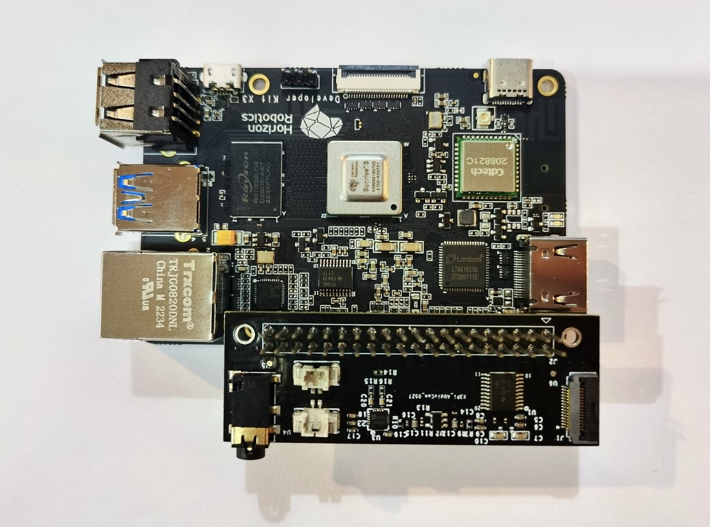
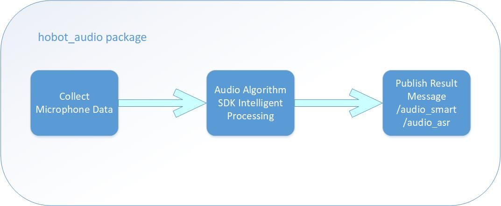

# 智能语音

## 功能介绍

地平线智能语音算法采用本地离线模式，订阅音频数据后送给BPU处理，然后发布**唤醒、命令词识别**、**声源定位DOA角度信息**以及**语音ASR识别结果**等消息。智能语音功能的实现对应于TogetheROS.Bot的**hobot_audio** package，适用于地平线RDK配套的环形和线形四麦阵列。

代码仓库：<https://github.com/HorizonRDK/hobot_audio.git>

应用场景：智能语音算法能够识别音频中的唤醒词以及自定义的命令词，并将语音内容解读为对应指令或转化为文字，可实现语音控制以及语音翻译等功能，主要应用于智能家居、智能座舱、智能穿戴设备等领域。

语音控制小车运动案例：[5.6. 语音控制小车运动](../apps/car_audio_control)

## 支持平台

| 平台   | 运行方式     | 示例功能                           |
| ------ | ------------ | ---------------------------------- |
| RDK X3 | Ubuntu 20.04 | 启动音频模块算法，并在终端显示结果 |

**注意：仅支持RDK X3，RDK X3 Module暂不支持。**

## 准备工作

1. 地平线RDK已烧录好地平线提供的Ubuntu 20.04系统镜像。
2. 地平线RDK已成功安装TogetheROS.Bot。
3. 地平线RDK已成功安装智能语音算法包，安装命令：`apt update; apt install tros-hobot-audio`。
4. 按照以下方法在地平线RDK上接好环形或线形四麦音频板。

### 连接音频板

#### 接口连接

#### 环形麦克风阵列

环形麦克风板为一体化设计，实物如下图：


购买链接如下：

<https://www.waveshare.net/shop/Audio-Driver-HAT.htm>

连接步骤：

1. 将麦克风板连接到地平线RDK X3 40PIN GPIO 接口上，连接后实物如下图：

   

2. 接上电源，网线等。

#### 线形麦克风阵列

线形麦克风阵列由音频转接板和线形麦克风板两部分组成，实物图和连接说明如下：

音频转接板:


线形麦克风板：


1. 首先需要将地平线RDK X3与音频转接板连接，二者引脚与引脚均应对齐，连接实物图如下：

   

2. 其次，需要将地平线RDK X3与麦克风阵列拾音板连接，转接板 FPC 接口通过15pin 异面FFC线缆接入到麦克风阵列拾音板，线缆金手指应朝下，连接实物图如下：

   

3. 接上AEC的线。

   

4. 接上电源，网线等。

#### 上电检查

将地平线RDK与麦克风阵列接好之后上电，在串口上使用指令`i2cdetect -r -y 0`可以检查设备的接入情况，若成功接好，默认可以在I2C上读取到三个地址。如下图：


若没检测到，请重新检查设备的连接。

## 使用介绍

智能语音hobot_audio package开始运行之后，会从麦克风阵列采集音频，并且将采集到的音频数据送入语音智能算法SDK模块做智能处理，输出唤醒事件、命令词、ASR结果等智能信息，其中唤醒事件、命令词通过`audio_msg::msg::SmartAudioData`类型消息发布，ASR结果通过`std_msgs::msg::String`类型消息发布。

具体流程如下图：



智能语音功能支持对原始音频进行降噪之后进行ASR识别，默认的唤醒词和命令词定义在智能语音功能代码模块根目录下*config/hrsc/cmd_word.json*文件，默认为：

```json
{
    "cmd_word": [
        "地平线你好",
        "向前走",
        "向后退",
        "向左转",
        "向右转",
        "停止运动"
    ]
}
```

唤醒词以及命令词用户可以根据需要配置，若更改唤醒词效果可能会与默认的唤醒词命令词效果有差异。推荐唤醒词以及命令词使用中文，最好是朗朗上口的词语，且词语长度推荐使用3~5个字。

另外，智能语音功能支持输出声源定位的DOA角度信息，单位为角度，环形麦克风阵列取值范围：0度\~360度，线形麦克风阵列取值范围：0度\~180度。

角度的相对位置关系与麦克风的安装位置强相关，环形麦克风阵列DOA角度示意图如下：


线形麦克风阵列DOA角度示意图如下：


地平线RDK板端运行hobot_audio package：

1. 配置tros.b环境和拷贝配置文件

   ```shell
   # 配置tros.b环境
   source /opt/tros/setup.bash
   
   # 从tros.b的安装路径中拷贝出运行示例需要的配置文件。
   cp -r /opt/tros/lib/hobot_audio/config/ .
   ```

2. 选择麦克风阵列类型以及是否开启ASR结果输出

   麦克风阵列类型和ASR输出均通过配置文件*config/audio_config.json*设置，该文件默认配置如下：

   ```json
   {
     "micphone_enable": 1,
     "micphone_rate": 16000,
     "micphone_chn": 8,  // mic+ref total num
     "micphone_buffer_time": 0, // ring buffer length in us
     "micphone_nperiods": 4,  // period time in us
     "micphone_period_size": 512,  // period_size, how many frames one period contains
     "voip_mode": 0,   // whether the call mode is voice
     "mic_type": 0,    // 0: cir mic; 1: linear mic
     "asr_mode": 0,   // 0: disable, 1: enable asr after wakeup, 2: enable asr anyway
     "asr_channel": 3, // if asr_mode = 2, output specific channel asr, range(0-3)
     "save_audio": 0
   }
   ```

    - 麦克风阵列类型通过`mic_type`字段设置，默认值为`0`，表示环形麦克风阵列。如果使用线形麦克风阵列，需要修改该字段为`1`。
    - ASR输出通过`asr_mode`字段设置，默认值为`0`，表示不输出ASR结果。若要开启ASR结果输出，需要将该字段改为`1`或`2`，其中`1`表示唤醒后输出一次ASR结果，`2`表示一直输出ASR结果。

3. 加载音频驱动和启动应用

   ```shell
   # 加载音频驱动，设备启动之后只需要加载一次
   bash config/audio.sh
   
   #启动launch文件
   ros2 launch hobot_audio hobot_audio.launch.py
   ```

   注意：加载音频驱动时确保无其他音频设备连接，例如USB麦克风或带麦克风功能的USB摄像头，否则会导致应用打开音频设备失败，报错退出。

## 结果分析

在旭日X3板端运行终端输出如下信息：

```text
alsa_device_init, snd_pcm_open. handle((nil)), name(hw:0,0), direct(1), mode(0)
snd_pcm_open succeed. name(hw:0,0), handle(0x557d6e4d00)
Rate set to 16000Hz (requested 16000Hz)
Buffer size range from 16 to 20480
Period size range from 16 to 10240
Requested period size 512 frames
Periods = 4
was set period_size = 512
was set buffer_size = 2048
alsa_device_init. hwparams(0x557d6e4fa0), swparams(0x557d6e5210)

```

以上log显示，音频设备初始化成功，并且打开了音频设备，可正常采集音频。

当人依次在麦克风旁边说出“地平线你好”、“向前走”、“向左转”、“向右转”、“向后退”命令词，语音算法sdk经过智能处理后输出识别结果，log显示如下：

```text
recv hrsc sdk event wakeup success, wkp count is 1
[WARN] [1657869437.600230208] [hobot_audio]: recv event:0
recv hrsc sdk doa data: 100
recv hrsc sdk command data: 向前走
[WARN] [1657869443.870029101] [hobot_audio]: recv cmd word:向前走
recv hrsc sdk doa data: 110
recv hrsc sdk command data: 向左转
[WARN] [1657869447.623147766] [hobot_audio]: recv cmd word:向左转
recv hrsc sdk doa data: 100
recv hrsc sdk command data: 向右转
[WARN] [1657869449.865822772] [hobot_audio]: recv cmd word:向右转
recv hrsc sdk doa data: 110
recv hrsc sdk command data: 向后退
[WARN] [1657869452.313969277] [hobot_audio]: recv cmd word:向后退

```

log显示，识别到语音命令词“向前走”、“向左转”、“向右转”、“向后退”，并且输出DOA的角度信息，如“recv hrsc sdk doa data: 110”字段表示DOA角度为110度。

hobot_audio默认发布的智能语音消息话题名为：**/audio_smart**,  在另一个终端执行使用`ros2 topic list`命令可以查询到此topic信息：

```shell
$ ros2 topic list
/audio_smart
```

若开启ASR输出，发布消息话题为：**/audio_asr**，`ros2 topic list`结果为：

```shell
$ ros2 topic list
/audio_smart
/audio_asr
```
