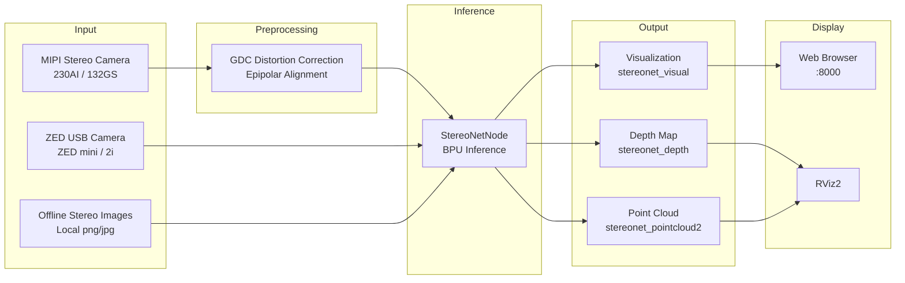

# Stereo Depth Algorithm

```mdx-code-block
import Tabs from '@theme/Tabs';
import TabItem from '@theme/TabItem';
import DocScope from '@site/src/components/DocScope';
```

## 1. Overview

The D-Robotics stereo depth estimation algorithm takes stereo image data as input and outputs disparity and depth maps corresponding to the left view. Inspired by the IGEV network, it uses a GRU architecture with good data generalization and high inference efficiency.

The overall data flow is shown below:



Stereo algorithm code repository: https://github.com/D-Robotics/hobot_stereonet

MIPI camera code repository: https://github.com/D-Robotics/hobot_mipi_cam

ZED camera code repository: https://github.com/D-Robotics/hobot_zed_cam

Stereo algorithm tutorial:

- [Video: Live Replay | RDK X5 AI Stereo Algorithm Deployment](https://www.bilibili.com/video/BV1KdEjzREMz/?share_source=copy_web&vd_source=deb3551e36cc4b1c1020033ad17c564b)
- [Blog: D-Robotics AI Stereo Algorithm: A Survey of Stereo Matching](https://mp.weixin.qq.com/s/09kvfQzYgO4dKLUMNLweTg)

## 2. Supported Platforms

| Platform              | System Support                     | Example Features                                             |
| --------------------- | ---------------------------------- | ------------------------------------------------------------ |
| RDK X5, RDK X5 Module | Ubuntu 22.04 (Humble)              | Start stereo camera, infer depth results, and display on Web |
| RDK S100, RDK S100P   | Ubuntu 22.04/24.04 (Humble, Jazzy) | Start stereo camera, infer depth results, and display on Web |

## 3. Model Versions

### 3.1. X5 Models

| Algorithm Version     | Quantization | Input Size  | Max Inference FPS | Description                                                 |
| --------------------- | ------------ | ----------- | ----------------- | ----------------------------------------------------------- |
| V2.0                  | int16        | 640x352x3x2 | 15                | Legacy version                                              |
| V2.1                  | int16        | 640x352x3x2 | 15                | Legacy version with confidence output                       |
| V2.2                  | int8         | 640x352x3x2 | 23                | Legacy version                                              |
| V2.3                  | int8         | 640x352x3x2 | 27                | Legacy version, highest frame rate                          |
| V2.4_int16            | int16        | 640x352x3x2 | 15                | Current main version, high-precision depth estimation       |
| V2.4_int8             | int8         | 640x352x3x2 | 23                | Current main version, high-frame-rate depth estimation      |
| V2.5_int16            | int16        | 640x352x3x2 | 16                | Latest version, high-precision depth estimation             |
| V2.5_int16_96         | int16        | 640x352x3x2 | 18                | Latest version, max search disparity 96                     |
| V2.5_int16_544_448    | int16        | 544x448x3x2 | 15                | Latest version, 544x448 resolution                          |
| V2.5_int16_544_448_96 | int16        | 544x448x3x2 | 17                | Latest version, 544x448 resolution, max search disparity 96 |

### 3.2. S100 Models

| Algorithm Version | Quantization | Input Size  | Max Inference FPS | Description                                 |
| ----------------- | ------------ | ----------- | ----------------- | ------------------------------------------- |
| V2.1              | int16        | 640x352x3x2 | 53                | Legacy version with confidence output       |
| V2.4              | int16        | 640x352x3x2 | 53                | Current main version with confidence output |

## 4. Preparation

### 4.1. RDK Platform

1. RDK has been flashed with RDK OS
2. TogetheROS.Bot has been successfully installed on RDK
3. For online inference, prepare a stereo camera. Multiple MIPI cameras and ZED mini/2i USB cameras are currently supported
4. For offline inference, prepare stereo image data
5. Confirm that the PC can access RDK over the network

### 4.2. System and Package Versions

|                                     | Version              | Query Method                                    |
| ----------------------------------- | -------------------- | ----------------------------------------------- |
| RDK X5 system image version         | 3.3.3 and above      | `cat /etc/version`                              |
| RDK S100 system image version       | 4.0.2-Beta and above | `cat /etc/version`                              |
| tros-humble-hobot-stereonet package | 2.5.0 and above      | `apt list \| grep tros-humble-hobot-stereonet/` |
| tros-humble-mipi-cam package        | 2.3.13 and above     | `apt list \| grep tros-humble-mipi-cam/`        |
| tros-humble-hobot-zed-cam package   | 2.3.3 and above      | `apt list \| grep tros-humble-hobot-zed-cam/`   |

- If the **system image version** does not meet requirements, refer to the corresponding documentation section for image flashing
- If the **package version** does not meet requirements, run the following commands to update:

<Tabs groupId="tros-distro">
<TabItem value="humble" label="Humble">

```bash
sudo apt update
sudo apt install --only-upgrade tros-humble-hobot-stereonet
sudo apt install --only-upgrade tros-humble-mipi-cam
sudo apt install --only-upgrade tros-humble-hobot-zed-cam
```

</TabItem>

<TabItem value="jazzy" label="Jazzy">

```bash
sudo apt update
sudo apt install --only-upgrade tros-jazzy-hobot-stereonet
sudo apt install --only-upgrade tros-jazzy-mipi-cam
sudo apt install --only-upgrade tros-jazzy-hobot-zed-cam
```

</TabItem>
</Tabs>

### 4.3. Beta Source Configuration (X5 Only)

<DocScope products="RDK-X5">

If the above commands cannot update the program to the latest version, change the apt source file to the beta source:

```bash
# Switch to beta source, run the following commands:
sudo echo 'deb [signed-by=/usr/share/keyrings/sunrise.gpg] http://archive.d-robotics.cc/ubuntu-rdk-x5-beta  jammy main' | sudo tee /etc/apt/sources.list.d/sunrise.list
apt update

# To switch back to the official source, run the following commands:
sudo echo 'deb [signed-by=/usr/share/keyrings/sunrise.gpg] http://archive.d-robotics.cc/ubuntu-rdk-x5  jammy main' | sudo tee /etc/apt/sources.list.d/sunrise.list
apt update
```

:::caution **Note**
**If the `sudo apt update` command fails or reports an error, please refer to the [FAQ](https://developer.d-robotics.cc/rdk_x_doc/en/FAQ/hardware_and_system?v=3.5.0&p=RDK+X5#q10-what-to-do-if-apt-update-fails-eg-key-error-update-failure-lock-file-in-use) section `Q10: How to handle apt update command failure or error?` for resolution.**
:::

</DocScope>

<DocScope products="RDK-S100">

:::caution **Note**
**If the `sudo apt update` command fails or reports an error, please refer to the [FAQ](https://developer.d-robotics.cc/rdk_s_doc/en/FAQ/hardware_and_system?v=4.0.5&p=RDK+S100#q6-how-do-i-handle-apt-update-failures-or-errors) section `Q6: How to handle apt update command failure or error?` for resolution.**
:::

</DocScope>

## 5. Hardware Installation

### 5.1. 230AI MIPI Stereo Camera

- The official RDK 230AI MIPI stereo camera is shown below:


<p style={{ color: 'red' }}> Note: Check that the camera back silkscreen shows CDPxxx-V3/V4 to confirm V3 or V4 version </p>

- RDK X5 installation is shown below:


- RDK S100 installation is shown below. Note: set the S100 CAM daughter board DIP switches to `LPWM` and `3.3V`:


### 5.2. 132GS MIPI Stereo Camera

- The official RDK 132GS MIPI stereo camera is shown below:


- RDK X5 installation is shown below:


- The latest cables have been upgraded. Note that cables are directional: CAM end connects to the camera, RDK end connects to the development board. (Both white and black cables work normally; either may be shipped randomly)


- RDK S100 installation is shown below. Note: set the S100 CAM daughter board DIP switches to `LPWM` and `3.3V`:


### 5.3. ZED Camera Connection

- ZED stereo camera is shown below:


- Connect ZED camera to RDK via USB

## 6. Important Notes

:::caution **Important**
**Please make sure to run all commands in this document as the `root` user.**

Other users may lack sufficient permissions, causing unnecessary errors. You can verify the current user with the following command:
:::


## 7. MIPI Camera Startup

### 7.1. Obtaining Startup Scripts

The `run_stereo.sh` script is bundled with the package and can be obtained as follows:

<Tabs groupId="tros-distro">
<TabItem value="humble" label="Humble">

```bash
cp -rv /opt/tros/humble/share/hobot_stereonet/script/run_cam.sh ./
cp -rv /opt/tros/humble/share/hobot_stereonet/script/run_codec_web.sh ./
cp -rv /opt/tros/humble/share/hobot_stereonet/script/run_stereo.sh ./
```

</TabItem>

<TabItem value="jazzy" label="Jazzy">

```bash
cp -rv /opt/tros/jazzy/share/hobot_stereonet/script/run_cam.sh ./
cp -rv /opt/tros/jazzy/share/hobot_stereonet/script/run_codec_web.sh ./
cp -rv /opt/tros/jazzy/share/hobot_stereonet/script/run_stereo.sh ./
```

</TabItem>
</Tabs>

If you cannot copy from the package, you can also manually create the following three scripts.

#### run_cam.sh

```bash
#!/bin/bash
if [[ -f /opt/tros/humble/setup.bash ]]; then
  source /opt/tros/humble/setup.bash
elif [[ -f /opt/tros/jazzy/setup.bash ]]; then
  source /opt/tros/jazzy/setup.bash
else
  echo "Error: neither Humble nor Jazzy TROS environment was found"
  exit 1
fi

image_width=1280
image_height=1088
framerate=30.0
rotation=90.0
gdc_enable=False
cal_rotation=90.0
lpwm_enable=True
frame_ts_type=realtime
out_format=nv12
channel=2
channel2=0
log_level=ERROR

while [[ $# -gt 0 ]]; do
  case $1 in
    --image_width) image_width=$2; shift 2 ;;
    --image_height) image_height=$2; shift 2 ;;
    --framerate) framerate=$2; shift 2 ;;
    --rotation) rotation=$2; shift 2 ;;
    --gdc_enable) gdc_enable=$2; shift 2 ;;
    --cal_rotation) cal_rotation=$2; shift 2 ;;
    --lpwm_enable) lpwm_enable=$2; shift 2 ;;
    --frame_ts_type) frame_ts_type=$2; shift 2 ;;
    --out_format) out_format=$2; shift 2 ;;
    --channel) channel=$2; shift 2 ;;
    --channel2) channel2=$2; shift 2 ;;
    --log_level) log_level=$2; shift 2 ;;
    *) echo "unknown param: $1"; exit 1 ;;
  esac
done

ros2 run mipi_cam mipi_cam --ros-args \
-p device_mode:=dual -p dual_combine:=1 \
-p image_width:=$image_width -p image_height:=$image_height \
-p framerate:=$framerate -p rotation:=$rotation \
-p gdc_enable:=$gdc_enable -p cal_rotation:=$cal_rotation \
-p lpwm_enable:=$lpwm_enable \
-p frame_ts_type:=$frame_ts_type \
-p out_format:=$out_format \
-p channel:=$channel -p channel2:=$channel2 \
--log-level $log_level
```

#### run_codec_web.sh

```bash
#!/bin/bash
if [[ -f /opt/tros/humble/setup.bash ]]; then
  source /opt/tros/humble/setup.bash
elif [[ -f /opt/tros/jazzy/setup.bash ]]; then
  source /opt/tros/jazzy/setup.bash
else
  echo "Error: neither Humble nor Jazzy TROS environment was found"
  exit 1
fi

codec_sub_topic=/StereoNetNode/stereonet_visual
codec_in_format=bgr8
codec_pub_topic=/image_jpeg
websocket_image_topic=/image_jpeg
websocket_channel=0

while [[ $# -gt 0 ]]; do
  case $1 in
    --codec_sub_topic) codec_sub_topic=$2; shift 2 ;;
    --codec_in_format) codec_in_format=$2; shift 2 ;;
    --codec_pub_topic) codec_pub_topic=$2; shift 2 ;;
    --websocket_image_topic) websocket_image_topic=$2; shift 2 ;;
    --websocket_channel) websocket_channel=$2; shift 2 ;;
    *) echo "unknown param: $1"; exit 1 ;;
  esac
done

ros2 launch hobot_stereonet codec_web_visual.launch.py \
codec_sub_topic:=$codec_sub_topic codec_in_format:=$codec_in_format codec_pub_topic:=$codec_pub_topic \
websocket_image_topic:=$websocket_image_topic websocket_channel:=$websocket_channel
```

#### run_stereo.sh

```bash
#!/bin/bash
if [[ -f /opt/tros/humble/setup.bash ]]; then
  source /opt/tros/humble/setup.bash
elif [[ -f /opt/tros/jazzy/setup.bash ]]; then
  source /opt/tros/jazzy/setup.bash
else
  echo "Error: neither Humble nor Jazzy TROS environment was found"
  exit 1
fi

ros2 pkg prefix mipi_cam
ros2 pkg prefix hobot_stereonet

rm -rfv performance_*.txt

# stereonet version
stereonet_version=v2.4_int16

# node name
stereo_node_name=StereoNetNode

# uncertainty
uncertainty_th=-0.10

# topic
stereo_image_topic=/image_combine_raw
camera_info_topic=/image_combine_raw/right/camera_info
left_camera_info_topic=/image_combine_raw/left/camera_info
depth_image_topic="~/stereonet_depth"
depth_camera_info_topic="~/stereonet_depth/camera_info"
rectify_left_camera_info_topic="~/rectify_left_image/camera_info"
rectify_right_camera_info_topic="~/rectify_right_image/camera_info"
pointcloud2_topic="~/stereonet_pointcloud2"
publish_pcd_enabled=True
rectify_left_image_topic="~/rectify_left_image"
rectify_right_image_topic="~/rectify_right_image"
publish_rectify_bgr=False
origin_left_image_topic="~/origin_left_image"
origin_right_image_topic="~/origin_right_image"
publish_origin_enable=True
visual_image_topic="~/stereonet_visual"
publish_visual_enabled=True
stereonet_frame_id="camera_link"

# mipi cam
use_mipi_cam=True
mipi_image_width=640
mipi_image_height=352
mipi_image_framerate=30.0
mipi_frame_ts_type=realtime
mipi_gdc_enable=True
mipi_lpwm_enable=True
mipi_rotation=90.0
mipi_channel=2
mipi_channel2=0
mipi_cal_rotation=0.0

# calib
calib_method=none
stereo_calib_file_path=calib.yaml

# render
render_type=distance
render_perf=True
render_max_disp=80
render_z_near=-1.0
render_z_range=3.0
depth_decimal_num=2

# speckle filter
speckle_filter_enable=False
max_speckle_size=100
max_disp_diff=1.0

# pointcloud
pointcloud_height_min=-5.0
pointcloud_height_max=5.0
pointcloud_depth_max=5.0
pointcloud_downsample_step=2
pointcloud_coord=ROS

# pcl filter
pcl_filter_enable=False
grid_size=0.1
grid_min_point_count=5

# thread
infer_thread_num=2
save_thread_num=4
max_save_task=50

# save
save_result_flag=False
save_dir=./result
save_freq=1
save_total=-1
save_stereo_flag=True
save_origin_flag=False
save_disp_flag=True
save_uncert_flag=False
save_depth_flag=True
save_visual_flag=True
save_pcd_flag=False

# local image
use_local_image_flag=False
local_image_dir=./offline
image_sleep=0

# camera intrinsic
camera_cx=0.0
camera_cy=0.0
camera_fx=0.0
camera_fy=0.0
baseline=0.0
doffs=0.0

# mask
left_img_mask_enable=False

# epipolar
epipolar_mode=False
epipolar_img=rect
chessboard_per_rows=20
chessboard_per_cols=11
chessboard_square_size=0.06
feature_epipolar_mode=False

# angle calc
ground_angle_enable=False
ground_roi_center_x=-1
ground_roi_center_y=-1
ground_roi_width=80
ground_roi_height=40
ground_roi_min_valid_points=100

# web
stereonet_pub_web=True
codec_sub_topic=/$stereo_node_name/stereonet_visual
codec_in_format=bgr8
codec_pub_topic=/image_jpeg
websocket_image_topic=/image_jpeg
websocket_channel=0

while [[ $# -gt 0 ]]; do
  case $1 in
    # stereonet version
    --stereonet_version) stereonet_version=$2; shift 2 ;;

    # node name
    --stereo_node_name) stereo_node_name=$2; shift 2 ;;

    # uncertainty
    --uncertainty_th) uncertainty_th=$2; shift 2 ;;

    # topic
    --stereo_image_topic) stereo_image_topic=$2; shift 2 ;;
    --camera_info_topic) camera_info_topic=$2; shift 2 ;;
    --left_camera_info_topic) left_camera_info_topic=$2; shift 2 ;;
    --depth_image_topic) depth_image_topic=$2; shift 2 ;;
    --rectify_left_camera_info_topic) rectify_left_camera_info_topic=$2; shift 2 ;;
    --rectify_right_camera_info_topic) rectify_right_camera_info_topic=$2; shift 2 ;;
    --depth_camera_info_topic) depth_camera_info_topic=$2; shift 2 ;;
    --pointcloud2_topic) pointcloud2_topic=$2; shift 2 ;;
    --publish_pcd_enabled) publish_pcd_enabled=$2; shift 2 ;;
    --rectify_left_image_topic) rectify_left_image_topic=$2; shift 2 ;;
    --rectify_right_image_topic) rectify_right_image_topic=$2; shift 2 ;;
    --publish_rectify_bgr) publish_rectify_bgr=$2; shift 2 ;;
    --origin_left_image_topic) origin_left_image_topic=$2; shift 2 ;;
    --origin_right_image_topic) origin_right_image_topic=$2; shift 2 ;;
    --publish_origin_enable) publish_origin_enable=$2; shift 2 ;;
    --visual_image_topic) visual_image_topic=$2; shift 2 ;;
    --publish_visual_enabled) publish_visual_enabled=$2; shift 2 ;;
    --stereonet_frame_id) stereonet_frame_id=$2; shift 2 ;;

    # mipi cam
    --use_mipi_cam) use_mipi_cam=$2; shift 2 ;;
    --mipi_image_width) mipi_image_width=$2; shift 2 ;;
    --mipi_image_height) mipi_image_height=$2; shift 2 ;;
    --mipi_image_framerate) mipi_image_framerate=$2; shift 2 ;;
    --mipi_frame_ts_type) mipi_frame_ts_type=$2; shift 2 ;;
    --mipi_gdc_enable) mipi_gdc_enable=$2; shift 2 ;;
    --mipi_lpwm_enable) mipi_lpwm_enable=$2; shift 2 ;;
    --mipi_rotation) mipi_rotation=$2; shift 2 ;;
    --mipi_channel) mipi_channel=$2; shift 2 ;;
    --mipi_channel2) mipi_channel2=$2; shift 2 ;;
    --mipi_cal_rotation) mipi_cal_rotation=$2; shift 2 ;;

    # calib
    --calib_method) calib_method=$2; shift 2 ;;
    --stereo_calib_file_path) stereo_calib_file_path=$2; shift 2 ;;

    # render
    --render_type) render_type=$2; shift 2 ;;
    --render_perf) render_perf=$2; shift 2 ;;
    --render_max_disp) render_max_disp=$2; shift 2 ;;
    --render_z_near) render_z_near=$2; shift 2 ;;
    --render_z_range) render_z_range=$2; shift 2 ;;
    --depth_decimal_num) depth_decimal_num=$2; shift 2 ;;

    # speckle filter
    --speckle_filter_enable) speckle_filter_enable=$2; shift 2 ;;
    --max_speckle_size) max_speckle_size=$2; shift 2 ;;
    --max_disp_diff) max_disp_diff=$2; shift 2 ;;

    # pointcloud
    --pointcloud_height_min) pointcloud_height_min=$2; shift 2 ;;
    --pointcloud_height_max) pointcloud_height_max=$2; shift 2 ;;
    --pointcloud_depth_max) pointcloud_depth_max=$2; shift 2 ;;
    --pointcloud_downsample_step) pointcloud_downsample_step=$2; shift 2 ;;
    --pointcloud_coord) pointcloud_coord=$2; shift 2 ;;

    # pcl filter
    --pcl_filter_enable) pcl_filter_enable=$2; shift 2 ;;
    --grid_size) grid_size=$2; shift 2 ;;
    --grid_min_point_count) grid_min_point_count=$2; shift 2 ;;

    # thread
    --infer_thread_num) infer_thread_num=$2; shift 2 ;;
    --save_thread_num) save_thread_num=$2; shift 2 ;;
    --max_save_task) max_save_task=$2; shift 2 ;;

    # save
    --save_result_flag) save_result_flag=$2; shift 2 ;;
    --save_dir) save_dir=$2; shift 2 ;;
    --save_freq) save_freq=$2; shift 2 ;;
    --save_total) save_total=$2; shift 2 ;;
    --save_stereo_flag) save_stereo_flag=$2; shift 2 ;;
    --save_origin_flag) save_origin_flag=$2; shift 2 ;;
    --save_disp_flag) save_disp_flag=$2; shift 2 ;;
    --save_uncert_flag) save_uncert_flag=$2; shift 2 ;;
    --save_depth_flag) save_depth_flag=$2; shift 2 ;;
    --save_visual_flag) save_visual_flag=$2; shift 2 ;;
    --save_pcd_flag) save_pcd_flag=$2; shift 2 ;;

    # local image
    --use_local_image_flag) use_local_image_flag=$2; shift 2 ;;
    --local_image_dir) local_image_dir=$2; shift 2 ;;
    --image_sleep) image_sleep=$2; shift 2 ;;

    # camera intrinsic
    --camera_cx) camera_cx=$2; shift 2 ;;
    --camera_cy) camera_cy=$2; shift 2 ;;
    --camera_fx) camera_fx=$2; shift 2 ;;
    --camera_fy) camera_fy=$2; shift 2 ;;
    --baseline) baseline=$2; shift 2 ;;
    --doffs) doffs=$2; shift 2 ;;

    # mask
    --left_img_mask_enable) left_img_mask_enable=$2; shift 2 ;;

    # epipolar
    --epipolar_mode) epipolar_mode=$2; shift 2 ;;
    --epipolar_img) epipolar_img=$2; shift 2 ;;
    --chessboard_per_rows) chessboard_per_rows=$2; shift 2 ;;
    --chessboard_per_cols) chessboard_per_cols=$2; shift 2 ;;
    --chessboard_square_size) chessboard_square_size=$2; shift 2 ;;
    --feature_epipolar_mode) feature_epipolar_mode=$2; shift 2 ;;

    # angle calc
    --ground_angle_enable) ground_angle_enable=$2; shift 2 ;;
    --ground_roi_center_x) ground_roi_center_x=$2; shift 2 ;;
    --ground_roi_center_y) ground_roi_center_y=$2; shift 2 ;;
    --ground_roi_width) ground_roi_width=$2; shift 2 ;;
    --ground_roi_height) ground_roi_height=$2; shift 2 ;;
    --ground_roi_min_valid_points) ground_roi_min_valid_points=$2; shift 2 ;;

    # web
    --stereonet_pub_web) stereonet_pub_web=$2; shift 2 ;;
    --codec_sub_topic) codec_sub_topic=$2; shift 2 ;;
    --codec_in_format) codec_in_format=$2; shift 2 ;;
    --codec_pub_topic) codec_pub_topic=$2; shift 2 ;;
    --websocket_image_topic) websocket_image_topic=$2; shift 2 ;;
    --websocket_channel) websocket_channel=$2; shift 2 ;;

    *) echo "unknown param: $1"; exit 1 ;;
  esac
done

ros2 launch hobot_stereonet stereonet_model_web_visual_$stereonet_version.launch.py \
stereo_node_name:=$stereo_node_name \
uncertainty_th:=$uncertainty_th \
stereo_image_topic:=$stereo_image_topic camera_info_topic:=$camera_info_topic left_camera_info_topic:=$left_camera_info_topic \
depth_image_topic:=$depth_image_topic depth_camera_info_topic:=$depth_camera_info_topic \
rectify_left_camera_info_topic:=$rectify_left_camera_info_topic rectify_right_camera_info_topic:=$rectify_right_camera_info_topic \
pointcloud2_topic:=$pointcloud2_topic publish_pcd_enabled:=$publish_pcd_enabled \
rectify_left_image_topic:=$rectify_left_image_topic rectify_right_image_topic:=$rectify_right_image_topic publish_rectify_bgr:=$publish_rectify_bgr \
origin_left_image_topic:=$origin_left_image_topic origin_right_image_topic:=$origin_right_image_topic publish_origin_enable:=$publish_origin_enable \
visual_image_topic:=$visual_image_topic publish_visual_enabled:=$publish_visual_enabled \
use_mipi_cam:=$use_mipi_cam mipi_image_width:=$mipi_image_width mipi_image_height:=$mipi_image_height \
mipi_image_framerate:=$mipi_image_framerate mipi_frame_ts_type:=$mipi_frame_ts_type \
mipi_gdc_enable:=$mipi_gdc_enable mipi_lpwm_enable:=$mipi_lpwm_enable mipi_rotation:=$mipi_rotation \
mipi_channel:=$mipi_channel mipi_channel2:=$mipi_channel2 mipi_cal_rotation:=$mipi_cal_rotation \
calib_method:=$calib_method stereo_calib_file_path:=$stereo_calib_file_path \
render_type:=$render_type render_perf:=$render_perf render_max_disp:=$render_max_disp render_z_near:=$render_z_near render_z_range:=$render_z_range \
depth_decimal_num:=$depth_decimal_num \
speckle_filter_enable:=$speckle_filter_enable max_speckle_size:=$max_speckle_size max_disp_diff:=$max_disp_diff \
pointcloud_height_min:=$pointcloud_height_min pointcloud_height_max:=$pointcloud_height_max pointcloud_depth_max:=$pointcloud_depth_max \
pointcloud_downsample_step:=$pointcloud_downsample_step pointcloud_coord:=$pointcloud_coord \
pcl_filter_enable:=$pcl_filter_enable grid_size:=$grid_size grid_min_point_count:=$grid_min_point_count \
infer_thread_num:=$infer_thread_num save_thread_num:=$save_thread_num max_save_task:=$max_save_task \
use_local_image_flag:=$use_local_image_flag local_image_dir:=$local_image_dir image_sleep:=$image_sleep \
save_result_flag:=$save_result_flag save_dir:=$save_dir save_freq:=$save_freq save_total:=$save_total save_stereo_flag:=$save_stereo_flag \
save_origin_flag:=$save_origin_flag save_disp_flag:=$save_disp_flag save_uncert_flag:=$save_uncert_flag save_depth_flag:=$save_depth_flag \
save_visual_flag:=$save_visual_flag save_pcd_flag:=$save_pcd_flag \
use_local_image_flag:=$use_local_image_flag local_image_dir:=$local_image_dir image_sleep:=$image_sleep \
camera_cx:=$camera_cx camera_cy:=$camera_cy camera_fx:=$camera_fx camera_fy:=$camera_fy baseline:=$baseline doffs:=$doffs \
left_img_mask_enable:=$left_img_mask_enable \
epipolar_mode:=$epipolar_mode epipolar_img:=$epipolar_img \
chessboard_per_rows:=$chessboard_per_rows chessboard_per_cols:=$chessboard_per_cols chessboard_square_size:=$chessboard_square_size \
feature_epipolar_mode:=$feature_epipolar_mode \
ground_angle_enable:=$ground_angle_enable ground_roi_center_x:=$ground_roi_center_x ground_roi_center_y:=$ground_roi_center_y \
ground_roi_width:=$ground_roi_width ground_roi_height:=$ground_roi_height ground_roi_min_valid_points:=$ground_roi_min_valid_points \
stereonet_pub_web:=$stereonet_pub_web codec_sub_topic:=$codec_sub_topic codec_in_format:=$codec_in_format \
codec_pub_topic:=$codec_pub_topic websocket_image_topic:=$websocket_image_topic websocket_channel:=$websocket_channel
```

### 7.2. Verifying I2C Signal

Connect to RDK via SSH and run the following commands to detect the camera I2C signal.

- 230AI stereo camera: if addresses such as 0x30, 0x32, 0x50 appear, the camera connection is normal

```bash
# RDK X5
i2cdetect -r -y 4
i2cdetect -r -y 6

# RDK S100
i2cdetect -r -y 1
i2cdetect -r -y 2
```


- 132GS stereo camera: if addresses such as 0x32, 0x33, 0x50 appear, the camera connection is normal

```bash
# RDK X5
i2cdetect -r -y 4
i2cdetect -r -y 6

# RDK S100
i2cdetect -r -y 1
i2cdetect -r -y 2
```


:::caution **Note**
**If I2C signal cannot be detected, the camera will not work properly**
:::

### 7.3. Verifying Camera Streaming

First start the camera to confirm proper image capture.

<Tabs groupId="Stereo Cam">
<TabItem value="230AI" label="230AI">

```bash
bash run_cam.sh --image_width 1920 --image_height 1080 --rotation 0.0 --cal_rotation 0.0 --log_level INFO
```

</TabItem>
<TabItem value="132GS" label="132GS">

```bash
bash run_cam.sh --log_level INFO
```

</TabItem>
</Tabs>

Using 132GS camera on X5 as an example, a correctly started camera prints the following log (S100 or different camera models will print different logs):


**Log analysis:**

- **I2C bus** is the control channel number, used to configure sensor registers (e.g., resolution, frame rate, starting streaming). Image data does not go through I2C; I2C is only responsible for control. The program checks whether the board's I2C controllers can scan sensor addresses. The log detects addresses 0x32 and 0x30, corresponding to I2C bus-4 and I2C bus-6.
- **mipi rx phy** is the image data channel number. Image data captured by the camera is transmitted to the chip through this high-speed channel. The log shows X5 has two mipi phy channels, numbered 0 and 2, corresponding to left and right cameras. These numbers can be adjusted via the `channel` and `mipi_channel` parameters to change the left/right image stitching order.

After the camera starts, you can verify the images by launching `run_codec_web.sh`:

```bash
bash run_codec_web.sh --codec_sub_topic /image_combine_raw --codec_in_format nv12
```

After the program starts, the real-time image data published on the `/image_combine_raw` topic can be continuously streamed over the network via WebSocket. A PC connected to the same network can simply open a browser and visit the web page provided by the development board to receive and display images in real time via WebSocket, without installing any additional client software.

On a PC connected to the RDK board, open a browser and go to `http://ip:8000` (replace ip with the RDK's IP address) to view the left and right images. You can verify through the real-time display that the top image is from the left camera and the bottom image is from the right camera.

### 7.4. Starting Stereo Algorithm

Connect to RDK via SSH and run the following commands to start the algorithm:

<Tabs groupId="RDK">
<TabItem value="RDK X5" label="RDK X5">

```bash
# With 230AI camera
bash run_stereo.sh --mipi_rotation 0.0

# With 132GS camera
bash run_stereo.sh
```

**Note:**
- Check whether the RGB image on the web page is from the left camera; cover the left camera lens to verify
- If left/right camera order is incorrect, adjust using one of two methods:
  - Method 1: Swap MIPI cables
  - Method 2: Add parameters to the run command: `--mipi_channel 0 --mipi_channel2 2` or `--mipi_channel 2 --mipi_channel2 0`, and see which produces correct results

</TabItem>
<TabItem value="RDK S100" label="RDK S100">

```bash
# With 230AI camera
bash run_stereo.sh --stereonet_version v2.4 --mipi_rotation 0.0

# With 132GS camera
bash run_stereo.sh --stereonet_version v2.4

# S100 also supports high-resolution models. Using 132GS camera as an example, startup command:
bash run_stereo.sh --stereonet_version v2.4_1280_704 --mipi_image_width 1280 --mipi_image_height 704
```

**Note:**
- Check whether the RGB image on the web page is from the left camera; cover the left camera lens to verify
- If left/right camera order is incorrect, adjust using one of two methods:
  - Method 1: Swap MIPI cables
  - Method 2: Add parameters to the run command: `--mipi_channel 0 --mipi_channel2 1` or `--mipi_channel 1 --mipi_channel2 0`, and see which produces correct results

</TabItem>
</Tabs>

:::caution **Note**
**If the program does not start correctly, use `ros2 topic list -v` to check whether topics corresponding to `stereo_image_topic` and `camera_info_topic` exist**

**If the program starts correctly but depth quality is poor, verify: 1. Left/right image stitching order is top-left and bottom-right; 2. Refer to the [Epipolar Alignment Detection](#12-epipolar-alignment-detection) section to confirm whether the left/right images meet epipolar alignment requirements**
:::

Left/right camera definition. <span style={{ color: 'red' }}> Confirm that the RGB image displayed on the web page is captured by the left camera </span>:


### 7.5. Viewing Results

After successful stereo algorithm startup, the following log is printed. `fx/fy/cx/cy/baseline` are camera intrinsics; `fps` is the algorithm running frame rate:


**Web viewing:** Open a browser and go to `http://ip:8000` (RDK IP in the figure is 192.168.1.100) to view RGB and depth images:


**RViz2 point cloud viewing:** RViz2 can be installed directly on RDK. Note the following configuration:

```bash
# Install RViz2
sudo apt install ros-humble-rviz2
# Start RViz2
if [[ -f /opt/tros/humble/setup.bash ]]; then
  source /opt/tros/humble/setup.bash
elif [[ -f /opt/tros/jazzy/setup.bash ]]; then
  source /opt/tros/jazzy/setup.bash
else
  echo "Error: neither Humble nor Jazzy TROS environment was found"
  exit 1
fi
rviz2
```


## 8. ZED Camera Startup

### 8.1. Starting ZED Camera Node

Connect to RDK via SSH; X5 and S100 use the same commands:

```bash
if [[ -f /opt/tros/humble/setup.bash ]]; then
  source /opt/tros/humble/setup.bash
elif [[ -f /opt/tros/jazzy/setup.bash ]]; then
  source /opt/tros/jazzy/setup.bash
else
  echo "Error: neither Humble nor Jazzy TROS environment was found"
  exit 1
fi

ros2 launch hobot_zed_cam zed_cam_node.launch.py \
resolution:=720p \
need_rectify:=true dst_width:=640 dst_height:=352
```

| Parameter    | Description                                                                         |
| ------------ | ----------------------------------------------------------------------------------- |
| resolution   | ZED raw output resolution with distortion. 720p means 1280x720; can be set to 1080p |
| need_rectify | Whether final output images need rectification                                      |
| dst_width    | Final rectified output image width (640x352)                                        |
| dst_height   | Final rectified output image height (640x352)                                       |

<p style={{ color: 'red' }}> Note: RDK must be online when running ZED camera, as ZED requires internet to download calibration files </p>


When online, the program automatically downloads calibration files. If RDK is offline, manually download and upload calibration files to RDK.
Based on log info, open a browser on PC and visit `https://calib.stereolabs.com/?SN=38085162` to download calibration file SN38085162.conf.
Note each ZED has a different SN. Download the corresponding calibration file based on error messages and upload to `/root/zed/settings/` (create directory if missing).

### 8.2. Starting Stereo Algorithm

Open another terminal and run:

```bash
bash run_stereo.sh --use_mipi_cam False --camera_info_topic /image_combine_raw/camera_info
```

### 8.3. Viewing Results

View depth map via web at `http://ip:8000` (replace ip with the RDK's IP address). For **point cloud** and **saving images**, refer to the [MIPI Camera Startup - Viewing Results](#75-viewing-results) and [Data Saving](#11-data-saving) sections.

## 9. Offline Startup

### 9.1. Preparing Offline Data

To evaluate algorithm performance with local images, prepare the following data and upload to RDK:

1. **Undistorted, epipolar-aligned** left/right images in png or jpg format. Name images according to rules: left images must contain `left`, right images must contain `right`. The algorithm iterates through images by index until all are processed:


2. Camera intrinsic file saved in the image directory as `camera_intrinsic.txt`. Reference content:

```bash
# fx fy cx cy baseline(m)
215.762581 215.762581 325.490113 173.881556 0.079957
```

### 9.2. Starting Stereo Algorithm

Connect to RDK via SSH and run the following commands:

<Tabs groupId="RDK">
<TabItem value="RDK X5" label="RDK X5">

```bash
bash run_stereo.sh \
--use_local_image_flag True --local_image_dir <offline_image_path> \
--save_result_flag True --save_dir <result_save_path> \
--save_stereo_flag True --save_origin_flag False \
--save_disp_flag True --save_uncert_flag False \
--save_depth_flag True --save_visual_flag True \
--save_pcd_flag True

# If web display is too fast, add --image_sleep 2000 to control pause time
```

</TabItem>
<TabItem value="RDK S100" label="RDK S100">

```bash
bash run_stereo.sh --stereonet_version v2.4 \
--use_local_image_flag True --local_image_dir <offline_image_path> \
--save_result_flag True --save_dir <result_save_path> \
--save_stereo_flag True --save_origin_flag False \
--save_disp_flag True --save_uncert_flag False \
--save_depth_flag True --save_visual_flag True \
--save_pcd_flag True

# If web display is too fast, add --image_sleep 2000 to control pause time
```

</TabItem>
</Tabs>

### 9.3. Viewing Results

After successful startup, the following log is printed:


View RGB and depth images via web at `http://ip:8000` (RDK IP in figure is 192.168.128.10):


## 10. Startup Parameter Reference

The `run_stereo.sh` script supports the following parameters, which can be passed via `--param_name param_value` on the command line.

### 10.1. Model & Node

| Parameter           | Description                                                                | Default         | Options                                                                                                                                                                                          |
| ------------------- | -------------------------------------------------------------------------- | --------------- | ------------------------------------------------------------------------------------------------------------------------------------------------------------------------------------------------ |
| `stereonet_version` | Algorithm version                                                          | `v2.4_int16`    | X5: `v2.0` / `v2.1` / `v2.2` / `v2.3` / `v2.4_int16` / `v2.4_int8` / `v2.5_int16` / `v2.5_int16_96` / `v2.5_int16_544_448` / `v2.5_int16_544_448_96`<br/>S100: `v2.1` / `v2.4` / `v2.4_1280_704` |
| `stereo_node_name`  | ROS node name                                                              | `StereoNetNode` | Any valid ROS node name                                                                                                                                                                          |
| `uncertainty_th`    | Confidence threshold. Set to positive value to enable confidence filtering | `-0.10`         | Recommended: `0.10`                                                                                                                                                                              |
| `infer_thread_num`  | Inference thread count. More threads increase FPS but also latency         | `2`             | `1` / `2`                                                                                                                                                                                        |

### 10.2. Camera Parameters

| Parameter              | Description                                                   | Default | Options                        |
| ---------------------- | ------------------------------------------------------------- | ------- | ------------------------------ |
| `use_mipi_cam`         | Whether to start MIPI camera                                  | `True`  | `True` / `False`               |
| `mipi_image_width`     | Camera output image width                                     | `640`   | Depends on camera model        |
| `mipi_image_height`    | Camera output image height                                    | `352`   | Depends on camera model        |
| `mipi_image_framerate` | Camera output frame rate                                      | `30.0`  | Depends on camera model        |
| `mipi_rotation`        | Image rotation angle                                          | `90.0`  | 132GS: `90.0`, 230AI: `0.0`    |
| `mipi_gdc_enable`      | Enable GDC distortion correction                              | `True`  | `True` / `False`               |
| `mipi_lpwm_enable`     | Enable hardware sync to keep left/right timestamps consistent | `True`  | `True` / `False`               |
| `mipi_channel`         | Left camera MIPI channel number                               | `2`     | X5: `0` / `2`; S100: `0` / `1` |
| `mipi_channel2`        | Right camera MIPI channel number                              | `0`     | X5: `0` / `2`; S100: `0` / `1` |
| `mipi_cal_rotation`    | Calibration rotation angle                                    | `0.0`   | Generally keep default         |

### 10.3. Calibration

| Parameter                                             | Description                                | Default      | Options                                                              |
| ----------------------------------------------------- | ------------------------------------------ | ------------ | -------------------------------------------------------------------- |
| `calib_method`                                        | Rectification method                       | `none`       | `none` (camera already did GDC) / `custom` (custom calibration file) |
| `stereo_calib_file_path`                              | Path to custom calibration file            | `calib.yaml` | File path                                                            |
| `camera_fx` / `camera_fy` / `camera_cx` / `camera_cy` | Camera intrinsics (for custom calibration) | `0.0`        | Float                                                                |
| `baseline`                                            | Stereo baseline (m)                        | `0.0`        | Float                                                                |
| `doffs`                                               | Disparity offset                           | `0.0`        | Float                                                                |

### 10.4. Rendering

| Parameter         | Description                                        | Default    | Options                                                      |
| ----------------- | -------------------------------------------------- | ---------- | ------------------------------------------------------------ |
| `render_type`     | Rendering mode                                     | `distance` | `distance` / `indoor` / `outdoor` (`indoor` not recommended) |
| `render_perf`     | Show CPU/BPU usage, latency, FPS on rendered image | `True`     | `True` / `False`                                             |
| `render_max_disp` | Max disparity for rendering                        | `80`       | Integer                                                      |
| `render_z_near`   | Nearest distance for rendering (m)                 | `-1.0`     | Float                                                        |
| `render_z_range`  | Distance range for rendering (m)                   | `3.0`      | Float                                                        |

### 10.5. Point Cloud

| Parameter                    | Description                   | Default | Options |
| ---------------------------- | ----------------------------- | ------- | ------- |
| `pointcloud_height_min`      | Min point cloud height (m)    | `-5.0`  | Float   |
| `pointcloud_height_max`      | Max point cloud height (m)    | `5.0`   | Float   |
| `pointcloud_depth_max`       | Max point cloud depth (m)     | `5.0`   | Float   |
| `pointcloud_downsample_step` | Point cloud downsampling step | `2`     | Integer |
| `pointcloud_coord`           | Point cloud coordinate system | `ROS`   | `ROS`   |

### 10.6. Filtering

| Parameter               | Description                                                        | Default | Options                    |
| ----------------------- | ------------------------------------------------------------------ | ------- | -------------------------- |
| `speckle_filter_enable` | Enable speckle filter                                              | `False` | `True` / `False`           |
| `max_speckle_size`      | Max speckle size, smaller speckles are filtered out                | `100`   | Integer, larger = stronger |
| `max_disp_diff`         | Disparity difference threshold within speckles                     | `1.0`   | Float, smaller = stronger  |
| `pcl_filter_enable`     | Enable point cloud voxel filter                                    | `False` | `True` / `False`           |
| `grid_size`             | Voxel filter grid size (m)                                         | `0.1`   | Float                      |
| `grid_min_point_count`  | Min points per grid cell, cells with fewer points are filtered out | `5`     | Integer                    |

### 10.7. Data Saving

| Parameter          | Description                                                  | Default    | Options          |
| ------------------ | ------------------------------------------------------------ | ---------- | ---------------- |
| `save_result_flag` | Enable saving                                                | `False`    | `True` / `False` |
| `save_dir`         | Save directory, created automatically if missing             | `./result` | Path             |
| `save_freq`        | Save frequency, save once every N frames                     | `1`        | Integer          |
| `save_total`       | Total saves, -1 means unlimited                              | `-1`       | Integer          |
| `save_stereo_flag` | Save stereo images (fed to the algorithm)                    | `True`     | `True` / `False` |
| `save_origin_flag` | Save raw images (before preprocessing)                       | `False`    | `True` / `False` |
| `save_disp_flag`   | Save disparity map                                           | `True`     | `True` / `False` |
| `save_uncert_flag` | Save confidence map (only for models with confidence output) | `False`    | `True` / `False` |
| `save_depth_flag`  | Save depth map                                               | `True`     | `True` / `False` |
| `save_visual_flag` | Save web-rendered visualization                              | `True`     | `True` / `False` |
| `save_pcd_flag`    | Save point cloud data                                        | `False`    | `True` / `False` |

### 10.8. Offline Inference

| Parameter              | Description                    | Default     | Options          |
| ---------------------- | ------------------------------ | ----------- | ---------------- |
| `use_local_image_flag` | Enable offline inference       | `False`     | `True` / `False` |
| `local_image_dir`      | Offline image directory        | `./offline` | Path             |
| `image_sleep`          | Pause time between frames (ms) | `0`         | Integer          |

### 10.9. Epipolar Alignment Detection

| Parameter                | Description                                           | Default | Options           |
| ------------------------ | ----------------------------------------------------- | ------- | ----------------- |
| `epipolar_mode`          | Enable chessboard-based epipolar alignment detection  | `False` | `True` / `False`  |
| `epipolar_img`           | Image type used for detection                         | `rect`  | `origin` / `rect` |
| `chessboard_per_rows`    | Chessboard inner corners per row                      | `20`    | Integer           |
| `chessboard_per_cols`    | Chessboard inner corners per column                   | `11`    | Integer           |
| `chessboard_square_size` | Chessboard square size (m)                            | `0.06`  | Float             |
| `feature_epipolar_mode`  | Enable ORB feature-based epipolar alignment detection | `False` | `True` / `False`  |

### 10.10. Web Visualization

| Parameter               | Description                         | Default                               | Options          |
| ----------------------- | ----------------------------------- | ------------------------------------- | ---------------- |
| `stereonet_pub_web`     | Enable web visualization publishing | `True`                                | `True` / `False` |
| `codec_sub_topic`       | Codec subscribed topic              | `/$stereo_node_name/stereonet_visual` | Topic name       |
| `codec_in_format`       | Codec input format                  | `bgr8`                                | Format name      |
| `codec_pub_topic`       | Codec published topic               | `/image_jpeg`                         | Topic name       |
| `websocket_image_topic` | WebSocket image topic               | `/image_jpeg`                         | Topic name       |

### 10.11. Topics

| Parameter                   | Description                           | Default                                |
| --------------------------- | ------------------------------------- | -------------------------------------- |
| `stereo_image_topic`        | Subscribed stereo image topic         | `/image_combine_raw`                   |
| `camera_info_topic`         | Subscribed camera info topic          | `/image_combine_raw/right/camera_info` |
| `left_camera_info_topic`    | Subscribed left camera info topic     | `/image_combine_raw/left/camera_info`  |
| `depth_image_topic`         | Published depth map topic             | `/StereoNetNode/stereonet_depth`       |
| `pointcloud2_topic`         | Published point cloud topic           | `/StereoNetNode/stereonet_pointcloud2` |
| `visual_image_topic`        | Published visualization topic         | `/StereoNetNode/stereonet_visual`      |
| `rectify_left_image_topic`  | Published rectified left image topic  | `/StereoNetNode/rectify_left_image`    |
| `rectify_right_image_topic` | Published rectified right image topic | `/StereoNetNode/rectify_right_image`   |
| `origin_left_image_topic`   | Published raw left image topic        | `/StereoNetNode/origin_left_image`     |
| `origin_right_image_topic`  | Published raw right image topic       | `/StereoNetNode/origin_right_image`    |

## 11. Data Saving

### 11.1. Save One Frame at Runtime

After successful startup, open another terminal and run the following to save one frame:

```bash
if [[ -f /opt/tros/humble/setup.bash ]]; then
  source /opt/tros/humble/setup.bash
elif [[ -f /opt/tros/jazzy/setup.bash ]]; then
  source /opt/tros/jazzy/setup.bash
else
  echo "Error: neither Humble nor Jazzy TROS environment was found"
  exit 1
fi

# First check whether the node is running normally; note whether ROS_DOMAIN_ID is set or node name changed
ros2 node list

# If /StereoNetNode is running normally, run the following to save one frame
# Set save directory (absolute path recommended; created automatically if missing)
ros2 param set /StereoNetNode save_dir /root/online_once
# Save one frame (can be repeated)
ros2 param set /StereoNetNode save_result_once true
```

### 11.2. Batch Save at Startup

Specify save parameters in the startup command:

```bash
# With 230AI camera
bash run_stereo.sh --mipi_rotation 0.0 \
--save_result_flag True --save_dir /root/online_batch \
--save_freq 1 --save_total -1 \
--save_stereo_flag True --save_origin_flag False \
--save_disp_flag True --save_uncert_flag False \
--save_depth_flag True --save_visual_flag True \
--save_pcd_flag False

# With 132GS camera
bash run_stereo.sh \
--save_result_flag True --save_dir /root/online_batch \
--save_freq 1 --save_total -1 \
--save_stereo_flag True --save_origin_flag False \
--save_disp_flag True --save_uncert_flag False \
--save_depth_flag True --save_visual_flag True \
--save_pcd_flag False

# S100 requires model version, e.g. add --stereonet_version v2.4
# save_stereo_flag    Save stereo image fed to the algorithm for inference
# save_origin_flag    Save raw stereo images not fed to inference (e.g. unrectified or resolution-mismatched images after preprocessing)
# save_disp_flag      Save disparity map
# save_uncert_flag    Save confidence map (only supported by models with confidence output)
# save_depth_flag     Save depth map
# save_visual_flag    Save web-rendered visualization
# save_pcd_flag       Save point cloud data
```


### 11.3. Batch Save at Runtime

After successful startup, open another terminal and run the following to save data:

```bash
if [[ -f /opt/tros/humble/setup.bash ]]; then
  source /opt/tros/humble/setup.bash
elif [[ -f /opt/tros/jazzy/setup.bash ]]; then
  source /opt/tros/jazzy/setup.bash
else
  echo "Error: neither Humble nor Jazzy TROS environment was found"
  exit 1
fi

# First check whether the node is running normally; note whether ROS_DOMAIN_ID is set or node name changed
ros2 node list

# If /StereoNetNode is running normally, run the following to save data
# Set save directory (absolute path recommended; created automatically if missing)
ros2 param set /StereoNetNode save_dir /root/online_batch
# Set total save count
ros2 param set /StereoNetNode save_total 10
# Set save frequency
ros2 param set /StereoNetNode save_freq 1

# Set save content as needed
ros2 param set /StereoNetNode save_stereo_flag true   # Save stereo image fed to the algorithm for inference
ros2 param set /StereoNetNode save_origin_flag true   # Save raw stereo images not fed to inference (e.g. unrectified or resolution-mismatched images after preprocessing)
ros2 param set /StereoNetNode save_disp_flag true     # Save disparity map
ros2 param set /StereoNetNode save_uncert_flag true   # Save confidence map (only supported by models with confidence output)
ros2 param set /StereoNetNode save_depth_flag true    # Save depth map
ros2 param set /StereoNetNode save_visual_flag true   # Save web-rendered visualization
ros2 param set /StereoNetNode save_pcd_flag true      # Save point cloud data

# Execute save command
ros2 param set /StereoNetNode save_result_flag true

# To continue saving after completion, run the following two commands again
# Reset total save count
ros2 param set /StereoNetNode save_total 10
# Execute save command
ros2 param set /StereoNetNode save_result_flag true
```

## 12. Epipolar Alignment Detection

Poor depth quality may be due to incorrect left/right stitching order or lack of epipolar alignment between left/right images.
Stereo algorithms require strict epipolar alignment; left/right epipolar error should generally be less than `1 pixel`.

This program provides two epipolar alignment detection methods:

### 12.1. Chessboard-Based (Recommended)

This method is stricter and recommended. A chessboard calibration board is required.

Using X5 with 132GS camera as an example:

```bash
# X5 with 132GS camera; for S100 or other cameras refer to parameter settings above
# Note chessboard parameters: example uses 20 inner corners per row, 11 per column, 0.06m square size
bash run_stereo.sh --epipolar_mode True \
--chessboard_per_rows 20 --chessboard_per_cols 11 --chessboard_square_size 0.06
```

After successful startup, the following image appears on the web:


For chessboard-based detection, epipolar and reprojection errors should both be within `1 pixel` for qualified stereo images; otherwise calibration parameters are incorrect.

### 12.2. ORB Feature-Based

This method does not require a calibration board, only needs to run in texture-rich scenes, but the computed epipolar error may be larger.

Using X5 with 132GS camera as an example:

```bash
# X5 with 132GS camera; for S100 or other cameras refer to parameter settings above
bash run_stereo.sh --feature_epipolar_mode True
```

After successful startup, the following image appears on the web:


ORB feature-based detection is less strict. Epipolar error should be less than `1 pixel` for qualified stereo images.

## 13. Topic Description

### 13.1. Subscribed Topics

| Default Name (Configurable)                     | Message Type                 | Description                                                  |
| ----------------------------------------------- | ---------------------------- | ------------------------------------------------------------ |
| /image_combine_raw                              | sensor_msgs::msg::Image      | Vertically stacked left/right images for model inference     |
| /image_combine_raw/right/camera_info (optional) | sensor_msgs::msg::CameraInfo | Camera calibration parameters for disparity/depth conversion |

### 13.2. Published Topics

| Default Name (Configurable)          | Message Type                  | Description                            |
| ------------------------------------ | ----------------------------- | -------------------------------------- |
| /StereoNetNode/stereonet_depth       | sensor_msgs::msg::Image       | Depth image in millimeters             |
| /StereoNetNode/stereonet_visual      | sensor_msgs::msg::Image       | Visualization rendered image           |
| /StereoNetNode/stereonet_pointcloud2 | sensor_msgs::msg::PointCloud2 | Point cloud in meters                  |
| /StereoNetNode/rectify_left_image    | sensor_msgs::msg::Image       | Rectified left image fed to algorithm  |
| /StereoNetNode/rectify_right_image   | sensor_msgs::msg::Image       | Rectified right image fed to algorithm |
| /StereoNetNode/origin_left_image     | sensor_msgs::msg::Image       | Raw left image, not fed to algorithm   |
| /StereoNetNode/origin_right_image    | sensor_msgs::msg::Image       | Raw right image, not fed to algorithm  |

## 14. Development Integration Guide

If you want to integrate the stereo depth estimation algorithm into your own program, there are two approaches: **ROS2 topic integration** and **C++ API direct calls**.

### 14.1. ROS2 Topic Integration

This is the simplest approach. You only need to publish stereo image and camera info topics from your program, and StereoNetNode will automatically subscribe, infer, and output depth maps, point clouds, and other results.

**Input topic requirements:**

| Topic                                                              | Message Type                   | Description                                                           |
| ------------------------------------------------------------------ | ------------------------------ | --------------------------------------------------------------------- |
| Stereo image topic (default `/image_combine_raw`)                  | `sensor_msgs::msg::Image`      | Vertically stacked left/right images in `nv12` format                 |
| Camera info topic (default `/image_combine_raw/right/camera_info`) | `sensor_msgs::msg::CameraInfo` | Right camera calibration parameters for disparity-to-depth conversion |

**Image stitching format:**

Left and right images must be vertically stacked into a single image: top half is the left image, bottom half is the right image. Both images must have the same resolution. For example, if the model input size is 640x352, the stitched image is 640x704.

```
+------------------+
|   Left Image     |  640x352
+------------------+
|   Right Image    |  640x352
+------------------+
```

**Stereo image topic `encoding` field:**

StereoNetNode automatically recognizes the image format via the `encoding` field:

```cpp
// If encoding contains "nv12", process as NV12 without color conversion
if (stereo_msg->encoding.find("nv12") != std::string::npos) {
    // Use NV12 data directly
}
// Otherwise process as bgr8/rgb8 and automatically convert to NV12
else {
    // Auto-convert to NV12 format
}
```

**Publishing example:**

```cpp
#include <rclcpp/rclcpp.hpp>
#include <sensor_msgs/msg/image.hpp>
#include <sensor_msgs/msg/camera_info.hpp>
#include <cv_bridge/cv_bridge.h>

// Publish stitched stereo image
auto stereo_img_pub = node->create_publisher<sensor_msgs::msg::Image>("/image_combine_raw", 10);

// Vertically stack left and right images
cv::Mat combined(704, 640, CV_8UC3); // 640x352 x2 = 640x704
cv::Mat left_img = cv::imread("left.png");
cv::Mat right_img = cv::imread("right.png");
left_img.copyTo(combined(cv::Rect(0, 0, 640, 352)));
right_img.copyTo(combined(cv::Rect(0, 352, 640, 352)));

auto msg = cv_bridge::CvImage(std_msgs::msg::Header(), "bgr8", combined).toImageMsg();
stereo_img_pub->publish(*msg);

// Publish camera info
auto cam_info_pub = node->create_publisher<sensor_msgs::msg::CameraInfo>(
    "/image_combine_raw/right/camera_info", 10);
sensor_msgs::msg::CameraInfo info_msg;
info_msg.k[0] = fx; info_msg.k[2] = cx;  // Intrinsic matrix
info_msg.k[4] = fy; info_msg.k[5] = cy;
info_msg.k[8] = 1.0;
cam_info_pub->publish(info_msg);
```

**Starting StereoNetNode:**

```bash
# Start via run_stereo.sh, specifying not to use MIPI camera
bash run_stereo.sh --use_mipi_cam False
```

**Subscribing to output topics:**

After StereoNetNode starts, it automatically publishes the following topics. Subscribe to them to obtain depth maps and point clouds:

| Output Topic                           | Message Type                    | Description                  |
| -------------------------------------- | ------------------------------- | ---------------------------- |
| `/StereoNetNode/stereonet_depth`       | `sensor_msgs::msg::Image`       | Depth map, unit: mm, 16UC1   |
| `/StereoNetNode/stereonet_pointcloud2` | `sensor_msgs::msg::PointCloud2` | Point cloud, unit: m         |
| `/StereoNetNode/stereonet_visual`      | `sensor_msgs::msg::Image`       | Visualization rendered image |

### 14.2. C++ API Direct Calls

If you don't want to depend on the ROS2 framework, you can directly use the `stereonet::StereonetProcess` class for inference. This is suitable for embedded and offline evaluation scenarios.

**14.2.1. Standalone Reference Project**

The project source code provides a complete standalone reference project that can be compiled and run directly:

https://github.com/D-Robotics/hobot_stereonet/tree/develop/standalone

**Compilation**

The standalone project uses ARM cross-compilation toolchain to generate executables that run on the RDK board.

**Dependencies:**

- ARM cross-compilation toolchain (e.g., `arm-gnu-toolchain-11.3.rel1-x86_64-aarch64-none-linux-gnu`)
- Download link: https://developer.arm.com/downloads/-/arm-gnu-toolchain-downloads

**Build steps:**

```bash
# 1. Download and extract the cross-compilation toolchain
tar -xvf arm-gnu-toolchain-11.3.rel1-x86_64-aarch64-none-linux-gnu.tar.xz -C /opt

# 2. Enter the standalone directory and run the build script
cd hobot_stereonet/standalone
bash run_build_X5.sh
```

After compilation, the `build/` directory contains `StereoInfer_X5.tar.gz`. Copy it to the RDK board and extract:

```bash
cd /userdata/
tar -zxvf StereoInfer_X5.tar.gz
cd StereoInfer
bash make_ln.sh
```

**Two Reference Examples**

The standalone project includes two executable programs covering two common use cases:

**1. infer — Offline Batch Inference**

Suitable for depth estimation on a set of existing images. Input is a local image directory; output includes disparity maps, depth maps, point clouds, etc.

```bash
export LD_LIBRARY_PATH=${LD_LIBRARY_PATH}:/userdata/StereoInfer/3rdparty/lib_opencv4.5.4/lib/
./infer ./model/DStereoV2.4_int16.bin ./img 0.10
```

Input directory format (supports multi-subdirectory batch processing):

```text
img/
 ├── scene1/
 │    ├── left_xxx.png
 │    ├── right_xxx.png
 │    ├── camera_intrinsic.txt
 ├── scene2/
 │    ├── ...
```

The source code `infer.cpp` demonstrates the complete workflow: initialize model → read images → format conversion → inference → disparity/depth/point cloud/visualization output.

**2. test_perf — Performance Testing**

Simulates a camera capture pipeline, continuously infers and reports performance metrics.

```bash
export LD_LIBRARY_PATH=${LD_LIBRARY_PATH}:/userdata/StereoInfer/3rdparty/lib_opencv4.5.4/lib/
./test_perf ./model/DStereoV2.4_int16.bin 1 30 0.10
```

Parameters: `model_path inference_thread_count simulated_fps confidence_threshold`.

After running, fps, latency, cpu_usage, and bpu_usage are printed to the console and also recorded in `performance_xx.txt`.

The source code `test_perf.cpp` demonstrates a multi-threaded pipeline: capture thread → inference thread → postprocessing/saving thread, serving as a reference for high-performance real-time scenarios.

**14.2.2. Building Your Own C++ Project**

If you need to call the stereo algorithm API in a standalone project, follow these steps.

**Project directory structure**

```
my_stereo_project/
├── CMakeLists.txt
├── main.cpp
├── include/                          # Copy from hobot_stereonet/include/
│   ├── stereonet_process.h
│   ├── camera_intrinsic.h
│   ├── img_convert_utils.h
│   ├── dnn_platform.h
│   ├── timer_utils.h
│   ├── log_macros.h
│   └── ...
├── src/                              # Copy from hobot_stereonet/src/
│   ├── stereonet_process.cpp
│   ├── img_convert_utils.cpp
│   ├── timer_utils.cpp
│   └── ...
└── 3rdparty/                         # Dependency libraries
    ├── libdnn/                       # or ucp_3.13.6 (S100/S600)
    ├── lib_opencv4.5.4/
    ├── eigen3/
    ├── magic_enum/
    ├── concurrentqueue/
    └── thread-pool/
```

**CMakeLists.txt example**

```cmake
cmake_minimum_required(VERSION 3.10)
project(MyStereoProject)

set(CMAKE_CXX_STANDARD 17)

# Platform definition (X5 / S100 / S600, pick one)
add_definitions(-DPLATFORM_X5)

# OpenCV
set(OpenCV_DIR ${CMAKE_CURRENT_SOURCE_DIR}/3rdparty/lib_opencv4.5.4/lib/cmake/opencv4)
find_package(OpenCV REQUIRED)

# Include paths
include_directories(
    include
    ${CMAKE_CURRENT_SOURCE_DIR}/3rdparty/eigen3
    ${CMAKE_CURRENT_SOURCE_DIR}/3rdparty/concurrentqueue
    ${CMAKE_CURRENT_SOURCE_DIR}/3rdparty/magic_enum/include
    ${CMAKE_CURRENT_SOURCE_DIR}/3rdparty/thread-pool/include
    ${CMAKE_CURRENT_SOURCE_DIR}/3rdparty/libdnn
)

# Link paths
link_directories(
    ${CMAKE_CURRENT_SOURCE_DIR}/3rdparty/libdnn
    ${CMAKE_CURRENT_SOURCE_DIR}/3rdparty/libdnn/hobot/lib
)

# Build executable
add_executable(my_stereo
    main.cpp
    src/stereonet_process.cpp
    src/timer_utils.cpp
    src/img_convert_utils.cpp
)

# Link libraries
target_link_libraries(my_stereo
    dnn cnn_intf hbmem hbrt_bayes_aarch64 alog
    ${OpenCV_LIBS}
)
```

**Cross-compilation**

```bash
cd my_stereo_project
mkdir build && cd build
cmake -DCMAKE_BUILD_TYPE=Release .. \
  -DCMAKE_C_COMPILER=/opt/arm-gnu-toolchain-11.3.rel1-x86_64-aarch64-none-linux-gnu/bin/aarch64-none-linux-gnu-gcc \
  -DCMAKE_CXX_COMPILER=/opt/arm-gnu-toolchain-11.3.rel1-x86_64-aarch64-none-linux-gnu/bin/aarch64-none-linux-gnu-g++
make -j$(nproc)
```

**API usage example**

```cpp
#include "stereonet_process.h"
#include "camera_intrinsic.h"
#include "img_convert_utils.h"
#include <opencv2/opencv.hpp>

int main() {
  // 1. Initialize model
  auto process = std::make_shared<stereonet::StereonetProcess>();
  process->init("./model/DStereoV2.4_int16.bin");

  // 2. Get model input size
  int w, h;
  process->get_model_input_size(w, h); // e.g., 640x352

  // 3. Read and resize left/right images
  cv::Mat left = cv::imread("left.png");
  cv::Mat right = cv::imread("right.png");
  cv::resize(left, left, cv::Size(w, h));
  cv::resize(right, right, cv::Size(w, h));

  // 4. Convert to NV12 format (required model input format)
  size_t nv12_size = w * h * 3 / 2;
  std::vector<uint8_t> left_nv12(nv12_size), right_nv12(nv12_size);
  ImgConvertUtils::bgr_mat_to_nv12(left, left_nv12.data());
  ImgConvertUtils::bgr_mat_to_nv12(right, right_nv12.data());

  // 5. Synchronous inference
  cv::Mat disp, uncert;
  process->forward_sync(left_nv12, right_nv12, 0.10, disp, uncert);

  // 6. Set camera intrinsics, convert disparity to depth
  stereonet::CameraIntrinsic intrinsic;
  intrinsic.fx = 215.76; intrinsic.fy = 215.76;
  intrinsic.cx = 325.49; intrinsic.cy = 173.88;
  intrinsic.baseline = 0.08; // Baseline in meters

  cv::Mat depth;
  process->disp_to_depth(disp, depth, intrinsic);

  // 7. Generate point cloud
  std::vector<stereonet::PointXYZRGB> pointcloud;
  process->depth_to_pointcloud_rgb(depth, left, intrinsic, pointcloud, 5.0f);
  process->dump_pcd_file_rgb("output.pcd", pointcloud);

  // 8. Generate visualization image
  cv::Mat visual;
  process->convert_visual_img(left, disp, depth, intrinsic, visual);
  cv::imwrite("visual.jpg", visual);

  return 0;
}
```

**Core API reference:**

| API                                                       | Function                                                        |
| --------------------------------------------------------- | --------------------------------------------------------------- |
| `init(model_path)`                                        | Load model file, initialize BPU                                 |
| `get_model_input_size(w, h)`                              | Get the input image size required by the model                  |
| `forward_sync(left_nv12, right_nv12, th, disp, uncert)`   | Synchronous inference, input NV12 data, output disparity map    |
| `disp_to_depth(disp, depth, intrinsic)`                   | Convert disparity map to depth map (requires camera intrinsics) |
| `depth_to_pointcloud_rgb(depth, rgb, intrinsic, pcl)`     | Generate colored point cloud from depth map + RGB image         |
| `convert_visual_img(rgb, disp, depth, intrinsic, visual)` | Generate visualization image with depth annotations             |

**Comparison of the two approaches:**

| Dimension           | ROS2 Topic Integration      | C++ API Direct Calls                     |
| ------------------- | --------------------------- | ---------------------------------------- |
| Use case            | Integrate into ROS2 systems | Embedded/offline/non-ROS scenarios       |
| Difficulty          | Low, just publish topics    | Medium, requires cross-compilation setup |
| Flexibility         | Depends on ROS2 framework   | High, full control over pipeline         |
| Image rectification | Must be done separately     | Must be done separately                  |